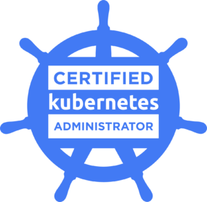
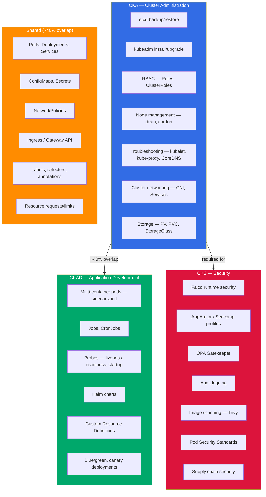
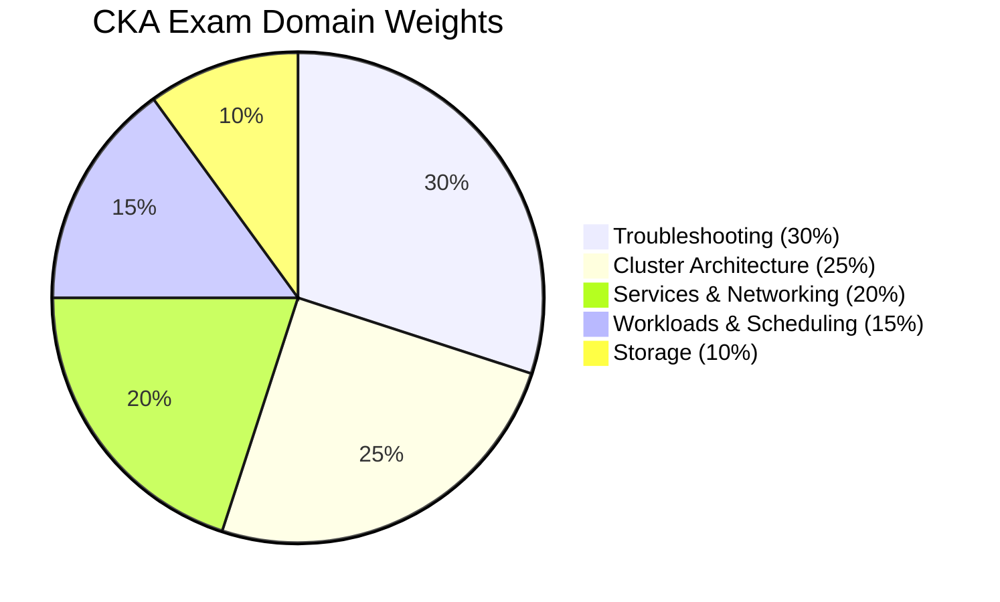
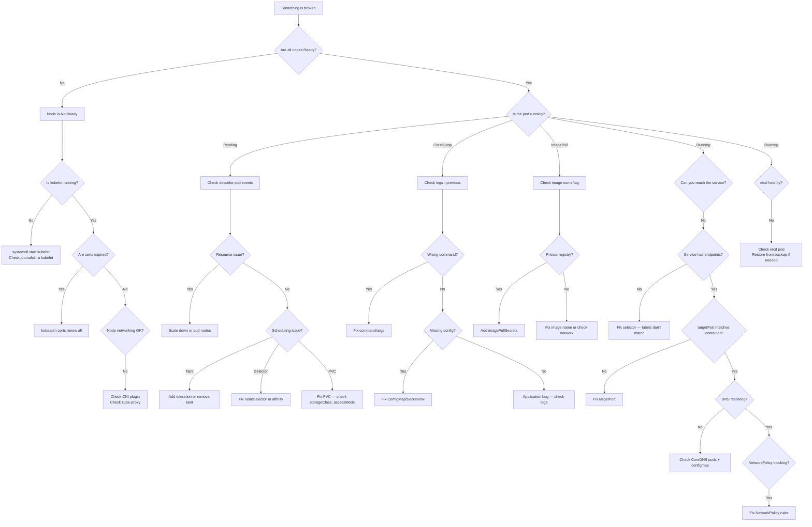

[](https://opensource.org/licenses/MIT)
[](http://makeapullrequest.com)
[](https://github.com/mbenh/CKA-Certified-Kubernetes-Administrator/actions/workflows/validate.yml)
[]()

> My CKA study notes, practice questions, and kubectl cheat sheet. Kubernetes v1.35. I scored 89% — this is everything I used to prepare.

# CKA Certification Guide 2026 — How I Passed with 89%

<p align="center">
  
</p>

I took the CKA in March 2026 and scored 89%. Writing this while it's fresh — partly because I was frustrated with how many outdated guides are still floating around (dockershim references in 2026, come on) and partly because organizing my notes helped me retain what I learned.

The [CKA](https://www.cncf.io/certification/cka/) is a hands-on, terminal-based exam. 2 hours, roughly 17 tasks, no multiple choice. I prepped for about 4 weeks. This repo has my notes, the commands I actually used, YAML I wrote from memory, and the mistakes I made along the way.

> Blog version of these notes: [Pass the CKA Certification Exam](https://techwithmohamed.com/blog/cka-exam-study-guide/)

If this was useful, a star helps others find it.

---

## Quick Start (< 4 Weeks to Exam)

If you're time-pressured, here's the fast track:

1. **Run the setup script** — get your aliases and vim config right from day one: [`scripts/exam-setup.sh`](scripts/exam-setup.sh)
2. **Do the exercises** — work through the [12 hands-on exercises](exercises/) in order. Each one targets a specific CKA domain.
3. **Memorize the skeletons** — the [YAML skeletons](skeletons/) are the templates I wrote from memory during the exam. Practice until you can type them without looking.
4. **Do the mock exam** — the [17 practice questions](#practice-questions-with-answers-mock-exam) below simulate real exam weight and difficulty.
5. **Do killer.sh twice** — once 2 weeks out, once 3 days before. See [killer.sh vs the Real Exam](#killersh-vs-the-real-cka-exam).
6. **Read the exam day strategy** — the [two-pass approach](#exam-day-strategy--time-allocation) saved me at least 15 minutes.

---

## Repo Structure

```
CKA-Certified-Kubernetes-Administrator/
├── README.md                          # This guide (you're here)
├── exercises/                         # 12 hands-on labs
│   ├── 01-pod-basics/
│   ├── 02-multi-container-pod/
│   ├── 03-configmap-secret/
│   ├── 04-rbac/
│   ├── 05-networkpolicy/
│   ├── 06-deployment-rollout/
│   ├── 07-etcd-backup-restore/
│   ├── 08-node-drain-cordon/
│   ├── 09-kubeadm-upgrade/
│   ├── 10-static-pod/
│   ├── 11-troubleshoot-cluster/
│   └── 12-storage-pv-pvc/
├── skeletons/                         # 18 YAML templates
│   ├── pod.yaml
│   ├── deployment.yaml
│   ├── service.yaml
│   ├── networkpolicy.yaml
│   ├── ingress.yaml
│   ├── gateway-api.yaml
│   ├── rbac.yaml
│   ├── clusterrole.yaml
│   ├── pv.yaml
│   ├── pvc.yaml
│   ├── storageclass.yaml
│   ├── daemonset.yaml
│   ├── statefulset.yaml
│   ├── job.yaml
│   ├── cronjob.yaml
│   ├── configmap-secret.yaml
│   ├── securitycontext.yaml
│   └── resourcequota.yaml
├── cheatsheet/
│   └── cka-cheatsheet.md              # One-page printable reference
├── troubleshooting/
│   └── README.md                      # Symptom-based lookup playbook
├── scripts/
│   └── exam-setup.sh                 # Aliases, vim config, bash completion
├── .github/
│   ├── workflows/validate.yml         # CI — YAML lint on every push
│   ├── ISSUE_TEMPLATE/                # Bug, content request, exam feedback
│   └── PULL_REQUEST_TEMPLATE.md
├── CONTRIBUTING.md
└── LICENSE
```

---

## Table of Contents

- [CKA Exam Details — Cost, Duration, Passing Score, Format](#cka-exam-details--cost-duration-passing-score-format-march-2026)
- [How Much Does the CKA Exam Cost?](#how-much-does-the-cka-exam-cost)
- [CKA vs CKAD vs CKS — Which One Should You Take?](#cka-vs-ckad-vs-cks--which-one-should-you-take)
- [CKA vs CKAD vs CKS Scope Architecture Diagram](#cka-vs-ckad-vs-cks-scope-architecture-diagram)
- [What Changed in Kubernetes v1.35 for CKA](#what-changed-in-kubernetes-v135-for-cka)
- [Before You Book the CKA Exam](#before-you-book-the-cka-exam)
- [The Exam Environment (PSI Remote Desktop)](#the-exam-environment-psi-remote-desktop)
- [First 60 Seconds — Aliases, vim, bash](#first-60-seconds--aliases-vim-bash)
- [Docs Pages I Actually Used During the Exam](#docs-pages-i-actually-used-during-the-exam)
- [kubectl Cheat Sheet for CKA](#kubectl-cheat-sheet-for-cka)
- [CKA Syllabus Breakdown (v1.35)](#cka-syllabus-breakdown-v135)
  - [Domain 1 — Storage (10%)](#domain-1--storage-10)
  - [Domain 2 — Troubleshooting (30%)](#domain-2--troubleshooting-30)
  - [Domain 3 — Workloads & Scheduling (15%)](#domain-3--workloads--scheduling-15)
  - [Domain 4 — Cluster Architecture, Installation & Configuration (25%)](#domain-4--cluster-architecture-installation--configuration-25)
  - [Domain 5 — Services & Networking (20%)](#domain-5--services--networking-20)
- [CKA Domain Weight Distribution](#cka-domain-weight-distribution)
- [Exam Day Strategy — Time Allocation](#exam-day-strategy--time-allocation)
- [Mistakes That Will Fail You on the CKA](#mistakes-that-will-fail-you-on-the-cka)
- [Troubleshooting Decision Flowchart](#troubleshooting-decision-flowchart)
- [Practice Scenarios with Full Solutions](#practice-scenarios-with-full-solutions)
- [Practice Questions with Answers (Mock Exam)](#practice-questions-with-answers-mock-exam)
- [Study Resources for CKA 2026](#study-resources-for-cka-2026)
- [CKA Study Plan (4-5 Weeks)](#cka-study-plan-4-5-weeks)
- [killer.sh vs the Real CKA Exam](#killersh-vs-the-real-cka-exam)
- [CKA Exam Day Checklist](#cka-exam-day-checklist)
- [Study Progress Tracker](#study-progress-tracker)
- [YAML Skeletons — Write These from Memory](#yaml-skeletons--write-these-from-memory)
- [CKA FAQ — Common Questions](#cka-faq--common-questions)
- [Final Words](#final-words)

---

## CKA Exam Details — Cost, Duration, Passing Score, Format (March 2026)

| **CKA Exam Details**               | **Information**                                                                                                                                     |
|------------------------------------|-----------------------------------------------------------------------------------------------------------------------------------------------------|
| **Exam Type**                      | Performance-based (live terminal — NOT multiple choice)                                                                                             |
| **Exam Duration**                  | 2 hours                                                                                                                                             |
| **Passing Score**                  | 66%                                                                                                                                                 |
| **Kubernetes Version**             | v1.35                                                                                                                                               |
| **Number of Questions**            | ~17-25 tasks (varies per session)                                                                                                                   |
| **Exam Cost**                      | $445 USD (includes one free retake)                                                                                                                 |
| **Certificate Validity**           | 2 years                                                                                                                                             |
| **Exam Delivery**                  | PSI Secure Browser (remote proctored)                                                                                                               |
| **Allowed Resources**              | kubernetes.io/docs, kubernetes.io/blog, github.com/kubernetes — open in exam browser                                                                |
| **Domains Covered**               | 5 domains: Storage, Troubleshooting, Workloads & Scheduling, Cluster Architecture, Services & Networking                                            |
| **Exam Language**                  | English, Japanese, Simplified Chinese                                                                                                                |
| **OS in Exam**                     | Ubuntu Linux terminal                                                                                                                                |

Important: the passing score is 66%, not 75% like some older guides say. They lowered it. Still not easy though — 2 hours goes fast when you're troubleshooting a broken kubelet under pressure.

---

## How Much Does the CKA Exam Cost?

The CKA costs **$445 USD** as of March 2026. That includes:

- One exam attempt
- One free retake (if you fail)
- Two killer.sh simulator sessions (24 hours each)
- Access to a self-paced training course

Discount tips:
- The CNCF runs sales on Black Friday and KubeCon weeks — I've seen 30-40% off
- Linux Foundation bundles (CKA + CKAD) sometimes drop to ~$500 total
- Check if your employer has a training budget — most do for certs
- Student discounts exist through the Linux Foundation

Don't pay full price if you can wait for a sale. I paid around $300 during a KubeCon promo.

---

## CKA vs CKAD vs CKS — Which One Should You Take?

| | **CKA** | **CKAD** | **CKS** |
|---|---|---|---|
| **Focus** | Cluster administration | Application development | Security |
| **Who it's for** | SREs, platform engineers, admins | Developers deploying to K8s | Security engineers, senior admins |
| **Difficulty** | Medium-Hard | Medium | Hard |
| **Duration** | 2 hours | 2 hours | 2 hours |
| **Passing Score** | 66% | 66% | 67% |
| **Cost** | $445 | $445 | $445 |
| **Prerequisites** | None | None | Must hold active CKA |
| **Key Topics** | etcd, kubeadm, RBAC, troubleshooting, networking | Pods, Deployments, Jobs, probes, volumes | Falco, AppArmor, OPA, Network Policies, audit |
| **Questions** | ~17-25 | ~15-20 | ~15-20 |
| **Typical Order** | First cert to get | First or second | After CKA |

My take: if you're doing any kind of cluster administration, start with CKA. If you're purely a dev who deploys apps, CKAD first. CKS requires an active CKA, so you can't skip it.

There's about 40% overlap between CKA and CKAD (pods, deployments, services, configmaps, secrets). If you pass one, the other is easier. I did CKA first because troubleshooting and etcd backup are harder to learn on your own.

---

## CKA vs CKAD vs CKS Scope Architecture Diagram



---

## What Changed in Kubernetes v1.35 for CKA

If you're studying from a guide written for v1.29 or v1.30, some of it is wrong. Here's what changed that matters for the CKA:

| Feature | Status in v1.35 | CKA Impact |
|---|---|---|
| **Sidecar containers (native)** | GA | Init containers with `restartPolicy: Always` run as sidecars. You'll see this on the exam. |
| **In-place pod vertical scaling** | Beta | Can resize CPU/memory without restarting. Know it exists, probably not tested yet. |
| **Gateway API** | GA (v1.2+) | Replacing Ingress long-term. CKA may test basics — know Gateway + HTTPRoute. |
| **cgroup v2** | Default | All nodes use cgroup v2 now. Affects resource monitoring and limits. |
| **kubectl debug** | GA | `k debug node/<name>` and `k debug pod/<name>` — useful for troubleshooting tasks. |
| **ValidatingAdmissionPolicy** | GA | CEL-based admission without webhooks. Might appear in RBAC/policy questions. |
| **Pod Scheduling Readiness** | GA | Pods can wait in scheduling gates. Not heavily tested but know the concept. |
| **CSI migration complete** | Done | In-tree volume plugins fully migrated. StorageClass provisioners are all CSI now. |

The big ones for exam prep: native sidecars and Gateway API. If your study material doesn't cover these, it's outdated.

---

## Before You Book the CKA Exam

Checklist I wish someone had given me:

1. **Can you set up a cluster from scratch with kubeadm?** If not, do it at least twice before booking.
2. **Can you do an etcd backup and restore?** This is almost guaranteed to show up. Practice until you can type the command from memory.
3. **Are you comfortable with RBAC?** Role vs ClusterRole, RoleBinding vs ClusterRoleBinding, ServiceAccounts — you need to create these quickly.
4. **Can you troubleshoot a NotReady node?** Check kubelet, check certificates, check networking. This is 30% of the score.
5. **Do you have a cluster to practice on?** kind or minikube on your laptop, or Killercoda/KodeKloud online.
6. **Have you done killer.sh at least once?** The real exam is easier, but killer.sh builds speed and confidence.
7. **Is your ID ready?** Government-issued ID, matching your CNCF account name. Check this before exam day.

---

## The Exam Environment (PSI Remote Desktop)

The exam runs in a PSI Secure Browser — a remote Ubuntu desktop. Some things I wish I knew:

**Copy/Paste:**
- `Ctrl+Shift+C` / `Ctrl+Shift+V` in the terminal
- Right-click paste works sometimes, sometimes it doesn't
- The built-in notepad uses normal `Ctrl+C` / `Ctrl+V`
- Practice these shortcuts. I wasted 2 minutes fumbling with paste in the first question.

**Terminal quirks:**
- There's a small delay on every keystroke — maybe 50-100ms. It adds up.
- Tab completion works but feels laggy.
- You can open multiple terminal tabs. I used two: one for the task, one for verification.
- The file browser is basic. Stick to command line.

**Browser:**
- One extra tab allowed for kubernetes.io documentation
- Bookmarks are not available — you'll type URLs manually
- The search on kubernetes.io is your best friend. Use it instead of navigating.

**General:**
- Webcam and mic are on the entire time
- Clear your desk — nothing on it except your computer
- No second monitor
- No headphones/earphones
- Water bottle is fine (clear, no label)
- Bathroom breaks are allowed but the timer doesn't pause

---

## First 60 Seconds — Aliases, vim, bash

Run this at the start of every exam session. It saves 10-15 minutes over 2 hours.

```bash
# Aliases
alias k='kubectl'
alias kn='kubectl config set-context --current --namespace'
alias kgp='kubectl get pods'
alias kgs='kubectl get svc'
alias kgn='kubectl get nodes'
export do='--dry-run=client -o yaml'
export now='--force --grace-period=0'

# Tab completion
source <(kubectl completion bash)
complete -o default -F __start_kubectl k

# vim config
cat <<'EOF' >> ~/.vimrc
set expandtab
set tabstop=2
set shiftwidth=2
set number
set autoindent
EOF

# etcdctl
export ETCDCTL_API=3
```

Or just run: `source scripts/exam-setup.sh` — see [`scripts/exam-setup.sh`](scripts/exam-setup.sh)

After setting up, verify:

```bash
k get nodes          # aliases work?
k run test --image=nginx $do   # $do works?
```

---

## Docs Pages I Actually Used During the Exam

You can access kubernetes.io during the exam. Here are the pages I actually opened:

| Topic | Page |
|---|---|
| kubectl cheat sheet | https://kubernetes.io/docs/reference/kubectl/cheatsheet/ |
| etcd backup/restore | https://kubernetes.io/docs/tasks/administer-cluster/configure-upgrade-etcd/ |
| kubeadm upgrade | https://kubernetes.io/docs/tasks/administer-cluster/kubeadm/kubeadm-upgrade/ |
| RBAC | https://kubernetes.io/docs/reference/access-authn-authz/rbac/ |
| NetworkPolicy | https://kubernetes.io/docs/concepts/services-networking/network-policies/ |
| PV / PVC | https://kubernetes.io/docs/concepts/storage/persistent-volumes/ |
| StorageClass | https://kubernetes.io/docs/concepts/storage/storage-classes/ |
| Static pods | https://kubernetes.io/docs/tasks/configure-pod-container/static-pod/ |
| Assign pods to nodes | https://kubernetes.io/docs/concepts/scheduling-eviction/assign-pod-node/ |
| Taints and tolerations | https://kubernetes.io/docs/concepts/scheduling-eviction/taint-and-toleration/ |
| DaemonSet | https://kubernetes.io/docs/concepts/workloads/controllers/daemonset/ |
| Debug services | https://kubernetes.io/docs/tasks/debug/debug-application/debug-service/ |
| Debug pods | https://kubernetes.io/docs/tasks/debug/debug-application/debug-pods/ |
| CoreDNS | https://kubernetes.io/docs/tasks/administer-cluster/coredns/ |
| Ingress | https://kubernetes.io/docs/concepts/services-networking/ingress/ |
| Gateway API | https://kubernetes.io/docs/concepts/services-networking/gateway/ |
| Drain a node | https://kubernetes.io/docs/tasks/administer-cluster/safely-drain-node/ |

Tip: use the search bar on kubernetes.io. Don't waste time clicking through navigation menus.

---

## kubectl Cheat Sheet for CKA

These are the commands I used most during the exam. All using the aliases from the setup section.

### Context and Namespace

```bash
# Switch context (DO THIS BEFORE EVERY QUESTION)
k config use-context <context-name>

# Set default namespace
kn <namespace>

# Check current context
k config current-context
```

### Pods

```bash
# Create a pod
k run nginx --image=nginx:1.27

# Create pod YAML without running it
k run nginx --image=nginx:1.27 $do > pod.yaml

# Pod with labels
k run nginx --image=nginx:1.27 --labels=app=web,tier=frontend

# Pod with port
k run nginx --image=nginx:1.27 --port=80

# Get pods with extra info
k get pods -o wide
k get pods --show-labels
k get pods -l app=web

# Delete pod fast
k delete pod nginx $now
```

### Deployments

```bash
# Create deployment
k create deployment webapp --image=nginx:1.27 --replicas=3

# Generate YAML
k create deployment webapp --image=nginx:1.27 --replicas=3 $do > deploy.yaml

# Scale
k scale deployment webapp --replicas=5

# Update image
k set image deployment/webapp nginx=nginx:1.28

# Rollout commands
k rollout status deployment/webapp
k rollout history deployment/webapp
k rollout undo deployment/webapp
k rollout undo deployment/webapp --to-revision=2
```

### Services

```bash
# Expose a deployment
k expose deployment webapp --port=80 --target-port=80 --type=ClusterIP
k expose deployment webapp --port=80 --target-port=80 --type=NodePort

# Expose a pod
k expose pod nginx --port=80 --name=nginx-svc

# Generate service YAML
k create service clusterip my-svc --tcp=80:80 $do > svc.yaml
```

### RBAC

```bash
# Create ServiceAccount
k create sa my-sa -n my-ns

# Create Role
k create role pod-reader --verb=get,list,watch --resource=pods -n my-ns

# Create RoleBinding
k create rolebinding read-pods --role=pod-reader --serviceaccount=my-ns:my-sa -n my-ns

# Create ClusterRole
k create clusterrole node-reader --verb=get,list --resource=nodes

# Create ClusterRoleBinding
k create clusterrolebinding read-nodes --clusterrole=node-reader --serviceaccount=my-ns:my-sa

# Check permissions
k auth can-i list pods -n my-ns --as=system:serviceaccount:my-ns:my-sa
```

### Node Management

```bash
# Cordon (mark unschedulable)
k cordon <node-name>

# Drain (evict pods)
k drain <node-name> --ignore-daemonsets --delete-emptydir-data

# Uncordon
k uncordon <node-name>

# Label a node
k label node <node-name> disk=ssd

# Taint a node
k taint nodes <node-name> key=value:NoSchedule

# Remove a taint
k taint nodes <node-name> key=value:NoSchedule-
```

### etcd

```bash
# Snapshot
ETCDCTL_API=3 etcdctl snapshot save /tmp/etcd-backup.db \
  --endpoints=https://127.0.0.1:2379 \
  --cacert=/etc/kubernetes/pki/etcd/ca.crt \
  --cert=/etc/kubernetes/pki/etcd/server.crt \
  --key=/etc/kubernetes/pki/etcd/server.key

# Verify snapshot
ETCDCTL_API=3 etcdctl snapshot status /tmp/etcd-backup.db --write-table

# Restore
ETCDCTL_API=3 etcdctl snapshot restore /tmp/etcd-backup.db \
  --data-dir=/var/lib/etcd-restored
```

### Troubleshooting

```bash
# Node issues
k get nodes
k describe node <node-name>
ssh <node> -- sudo systemctl status kubelet
ssh <node> -- sudo journalctl -u kubelet --no-pager | tail -30

# Pod issues
k describe pod <pod-name>
k logs <pod-name>
k logs <pod-name> -c <container-name>
k logs <pod-name> --previous

# Service/endpoint issues
k get endpoints <service-name>
k get svc
k describe svc <service-name>

# DNS
k run test-dns --image=busybox:1.36 --rm -it -- nslookup kubernetes
k get pods -n kube-system -l k8s-app=kube-dns

# Debug node
k debug node/<node-name> -it --image=busybox:1.36
```

### Quick YAML Generation

```bash
# Pod
k run nginx --image=nginx:1.27 $do > pod.yaml

# Deployment
k create deployment webapp --image=nginx:1.27 $do > deploy.yaml

# Service
k expose deployment webapp --port=80 $do > svc.yaml

# Job
k create job my-job --image=busybox:1.36 -- sh -c "echo done" $do > job.yaml

# CronJob
k create cronjob my-cron --image=busybox:1.36 --schedule="*/5 * * * *" -- sh -c "echo tick" $do > cron.yaml

# ConfigMap
k create configmap my-cm --from-literal=key=value $do > cm.yaml

# Secret
k create secret generic my-secret --from-literal=pass=s3cret $do > secret.yaml
```

---

## CKA Syllabus Breakdown (v1.35)

### Domain 1 — Storage (10%)

10% of the score. Don't skip it — the questions are straightforward if you know PV/PVC mechanics.

> See also: [Exercise 12 — Storage](exercises/12-storage-pv-pvc/) | Skeletons: [pv.yaml](skeletons/pv.yaml), [pvc.yaml](skeletons/pvc.yaml), [storageclass.yaml](skeletons/storageclass.yaml)

#### 1.1 — Understand Storage Classes and Persistent Volumes

A **PersistentVolume (PV)** is a piece of storage provisioned by an admin. A **PersistentVolumeClaim (PVC)** is a request for storage by a user. A **StorageClass** defines how storage is dynamically provisioned.

Key concepts:
- PV is cluster-scoped (no namespace). PVC is namespace-scoped.
- PVC binds to a PV when: capacity >= request, accessModes match, storageClassName matches
- If no PV matches, the PVC stays `Pending` until one appears (or dynamic provisioning kicks in)

```yaml
# PV — cluster-scoped
apiVersion: v1
kind: PersistentVolume
metadata:
  name: my-pv
spec:
  capacity:
    storage: 5Gi
  accessModes:
  - ReadWriteOnce
  persistentVolumeReclaimPolicy: Retain
  storageClassName: manual
  hostPath:
    path: /data/my-pv
```

```yaml
# PVC — namespace-scoped
apiVersion: v1
kind: PersistentVolumeClaim
metadata:
  name: my-pvc
  namespace: default
spec:
  accessModes:
  - ReadWriteOnce
  resources:
    requests:
      storage: 2Gi
  storageClassName: manual
```

```yaml
# Pod using PVC
apiVersion: v1
kind: Pod
metadata:
  name: storage-pod
spec:
  containers:
  - name: app
    image: nginx:1.27
    volumeMounts:
    - name: data
      mountPath: /usr/share/nginx/html
  volumes:
  - name: data
    persistentVolumeClaim:
      claimName: my-pvc
```

#### 1.2 — Understand Volume Mode, Access Modes, and Reclaim Policies

**Access Modes:**

| Mode | Short | Description |
|---|---|---|
| ReadWriteOnce | RWO | One node can mount read-write |
| ReadOnlyMany | ROX | Many nodes can mount read-only |
| ReadWriteMany | RWX | Many nodes can mount read-write |
| ReadWriteOncePod | RWOP | Only one pod can mount read-write (v1.29+) |

**Reclaim Policies:**

| Policy | What happens when PVC is deleted |
|---|---|
| Retain | PV stays, data preserved, must manually clean up |
| Delete | PV and underlying storage are deleted |
| Recycle | Deprecated — don't use |

**Volume Modes:**
- `Filesystem` (default) — mounted as a directory
- `Block` — raw block device, no filesystem

On the exam: know the difference between Retain and Delete. If the question says "data should persist after PVC deletion," use Retain.

#### 1.3 — Configure Applications with Persistent Storage

The pattern is always the same:
1. Create PV (or let StorageClass provision it dynamically)
2. Create PVC referencing the StorageClass
3. Mount PVC in the Pod spec

```yaml
# StorageClass for dynamic provisioning
apiVersion: storage.k8s.io/v1
kind: StorageClass
metadata:
  name: fast
provisioner: kubernetes.io/no-provisioner
reclaimPolicy: Retain
volumeBindingMode: WaitForFirstConsumer
```

`WaitForFirstConsumer` delays binding until a pod actually needs the volume. This avoids scheduling issues where the PV is on node A but the pod lands on node B.

Common gotcha: forgetting `storageClassName`. If the PVC has `storageClassName: ""` (empty string), it only binds to PVs with no StorageClass. If you set `storageClassName: manual`, the PV must also have `storageClassName: manual`.

---

### Domain 2 — Troubleshooting (30%)

This is the biggest domain — 30% of the score. You'll get several questions asking you to fix broken things.

> See also: [Exercise 11 — Troubleshoot Cluster](exercises/11-troubleshoot-cluster/) | [Troubleshooting Decision Flowchart](#troubleshooting-decision-flowchart)

#### 2.1 — Evaluate Cluster and Node Logging

Where to find logs:

| Component | Log Location |
|---|---|
| kubelet | `journalctl -u kubelet` (systemd service) |
| kube-apiserver | `/var/log/kube-apiserver.log` or `k logs -n kube-system kube-apiserver-<node>` |
| kube-scheduler | `k logs -n kube-system kube-scheduler-<node>` |
| kube-controller-manager | `k logs -n kube-system kube-controller-manager-<node>` |
| etcd | `k logs -n kube-system etcd-<node>` |
| Container runtime | `journalctl -u containerd` |

Control plane components run as static pods (in `/etc/kubernetes/manifests/`), so you can check their logs with `k logs`. But kubelet is a systemd service — use `journalctl`.

```bash
# Check node status
k get nodes
k describe node <node-name>

# Check kubelet on a node
ssh <node>
sudo systemctl status kubelet
sudo journalctl -u kubelet --no-pager | tail -50

# Check control plane pods
k get pods -n kube-system
```

#### 2.2 — Monitor Applications

```bash
# Pod status and events
k get pods
k describe pod <pod-name>

# Resource usage (requires metrics-server)
k top pods
k top nodes

# Events sorted by time
k get events --sort-by='.lastTimestamp'
k get events -n <namespace> --field-selector reason=Failed
```

#### 2.3 — Container stdout/stderr Logs

```bash
# Current logs
k logs <pod-name>

# Specific container in multi-container pod
k logs <pod-name> -c <container-name>

# Previous container (crashed/restarted)
k logs <pod-name> --previous

# Follow logs
k logs <pod-name> -f

# Last N lines
k logs <pod-name> --tail=50

# Logs from all pods with a label
k logs -l app=web --all-containers
```

#### 2.4 — Troubleshoot Application Failure

Debugging pod issues by status:

**Pending:**
- No node has enough resources → check `k describe pod` for events
- PVC not bound → check `k get pvc`
- Node selector or affinity doesn't match any node
- Taints blocking scheduling

**CrashLoopBackOff:**
- Container exits immediately → check `k logs <pod> --previous`
- Wrong command or entrypoint
- Missing config (env vars, configmaps, secrets)
- Application error

**ImagePullBackOff:**
- Wrong image name or tag
- Private registry without imagePullSecrets
- Network issue reaching the registry

**Error / Failed:**
- Check `k describe pod` events section
- Check `k logs`

```bash
# Systematic pod debugging
k get pod <pod> -o wide          # which node? what IP?
k describe pod <pod>             # events, conditions
k logs <pod>                     # app logs
k logs <pod> --previous          # if it crashed
k exec <pod> -- cat /etc/resolv.conf   # DNS config
k exec <pod> -- env                     # env vars loaded?
```

#### 2.5 — Troubleshoot Cluster Component Failure

When the whole cluster is broken:

```bash
# 1. Are nodes ready?
k get nodes

# 2. Are control plane pods running?
k get pods -n kube-system

# 3. Is kubelet running on the node?
ssh <node>
sudo systemctl status kubelet
sudo systemctl restart kubelet    # try restarting

# 4. Check kubelet logs
sudo journalctl -u kubelet --no-pager | tail -50

# 5. Are certificates expired?
sudo kubeadm certs check-expiration

# 6. Is etcd healthy?
ETCDCTL_API=3 etcdctl endpoint health \
  --endpoints=https://127.0.0.1:2379 \
  --cacert=/etc/kubernetes/pki/etcd/ca.crt \
  --cert=/etc/kubernetes/pki/etcd/server.crt \
  --key=/etc/kubernetes/pki/etcd/server.key

# 7. Check static pod manifests
ls /etc/kubernetes/manifests/
# Should have: etcd.yaml, kube-apiserver.yaml, kube-controller-manager.yaml, kube-scheduler.yaml
```

Common causes:
- kubelet not running → `systemctl start kubelet`
- Wrong static pod manifest → fix YAML in `/etc/kubernetes/manifests/`
- Certificates expired → `kubeadm certs renew all`
- etcd data directory wrong → check `--data-dir` in etcd manifest
- kube-apiserver flag wrong → check manifest, fix, wait for restart

#### 2.6 — Troubleshoot Networking

Service not reachable? Work through this:

```bash
# 1. Does the service exist and have the right selector?
k get svc <service>
k describe svc <service>

# 2. Does the service have endpoints?
k get endpoints <service>
# If empty: selector doesn't match any running pod

# 3. Is the pod actually running on the target port?
k exec <pod> -- wget -qO- localhost:<port>

# 4. DNS working?
k run test-dns --image=busybox:1.36 --rm -it -- nslookup <service-name>

# 5. Is kube-proxy running?
k get pods -n kube-system -l k8s-app=kube-proxy

# 6. NetworkPolicy blocking traffic?
k get networkpolicy -n <namespace>
```

The most common networking issues on the exam:
- Service selector doesn't match pod labels (typo in labels)
- Service targetPort doesn't match container port
- NetworkPolicy denying traffic (remember: any policy = deny by default for that pod)
- CoreDNS down or misconfigured
- kube-proxy not running on a node

---

### Domain 3 — Workloads & Scheduling (15%)

15% of the score. This covers Deployments, rolling updates, ConfigMaps, Secrets, static pods, scheduling constraints.

> See also: [Exercise 01 — Pod Basics](exercises/01-pod-basics/) | [Exercise 06 — Deployment Rollout](exercises/06-deployment-rollout/) | [Exercise 10 — Static Pod](exercises/10-static-pod/)

#### 3.1 — Understand Deployments and How to Perform Rolling Updates and Rollbacks

Deployments manage ReplicaSets, which manage Pods. When you update a Deployment image, it creates a new ReplicaSet and gradually shifts pods over.

```bash
# Create
k create deployment webapp --image=nginx:1.26 --replicas=3

# Update image (triggers rolling update)
k set image deployment/webapp nginx=nginx:1.27

# Watch the rollout
k rollout status deployment/webapp

# Check history
k rollout history deployment/webapp

# Rollback to previous
k rollout undo deployment/webapp

# Rollback to specific revision
k rollout undo deployment/webapp --to-revision=2
```

Rolling update strategy options:

```yaml
spec:
  strategy:
    type: RollingUpdate
    rollingUpdate:
      maxSurge: 1        # max pods above desired count during update
      maxUnavailable: 0   # max pods that can be unavailable during update
```

- `maxSurge: 1, maxUnavailable: 0` = zero-downtime (one extra pod at a time)
- `maxSurge: 0, maxUnavailable: 1` = no extra pods, one goes down at a time
- `Recreate` strategy = kill all old pods first, then create new ones (causes downtime)

#### 3.2 — Use ConfigMaps and Secrets to Configure Applications

ConfigMaps hold non-sensitive config. Secrets hold sensitive data (base64-encoded, not encrypted by default).

```bash
# Create ConfigMap
k create configmap app-config \
  --from-literal=APP_MODE=production \
  --from-literal=LOG_LEVEL=info

# Create Secret
k create secret generic db-creds \
  --from-literal=DB_USER=admin \
  --from-literal=DB_PASS=changeme

# From file
k create configmap nginx-conf --from-file=nginx.conf
```

Three ways to inject into a pod:

**1. Environment variables (all keys):**
```yaml
envFrom:
- configMapRef:
    name: app-config
- secretRef:
    name: db-creds
```

**2. Single key as env var:**
```yaml
env:
- name: DATABASE_USER
  valueFrom:
    secretKeyRef:
      name: db-creds
      key: DB_USER
```

**3. Mounted as files:**
```yaml
volumeMounts:
- name: config-vol
  mountPath: /etc/config
volumes:
- name: config-vol
  configMap:
    name: app-config
```

Gotcha: if you mount a ConfigMap as a volume at a directory, it replaces the entire directory. Use `subPath` to mount a single file without replacing the directory.

#### 3.3 — Know How to Scale Applications

```bash
# Manual scaling
k scale deployment webapp --replicas=5

# Autoscaling (HPA — not heavily tested on CKA but know it exists)
k autoscale deployment webapp --min=2 --max=10 --cpu-percent=80
```

#### 3.4 — Understand the Primitives Used to Create Robust, Self-Healing, Application Deployments

Quick mental model:
- **ReplicaSet**: Keeps N pods running (managed by Deployment — rarely created directly)
- **Deployment**: Manages ReplicaSets, provides rolling updates
- **DaemonSet**: Runs one pod per node (logging agents, monitoring)
- **StatefulSet**: For stateful apps needing stable network identity and persistent storage

```yaml
# DaemonSet — runs on every node
apiVersion: apps/v1
kind: DaemonSet
metadata:
  name: log-agent
spec:
  selector:
    matchLabels:
      app: log-agent
  template:
    metadata:
      labels:
        app: log-agent
    spec:
      tolerations:
      - key: node-role.kubernetes.io/control-plane
        operator: Exists
        effect: NoSchedule
      containers:
      - name: agent
        image: fluentd:v1.17
        volumeMounts:
        - name: varlog
          mountPath: /var/log
      volumes:
      - name: varlog
        hostPath:
          path: /var/log
```

#### 3.5 — Understand How Resource Limits Can Affect Pod Scheduling

```yaml
resources:
  requests:
    memory: "64Mi"    # scheduler uses this to find a node
    cpu: "250m"       # 250 millicores = 0.25 CPU
  limits:
    memory: "128Mi"   # OOMKilled if exceeded
    cpu: "500m"       # throttled if exceeded
```

- **Requests** = what the scheduler looks at when placing the pod. If no node has enough, pod stays Pending.
- **Limits** = ceiling. Memory over limit = OOMKilled. CPU over limit = throttled.
- If you set limits without requests, requests default to limits.
- LimitRange sets defaults and constraints for a namespace. ResourceQuota caps total usage.

#### 3.6 — Awareness of Manifest Management and Common Templating Tools

On the CKA, you mostly write raw YAML. But know these exist:
- **Kustomize**: `k apply -k <dir>` — built into kubectl, overlays and patches
- **Helm**: package manager for Kubernetes — CKA may ask you to install a chart
- **kubectl $do**: generate YAML with `--dry-run=client -o yaml` and edit it

#### 3.7 — Schedule Pods on Specific Nodes

**nodeSelector** (simplest):
```yaml
spec:
  nodeSelector:
    disk: ssd
```

**Node affinity** (more flexible):
```yaml
spec:
  affinity:
    nodeAffinity:
      requiredDuringSchedulingIgnoredDuringExecution:
        nodeSelectorTerms:
        - matchExpressions:
          - key: disk
            operator: In
            values:
            - ssd
```

**Taints and tolerations:**

Taints go on nodes. Tolerations go on pods.

```bash
# Taint a node
k taint nodes node1 gpu=true:NoSchedule

# Remove taint
k taint nodes node1 gpu=true:NoSchedule-
```

```yaml
# Pod toleration
spec:
  tolerations:
  - key: "gpu"
    operator: "Equal"
    value: "true"
    effect: "NoSchedule"
```

Effects:
- `NoSchedule` — don't schedule new pods (existing stay)
- `PreferNoSchedule` — try to avoid, but not strict
- `NoExecute` — evict existing pods too

#### 3.8 — Static Pods

Static pods are managed by the kubelet directly, not the API server. The kubelet watches a directory (usually `/etc/kubernetes/manifests/`) and creates pods from any YAML files it finds there.

```bash
# Find the static pod path
cat /var/lib/kubelet/config.yaml | grep staticPodPath
# Usually: /etc/kubernetes/manifests

# Create a static pod
sudo tee /etc/kubernetes/manifests/static-web.yaml <<EOF
apiVersion: v1
kind: Pod
metadata:
  name: static-web
spec:
  containers:
  - name: web
    image: nginx:1.27
    ports:
    - containerPort: 80
EOF
```

Static pods show up in `kubectl get pods` with the node name appended (e.g., `static-web-node1`). You can't delete them via kubectl — the kubelet recreates them. To remove: delete the manifest file.

Control plane components (kube-apiserver, kube-scheduler, kube-controller-manager, etcd) are all static pods.

---

### Domain 4 — Cluster Architecture, Installation & Configuration (25%)

25% of the score. This is the CKA-specific domain — etcd, kubeadm, RBAC. If you're coming from CKAD, this is all new.

> See also: [Exercise 04 — RBAC](exercises/04-rbac/) | [Exercise 07 — etcd Backup](exercises/07-etcd-backup-restore/) | [Exercise 09 — kubeadm Upgrade](exercises/09-kubeadm-upgrade/)

#### 4.1 — Manage Role-Based Access Control (RBAC)

RBAC has four objects:

| Object | Scope | Binds to |
|---|---|---|
| Role | Namespace | RoleBinding |
| ClusterRole | Cluster-wide | ClusterRoleBinding or RoleBinding |
| RoleBinding | Namespace | Role or ClusterRole |
| ClusterRoleBinding | Cluster-wide | ClusterRole |

```bash
# Create Role (namespace-scoped permissions)
k create role pod-reader \
  --verb=get,list,watch \
  --resource=pods \
  -n dev

# Create RoleBinding
k create rolebinding read-pods \
  --role=pod-reader \
  --serviceaccount=dev:my-sa \
  -n dev

# Create ClusterRole (cluster-wide permissions)
k create clusterrole node-reader \
  --verb=get,list \
  --resource=nodes

# Create ClusterRoleBinding
k create clusterrolebinding read-nodes \
  --clusterrole=node-reader \
  --serviceaccount=dev:my-sa

# Test permissions
k auth can-i list pods -n dev --as=system:serviceaccount:dev:my-sa
k auth can-i list nodes --as=system:serviceaccount:dev:my-sa
```

Tricky bit: a ClusterRole bound with a RoleBinding only grants access in that namespace. A ClusterRole bound with a ClusterRoleBinding grants access cluster-wide. Same ClusterRole, different scope depending on the binding type.

#### 4.2 — Use Kubeadm to Install a Basic Cluster

The kubeadm workflow:

```bash
# On control plane node:
sudo kubeadm init --pod-network-cidr=10.244.0.0/16

# Set up kubeconfig
mkdir -p $HOME/.kube
sudo cp /etc/kubernetes/admin.conf $HOME/.kube/config
sudo chown $(id -u):$(id -g) $HOME/.kube/config

# Install CNI (e.g., Calico)
k apply -f https://docs.projectcalico.org/manifests/calico.yaml

# On worker nodes:
sudo kubeadm join <control-plane-ip>:6443 --token <token> --discovery-token-ca-cert-hash sha256:<hash>
```

If you lost the join command:
```bash
kubeadm token create --print-join-command
```

#### 4.3 — Manage a Highly Available Kubernetes Cluster

Know the concepts (not heavily tested with actual setup, but you need to understand it):

- **Stacked etcd**: etcd runs on the same nodes as control plane components. Simpler but less resilient.
- **External etcd**: etcd runs on separate nodes. More resilient, harder to set up.
- Multiple control plane nodes behind a load balancer
- `kubeadm init --control-plane-endpoint=<lb>:6443` for HA setup

#### 4.4 — Provision Underlying Infrastructure to Deploy a Kubernetes Cluster

This is mostly about knowing that kubeadm handles it. On the exam you won't set up VMs, but you might need to:
- Install container runtime (containerd)
- Disable swap
- Load kernel modules (br_netfilter, overlay)
- Set sysctl params (net.bridge.bridge-nf-call-iptables = 1)

#### 4.5 — Perform a Version Upgrade on a Kubernetes Cluster Using Kubeadm

This is a classic CKA question. The sequence matters:

**Control plane node:**
```bash
# 1. Update kubeadm
sudo apt-mark unhold kubeadm
sudo apt-get update && sudo apt-get install -y kubeadm=1.35.0-1.1
sudo apt-mark hold kubeadm

# 2. Plan
sudo kubeadm upgrade plan

# 3. Apply
sudo kubeadm upgrade apply v1.35.0

# 4. Update kubelet + kubectl
sudo apt-mark unhold kubelet kubectl
sudo apt-get install -y kubelet=1.35.0-1.1 kubectl=1.35.0-1.1
sudo apt-mark hold kubelet kubectl

# 5. Restart kubelet
sudo systemctl daemon-reload
sudo systemctl restart kubelet
```

**Worker node:**
```bash
# 1. From control plane: drain the worker
k drain worker-1 --ignore-daemonsets --delete-emptydir-data

# 2. SSH to worker, update packages
sudo apt-mark unhold kubeadm kubelet kubectl
sudo apt-get update
sudo apt-get install -y kubeadm=1.35.0-1.1 kubelet=1.35.0-1.1 kubectl=1.35.0-1.1
sudo apt-mark hold kubeadm kubelet kubectl

# 3. Upgrade node
sudo kubeadm upgrade node

# 4. Restart kubelet
sudo systemctl daemon-reload
sudo systemctl restart kubelet

# 5. From control plane: uncordon
k uncordon worker-1
```

Key difference: control plane uses `kubeadm upgrade apply`, worker uses `kubeadm upgrade node`.

#### 4.6 — Implement etcd Backup and Restore

This shows up on almost every CKA exam. Memorize this.

**Backup:**
```bash
ETCDCTL_API=3 etcdctl snapshot save /tmp/etcd-backup.db \
  --endpoints=https://127.0.0.1:2379 \
  --cacert=/etc/kubernetes/pki/etcd/ca.crt \
  --cert=/etc/kubernetes/pki/etcd/server.crt \
  --key=/etc/kubernetes/pki/etcd/server.key
```

Where to find the cert paths: `cat /etc/kubernetes/manifests/etcd.yaml` and look for `--cert-file`, `--key-file`, `--trusted-ca-file`.

**Verify:**
```bash
ETCDCTL_API=3 etcdctl snapshot status /tmp/etcd-backup.db --write-table
```

**Restore:**
```bash
# 1. Restore to a new directory
ETCDCTL_API=3 etcdctl snapshot restore /tmp/etcd-backup.db \
  --data-dir=/var/lib/etcd-restored

# 2. Update etcd manifest to use the restored directory
sudo vi /etc/kubernetes/manifests/etcd.yaml
# Change --data-dir=/var/lib/etcd → --data-dir=/var/lib/etcd-restored
# Change hostPath path: /var/lib/etcd → /var/lib/etcd-restored

# 3. Wait for etcd to restart (it's a static pod)
# kubectl may be unresponsive for 30-60 seconds — that's normal
```

The three flags you need every time: `--cacert`, `--cert`, `--key`. I wrote them on the notepad in the exam environment before starting.

---

### Domain 5 — Services & Networking (20%)

20% of the score. Services, Ingress, Gateway API, NetworkPolicy, DNS.

> See also: [Exercise 05 — NetworkPolicy](exercises/05-networkpolicy/) | Skeletons: [service.yaml](skeletons/service.yaml), [ingress.yaml](skeletons/ingress.yaml), [networkpolicy.yaml](skeletons/networkpolicy.yaml)

#### 5.1 — Understand Host Networking Configuration on the Cluster Nodes

Kubernetes networking model:
- Every pod gets its own IP address
- Pods can communicate with any other pod without NAT
- Nodes can communicate with all pods (and vice versa) without NAT
- The CNI plugin implements this (Calico, Flannel, Cilium, etc.)

```bash
# Check CNI on a node
ls /etc/cni/net.d/
cat /etc/cni/net.d/10-calico.conflist

# Check pod CIDR
k cluster-info dump | grep -m 1 cluster-cidr
```

#### 5.2 — Understand Connectivity Between Pods

Pods communicate using their IP addresses. Within the same node, it's bridged. Across nodes, the CNI handles it.

```bash
# Test pod-to-pod connectivity
k exec pod-a -- wget -qO- --timeout=2 http://<pod-b-ip>

# Check pod IPs
k get pods -o wide
```

#### 5.3 — Understand ClusterIP, NodePort, LoadBalancer Service Types

| Type | How it works | When to use |
|---|---|---|
| **ClusterIP** | Internal cluster IP only | Internal services (default) |
| **NodePort** | ClusterIP + port on every node (30000-32767) | Dev/testing, direct node access |
| **LoadBalancer** | NodePort + cloud LB | Production with cloud provider |
| **ExternalName** | CNAME to external DNS | Pointing to external services |

```bash
# ClusterIP (default)
k expose deployment webapp --port=80 --target-port=8080

# NodePort
k expose deployment webapp --port=80 --target-port=8080 --type=NodePort

# Specific NodePort
k expose deployment webapp --port=80 --target-port=8080 --type=NodePort --node-port=30080
```

The most important thing: `port` is what clients use to reach the service. `targetPort` is the port the container listens on. `nodePort` is the port on the node (NodePort/LoadBalancer only).

#### 5.4 — Understand How to Use Ingress Controllers and Ingress Resources

Ingress gives you HTTP/HTTPS routing to services based on hostname or path.

```yaml
apiVersion: networking.k8s.io/v1
kind: Ingress
metadata:
  name: my-ingress
  annotations:
    nginx.ingress.kubernetes.io/rewrite-target: /
spec:
  ingressClassName: nginx
  rules:
  - host: myapp.example.com
    http:
      paths:
      - path: /
        pathType: Prefix
        backend:
          service:
            name: my-service
            port:
              number: 80
```

Requirements:
- An Ingress Controller must be installed (e.g., nginx-ingress). The Ingress resource alone does nothing.
- `ingressClassName` is required in v1.35 — the old annotation `kubernetes.io/ingress.class` still works but is deprecated.

#### 5.5 — Know How to Use and Configure CoreDNS

CoreDNS is the cluster DNS server (replaced kube-dns a long time ago). It runs as a Deployment in `kube-system`.

```bash
# Check CoreDNS pods
k get pods -n kube-system -l k8s-app=kube-dns

# Check CoreDNS config
k get configmap coredns -n kube-system -o yaml

# Test DNS resolution
k run test-dns --image=busybox:1.36 --rm -it -- nslookup kubernetes.default.svc.cluster.local
```

DNS naming:
- Service: `<service>.<namespace>.svc.cluster.local`
- Pod: `<pod-ip-dashed>.<namespace>.pod.cluster.local`

If DNS doesn't work:
1. Is CoreDNS running? `k get pods -n kube-system -l k8s-app=kube-dns`
2. Does kube-dns service have endpoints? `k get endpoints kube-dns -n kube-system`
3. Is the Corefile correct? `k get cm coredns -n kube-system -o yaml`
4. Can the pod reach the DNS service? `k exec <pod> -- cat /etc/resolv.conf`

#### 5.6 — Choose an Appropriate Container Network Interface Plugin

The CKA won't ask you to write a CNI plugin. But know:

| CNI | Notes |
|---|---|
| **Calico** | Most common, supports NetworkPolicy |
| **Flannel** | Simple, no NetworkPolicy support |
| **Cilium** | eBPF-based, advanced features |
| **Weave** | Simple, supports NetworkPolicy |

Install is usually one `kubectl apply -f <url>`. The CNI must be installed before worker nodes join — pods stay Pending without it.

#### 5.7 — Understand NetworkPolicy

NetworkPolicy controls pod-to-pod traffic. Once you apply any NetworkPolicy to a pod, all traffic not explicitly allowed is denied for that pod.

```yaml
apiVersion: networking.k8s.io/v1
kind: NetworkPolicy
metadata:
  name: api-policy
  namespace: production
spec:
  podSelector:
    matchLabels:
      app: api
  policyTypes:
  - Ingress
  - Egress
  ingress:
  - from:
    - podSelector:
        matchLabels:
          app: frontend
    ports:
    - protocol: TCP
      port: 8080
  egress:
  - to:
    - podSelector:
        matchLabels:
          app: database
    ports:
    - protocol: TCP
      port: 5432
  # Always allow DNS
  - to: []
    ports:
    - protocol: UDP
      port: 53
```

Critical gotcha on the exam: if you add an Egress policy, you must also allow DNS (UDP 53). Otherwise the pod can't resolve any service names and everything looks broken even though the policy is "correct."

Another gotcha: `from` with multiple selectors in one rule = AND. Multiple rules = OR.

```yaml
# AND — must match BOTH namespace AND pod label
ingress:
- from:
  - namespaceSelector:
      matchLabels:
        env: prod
    podSelector:
      matchLabels:
        app: frontend

# OR — matches namespace OR pod label
ingress:
- from:
  - namespaceSelector:
      matchLabels:
        env: prod
- from:
  - podSelector:
      matchLabels:
        app: frontend
```

This difference tripped me up during practice. Read the indentation carefully.

#### 5.8 — Gateway API (v1.35)

Gateway API is the successor to Ingress. It's GA in v1.35 and may appear on the CKA.

```yaml
apiVersion: gateway.networking.k8s.io/v1
kind: Gateway
metadata:
  name: my-gateway
spec:
  gatewayClassName: istio
  listeners:
  - name: http
    protocol: HTTP
    port: 80
    allowedRoutes:
      namespaces:
        from: Same
---
apiVersion: gateway.networking.k8s.io/v1
kind: HTTPRoute
metadata:
  name: my-route
spec:
  parentRefs:
  - name: my-gateway
  hostnames:
  - "myapp.example.com"
  rules:
  - matches:
    - path:
        type: PathPrefix
        value: /api
    backendRefs:
    - name: api-service
      port: 80
```

Key differences from Ingress:
- Gateway = infrastructure resource (managed by platform team)
- HTTPRoute = application routing (managed by app team)
- More features: header matching, traffic splitting, request mirroring
- Supports TCP, UDP, gRPC — not just HTTP

---

## CKA Domain Weight Distribution



Where to focus: Troubleshooting + Cluster Architecture = 55% of the exam. If you nail these two, you only need a few more points to pass.

---

## Exam Day Strategy — Time Allocation

I used a two-pass approach and it saved me.

**Pass 1 (first 80 minutes):** Do all questions in order. If a question looks like it'll take more than 8 minutes, flag it and move on. Don't get stuck.

**Pass 2 (last 40 minutes):** Go back to flagged questions. You now know how much time you have per question.

Time estimates by question type:

| Question Type | Typical Time | Notes |
|---|---|---|
| Create a pod/deployment | 2-3 min | Use `$do` to generate YAML |
| Create RBAC resources | 3-5 min | Know the imperative commands |
| NetworkPolicy | 5-8 min | Always allow DNS egress |
| etcd backup/restore | 8-10 min | Know the cert paths |
| kubeadm upgrade | 8-10 min | Follow the sequence exactly |
| Troubleshoot broken node | 5-8 min | Check kubelet first |
| Troubleshoot networking | 5-8 min | Check endpoints, selectors |
| PV/PVC/StorageClass | 4-6 min | Match accessModes and storageClassName |
| DaemonSet | 3-4 min | Copy from docs fast |
| Ingress/Gateway | 4-6 min | Know ingressClassName |
| Static pod | 3-4 min | Write manifest directly to /etc/kubernetes/manifests/ |
| Node drain/cordon | 2-3 min | --ignore-daemonsets --delete-emptydir-data |

Total available: 120 minutes. Budget ~100 minutes for questions, 20 minutes buffer for context switching, copy/paste fumbling, and double-checking.

---

## Mistakes That Will Fail You on the CKA

These cost me points during practice. Don't repeat them.

### 1. Forgetting to switch context

Every question says "use context k8s-xxx." If you forget, you're working on the wrong cluster and get zero points.

```bash
# ALWAYS do this first
k config use-context <context-name>
```

### 2. Wrong namespace

You create resources in `default` when the question says `production`. Zero points.

```bash
# Set namespace for the question
kn <namespace>
# Or use -n on every command
k get pods -n production
```

### 3. YAML indentation errors

One wrong space = broken YAML = zero points. Set up vim properly.

```bash
# This should already be in your .vimrc
set expandtab
set tabstop=2
set shiftwidth=2
```

### 4. etcd restore — forgetting to update hostPath

You restore etcd to `/var/lib/etcd-restored` but forget to update the `hostPath.path` in the etcd manifest. etcd still reads from the old directory.

```yaml
# Must update BOTH:
# 1. --data-dir=/var/lib/etcd-restored
# 2. volumes[].hostPath.path: /var/lib/etcd-restored
```

### 5. Drain without --ignore-daemonsets

`k drain` fails if DaemonSet pods exist and you don't pass the flag. Don't waste time reading the error — just always use:

```bash
k drain <node> --ignore-daemonsets --delete-emptydir-data
```

### 6. NetworkPolicy without DNS egress

You write a NetworkPolicy egress rule but forget to allow DNS (UDP 53). The pod can't resolve service names, nothing works, and you think the policy is wrong.

```yaml
# Always include this in egress rules
- to: []
  ports:
  - protocol: UDP
    port: 53
```

### 7. Not verifying your work

You think you're done, move to the next question, and lose points because the pod isn't actually running. Always verify:

```bash
k get pod <name> -n <ns>        # Is it Running?
k get svc <name> -n <ns>        # Does service exist?
k get endpoints <name> -n <ns>  # Does service have endpoints?
```

### 8. Wasting time on hard questions first

A 3-point question and a 7-point question get the same time if you're stuck. Do the easy ones first.

### 9. Forgetting the ServiceAccount in RBAC

The question says "create a ServiceAccount and give it access." You create the Role and RoleBinding but forget to create the ServiceAccount first.

```bash
# Create SA first
k create sa my-sa -n my-ns

# Then bind it
k create rolebinding my-binding \
  --role=my-role \
  --serviceaccount=my-ns:my-sa \
  -n my-ns
```

---

## Troubleshooting Decision Flowchart

Use this when something is broken and you don't know where to start.



---

## Practice Scenarios with Full Solutions

These are longer, multi-step scenarios that mimic real exam questions.

### Scenario 1: etcd Backup and Restore

**Task:** Back up etcd to `/opt/etcd-backup.db`, then restore it to verify the backup works.

<details>
<summary>Solution</summary>

```bash
# Find cert paths
grep -E "cert-file|key-file|trusted-ca-file" /etc/kubernetes/manifests/etcd.yaml

# Backup
ETCDCTL_API=3 etcdctl snapshot save /opt/etcd-backup.db \
  --endpoints=https://127.0.0.1:2379 \
  --cacert=/etc/kubernetes/pki/etcd/ca.crt \
  --cert=/etc/kubernetes/pki/etcd/server.crt \
  --key=/etc/kubernetes/pki/etcd/server.key

# Verify
ETCDCTL_API=3 etcdctl snapshot status /opt/etcd-backup.db --write-table

# Restore
ETCDCTL_API=3 etcdctl snapshot restore /opt/etcd-backup.db \
  --data-dir=/var/lib/etcd-restored

# Update etcd manifest
sudo sed -i 's|/var/lib/etcd|/var/lib/etcd-restored|g' /etc/kubernetes/manifests/etcd.yaml

# Wait for etcd to restart
sleep 30
k get nodes
```

</details>

### Scenario 2: RBAC — ServiceAccount with Limited Access

**Task:** In namespace `dev`, create a ServiceAccount `deploy-bot` that can only create and list Deployments. Verify it cannot delete pods.

<details>
<summary>Solution</summary>

```bash
k create ns dev
k create sa deploy-bot -n dev
k create role deploy-manager -n dev \
  --verb=create,list,get \
  --resource=deployments
k create rolebinding deploy-bot-binding -n dev \
  --role=deploy-manager \
  --serviceaccount=dev:deploy-bot

# Verify
k auth can-i create deployments -n dev --as=system:serviceaccount:dev:deploy-bot
# yes
k auth can-i delete pods -n dev --as=system:serviceaccount:dev:deploy-bot
# no
```

</details>

### Scenario 3: Node Drain and Maintenance

**Task:** Drain node `worker-2` for maintenance, verify pods are rescheduled, then bring it back.

<details>
<summary>Solution</summary>

```bash
# Check current state
k get pods -o wide | grep worker-2

# Drain
k drain worker-2 --ignore-daemonsets --delete-emptydir-data

# Verify node is cordoned
k get nodes
# worker-2 should show SchedulingDisabled

# Verify pods moved
k get pods -o wide
# No non-DaemonSet pods on worker-2

# Simulate maintenance (wait)
# ...

# Bring back
k uncordon worker-2
k get nodes
# worker-2 should be Ready
```

</details>

### Scenario 4: kubeadm Upgrade

**Task:** Upgrade the control plane from v1.34.x to v1.35.0.

<details>
<summary>Solution</summary>

```bash
# 1. Upgrade kubeadm
sudo apt-mark unhold kubeadm
sudo apt-get update
sudo apt-get install -y kubeadm=1.35.0-1.1
sudo apt-mark hold kubeadm

# 2. Plan
sudo kubeadm upgrade plan

# 3. Apply
sudo kubeadm upgrade apply v1.35.0

# 4. Upgrade kubelet + kubectl
sudo apt-mark unhold kubelet kubectl
sudo apt-get install -y kubelet=1.35.0-1.1 kubectl=1.35.0-1.1
sudo apt-mark hold kubelet kubectl

# 5. Restart
sudo systemctl daemon-reload
sudo systemctl restart kubelet

# 6. Verify
k get nodes
```

</details>

### Scenario 5: Troubleshoot — Pod Can't Reach Service

**Task:** Pod `client` can't reach service `backend-svc` on port 80. Find and fix the issue.

<details>
<summary>Solution</summary>

```bash
# 1. Check service exists
k get svc backend-svc

# 2. Check endpoints
k get endpoints backend-svc
# If empty: selector doesn't match!

# 3. Check service selector
k describe svc backend-svc | grep Selector
# e.g., Selector: app=backend

# 4. Check pod labels
k get pods --show-labels | grep backend
# e.g., labels are app=back (typo!)

# 5. Fix pod labels
k label pod <backend-pod> app=backend --overwrite

# 6. Or fix service selector
k edit svc backend-svc
# Change selector to match actual pod labels

# 7. Verify
k get endpoints backend-svc
# Should now show pod IPs
k exec client -- wget -qO- --timeout=2 http://backend-svc
```

</details>

### Scenario 6: NetworkPolicy — Isolate Database

**Task:** Create a NetworkPolicy that allows only pods with label `role=api` to reach pods with label `role=db` on port 5432. Block all other ingress to the database.

<details>
<summary>Solution</summary>

```yaml
apiVersion: networking.k8s.io/v1
kind: NetworkPolicy
metadata:
  name: db-isolation
spec:
  podSelector:
    matchLabels:
      role: db
  policyTypes:
  - Ingress
  ingress:
  - from:
    - podSelector:
        matchLabels:
          role: api
    ports:
    - protocol: TCP
      port: 5432
```

```bash
k apply -f db-policy.yaml

# Test — api pod should work
k exec api-pod -- nc -zv <db-pod-ip> 5432

# Test — other pod should fail
k exec other-pod -- nc -zv <db-pod-ip> 5432
```

</details>

### Scenario 7: PV/PVC — Persistent Storage

**Task:** Create a PV using hostPath `/data/logs` (1Gi, ReadWriteOnce, Retain), a PVC requesting 500Mi, and mount it in a pod at `/var/log/app`.

<details>
<summary>Solution</summary>

```yaml
apiVersion: v1
kind: PersistentVolume
metadata:
  name: log-pv
spec:
  capacity:
    storage: 1Gi
  accessModes:
  - ReadWriteOnce
  persistentVolumeReclaimPolicy: Retain
  storageClassName: manual
  hostPath:
    path: /data/logs
---
apiVersion: v1
kind: PersistentVolumeClaim
metadata:
  name: log-pvc
spec:
  accessModes:
  - ReadWriteOnce
  resources:
    requests:
      storage: 500Mi
  storageClassName: manual
---
apiVersion: v1
kind: Pod
metadata:
  name: log-pod
spec:
  containers:
  - name: app
    image: busybox:1.36
    command: ["sh", "-c", "while true; do echo $(date) >> /var/log/app/app.log; sleep 5; done"]
    volumeMounts:
    - name: log-vol
      mountPath: /var/log/app
  volumes:
  - name: log-vol
    persistentVolumeClaim:
      claimName: log-pvc
```

```bash
k apply -f storage.yaml
k get pv log-pv
k get pvc log-pvc
k exec log-pod -- cat /var/log/app/app.log
```

</details>

### Scenario 8: Sidecar Container — Log Streaming

**Task:** Create a pod with a main container writing logs to `/var/log/app.log` and a sidecar (native v1.35 style) streaming that file to stdout.

<details>
<summary>Solution</summary>

```yaml
apiVersion: v1
kind: Pod
metadata:
  name: sidecar-logging
spec:
  initContainers:
  - name: log-streamer
    image: busybox:1.36
    restartPolicy: Always
    command: ["sh", "-c", "tail -f /var/log/app.log"]
    volumeMounts:
    - name: log-vol
      mountPath: /var/log
  containers:
  - name: app
    image: busybox:1.36
    command: ["sh", "-c", "while true; do echo \"$(date) app running\" >> /var/log/app.log; sleep 3; done"]
    volumeMounts:
    - name: log-vol
      mountPath: /var/log
  volumes:
  - name: log-vol
    emptyDir: {}
```

```bash
k apply -f sidecar.yaml
k logs sidecar-logging -c log-streamer
```

</details>

---

## Practice Questions with Answers (Mock Exam)

17 questions weighted to match the real exam. Switch context before each one.

---

### Question 1 [4%] [Cluster Architecture] Easy

`kubectl config use-context k8s-cluster1`

Create a ServiceAccount named `monitoring-sa` in namespace `monitoring`. Create a ClusterRole named `pod-viewer` that can `get`, `list`, `watch` pods in all namespaces. Bind the ClusterRole to the ServiceAccount.

<details>
<summary>Solution</summary>

```bash
k create ns monitoring
k create sa monitoring-sa -n monitoring
k create clusterrole pod-viewer --verb=get,list,watch --resource=pods
k create clusterrolebinding pod-viewer-binding \
  --clusterrole=pod-viewer \
  --serviceaccount=monitoring:monitoring-sa

# Verify
k auth can-i list pods -A --as=system:serviceaccount:monitoring:monitoring-sa
```

</details>

---

### Question 2 [5%] [Cluster Architecture] Medium

`kubectl config use-context k8s-cluster1`

Back up etcd to `/opt/etcd-snapshot.db`. The etcd server is running on the control plane node at `https://127.0.0.1:2379`.

<details>
<summary>Solution</summary>

```bash
# Find cert paths
cat /etc/kubernetes/manifests/etcd.yaml | grep -E "cert-file|key-file|trusted-ca"

ETCDCTL_API=3 etcdctl snapshot save /opt/etcd-snapshot.db \
  --endpoints=https://127.0.0.1:2379 \
  --cacert=/etc/kubernetes/pki/etcd/ca.crt \
  --cert=/etc/kubernetes/pki/etcd/server.crt \
  --key=/etc/kubernetes/pki/etcd/server.key

# Verify
ETCDCTL_API=3 etcdctl snapshot status /opt/etcd-snapshot.db --write-table
```

</details>

---

### Question 3 [3%] [Workloads & Scheduling] Easy

`kubectl config use-context k8s-cluster2`

Create a Deployment named `web-app` in namespace `production` with 3 replicas using image `nginx:1.27`. Expose it as a ClusterIP service named `web-svc` on port 80.

<details>
<summary>Solution</summary>

```bash
k create ns production
k create deployment web-app -n production --image=nginx:1.27 --replicas=3
k expose deployment web-app -n production --port=80 --target-port=80 --name=web-svc
k get deploy,svc -n production
```

</details>

---

### Question 4 [5%] [Troubleshooting] Medium

`kubectl config use-context k8s-cluster1`

Node `worker-1` is showing `NotReady`. Investigate and fix the issue so the node becomes `Ready`.

<details>
<summary>Solution</summary>

```bash
# Check node status
k describe node worker-1 | grep -A5 Conditions

# SSH to the node
ssh worker-1

# Check kubelet
sudo systemctl status kubelet
# If inactive/dead:
sudo systemctl start kubelet
sudo systemctl enable kubelet

# If it's a config issue, check logs
sudo journalctl -u kubelet --no-pager | tail -30

# Common fixes:
# - Wrong --kubeconfig path
# - Certificate issue → check /var/lib/kubelet/config.yaml
# - Swap enabled → sudo swapoff -a

# Verify from control plane
k get nodes
```

</details>

---

### Question 5 [4%] [Services & Networking] Medium

`kubectl config use-context k8s-cluster2`

Create a NetworkPolicy named `restrict-ingress` in namespace `production` that:
- Applies to pods with label `app=database`
- Allows ingress only from pods with label `app=backend` on TCP port 3306
- Allows DNS egress (UDP 53)

<details>
<summary>Solution</summary>

```yaml
apiVersion: networking.k8s.io/v1
kind: NetworkPolicy
metadata:
  name: restrict-ingress
  namespace: production
spec:
  podSelector:
    matchLabels:
      app: database
  policyTypes:
  - Ingress
  - Egress
  ingress:
  - from:
    - podSelector:
        matchLabels:
          app: backend
    ports:
    - protocol: TCP
      port: 3306
  egress:
  - to: []
    ports:
    - protocol: UDP
      port: 53
```

```bash
k apply -f netpol.yaml
```

</details>

---

### Question 6 [5%] [Cluster Architecture] Medium

`kubectl config use-context k8s-cluster1`

Upgrade the control plane node from Kubernetes v1.34.4 to v1.35.0 using kubeadm.

<details>
<summary>Solution</summary>

```bash
sudo apt-mark unhold kubeadm
sudo apt-get update
sudo apt-get install -y kubeadm=1.35.0-1.1
sudo apt-mark hold kubeadm

sudo kubeadm upgrade plan
sudo kubeadm upgrade apply v1.35.0

sudo apt-mark unhold kubelet kubectl
sudo apt-get install -y kubelet=1.35.0-1.1 kubectl=1.35.0-1.1
sudo apt-mark hold kubelet kubectl

sudo systemctl daemon-reload
sudo systemctl restart kubelet

k get nodes
```

</details>

---

### Question 7 [3%] [Storage] Easy

`kubectl config use-context k8s-cluster2`

Create a PersistentVolume named `data-pv` with 2Gi capacity, ReadWriteOnce access, hostPath `/data/volumes/pv1`, and storageClassName `manual`. Create a PersistentVolumeClaim named `data-pvc` in namespace `storage-test` requesting 1Gi.

<details>
<summary>Solution</summary>

```yaml
apiVersion: v1
kind: PersistentVolume
metadata:
  name: data-pv
spec:
  capacity:
    storage: 2Gi
  accessModes:
  - ReadWriteOnce
  storageClassName: manual
  hostPath:
    path: /data/volumes/pv1
---
apiVersion: v1
kind: PersistentVolumeClaim
metadata:
  name: data-pvc
  namespace: storage-test
spec:
  accessModes:
  - ReadWriteOnce
  resources:
    requests:
      storage: 1Gi
  storageClassName: manual
```

```bash
k create ns storage-test
k apply -f storage.yaml
k get pv data-pv
k get pvc data-pvc -n storage-test
```

</details>

---

### Question 8 [5%] [Troubleshooting] Hard

`kubectl config use-context k8s-cluster1`

Service `frontend-svc` in namespace `web` has no endpoints. Pods with label `app=frontend` are running. Find and fix the issue.

<details>
<summary>Solution</summary>

```bash
# Check service
k describe svc frontend-svc -n web | grep Selector
# e.g., Selector: app=front (typo)

# Check pod labels
k get pods -n web --show-labels
# Labels show: app=frontend

# Fix: edit service selector
k edit svc frontend-svc -n web
# Change selector from app=front to app=frontend
# Or:
k patch svc frontend-svc -n web -p '{"spec":{"selector":{"app":"frontend"}}}'

# Verify
k get endpoints frontend-svc -n web
```

</details>

---

### Question 9 [4%] [Workloads & Scheduling] Medium

`kubectl config use-context k8s-cluster2`

Create a DaemonSet named `log-collector` in namespace `kube-system` using image `fluentd:v1.17`. It should run on all nodes including the control plane.

<details>
<summary>Solution</summary>

```yaml
apiVersion: apps/v1
kind: DaemonSet
metadata:
  name: log-collector
  namespace: kube-system
spec:
  selector:
    matchLabels:
      app: log-collector
  template:
    metadata:
      labels:
        app: log-collector
    spec:
      tolerations:
      - key: node-role.kubernetes.io/control-plane
        operator: Exists
        effect: NoSchedule
      containers:
      - name: fluentd
        image: fluentd:v1.17
```

```bash
k apply -f ds.yaml
k get ds log-collector -n kube-system
k get pods -n kube-system -l app=log-collector -o wide
# Should run on ALL nodes
```

</details>

---

### Question 10 [5%] [Troubleshooting] Hard

`kubectl config use-context k8s-cluster1`

DNS resolution is not working in the cluster. Pods cannot resolve service names. Find and fix the issue.

<details>
<summary>Solution</summary>

```bash
# 1. Check CoreDNS pods
k get pods -n kube-system -l k8s-app=kube-dns
# Are they running? CrashLoopBackOff?

# 2. If not running, check logs
k logs -n kube-system -l k8s-app=kube-dns

# 3. Check CoreDNS ConfigMap
k get cm coredns -n kube-system -o yaml
# Look for syntax errors in Corefile

# 4. Check kube-dns service
k get svc kube-dns -n kube-system
k get endpoints kube-dns -n kube-system

# 5. Common fixes:
# - Corefile syntax error → fix ConfigMap, pods restart automatically
# - CoreDNS pods not scheduled → check tolerations
# - kube-dns service missing → recreate it

# 6. Test
k run test-dns --image=busybox:1.36 --rm -it -- nslookup kubernetes.default.svc.cluster.local
```

</details>

---

### Question 11 [3%] [Workloads & Scheduling] Easy

`kubectl config use-context k8s-cluster2`

Create a static pod named `static-nginx` on node `worker-1` using image `nginx:1.27` with port 80.

<details>
<summary>Solution</summary>

```bash
# SSH to worker-1
ssh worker-1

# Create manifest
sudo tee /etc/kubernetes/manifests/static-nginx.yaml <<EOF
apiVersion: v1
kind: Pod
metadata:
  name: static-nginx
spec:
  containers:
  - name: nginx
    image: nginx:1.27
    ports:
    - containerPort: 80
EOF

# Back on control plane
k get pods | grep static-nginx
```

</details>

---

### Question 12 [4%] [Cluster Architecture] Medium

`kubectl config use-context k8s-cluster1`

Drain node `worker-2` for maintenance. Make sure no pods are disrupted unexpectedly. After a simulated maintenance window, make the node schedulable again.

<details>
<summary>Solution</summary>

```bash
k drain worker-2 --ignore-daemonsets --delete-emptydir-data

# Verify
k get nodes
# worker-2: SchedulingDisabled
k get pods -o wide | grep worker-2
# Only DaemonSet pods

# After maintenance
k uncordon worker-2
k get nodes
# worker-2: Ready
```

</details>

---

### Question 13 [5%] [Services & Networking] Medium

`kubectl config use-context k8s-cluster2`

Create an Ingress resource named `app-ingress` in namespace `web` that routes:
- `app.example.com/api` to service `api-svc` on port 8080
- `app.example.com/web` to service `web-svc` on port 80

Use ingressClassName `nginx`.

<details>
<summary>Solution</summary>

```yaml
apiVersion: networking.k8s.io/v1
kind: Ingress
metadata:
  name: app-ingress
  namespace: web
  annotations:
    nginx.ingress.kubernetes.io/rewrite-target: /
spec:
  ingressClassName: nginx
  rules:
  - host: app.example.com
    http:
      paths:
      - path: /api
        pathType: Prefix
        backend:
          service:
            name: api-svc
            port:
              number: 8080
      - path: /web
        pathType: Prefix
        backend:
          service:
            name: web-svc
            port:
              number: 80
```

```bash
k apply -f ingress.yaml
k get ingress app-ingress -n web
```

</details>

---

### Question 14 [5%] [Troubleshooting] Hard

`kubectl config use-context k8s-cluster1`

A pod named `failing-app` in namespace `debug` is in `CrashLoopBackOff`. Investigate and fix it.

<details>
<summary>Solution</summary>

```bash
# 1. Check events
k describe pod failing-app -n debug

# 2. Check logs (previous container)
k logs failing-app -n debug --previous

# 3. Common issues:
# a) Wrong command → fix command/args
# b) Missing ConfigMap/Secret → create the missing resource
# c) Wrong env var reference → fix valueFrom
# d) Application crash → fix the image or config

# 4. Fix based on what you find, e.g.:
k edit pod failing-app -n debug
# Or delete and recreate with fixes:
k get pod failing-app -n debug -o yaml > fix.yaml
# Edit fix.yaml
k delete pod failing-app -n debug $now
k apply -f fix.yaml

# 5. Verify
k get pod failing-app -n debug
# Should be Running
```

</details>

---

### Question 15 [4%] [Storage] Medium

`kubectl config use-context k8s-cluster2`

Create a pod named `volume-pod` in namespace `storage-test` that mounts the existing PVC `data-pvc` at `/data`. Write the string "exam-test" to `/data/test.txt`. Verify the file exists.

<details>
<summary>Solution</summary>

```yaml
apiVersion: v1
kind: Pod
metadata:
  name: volume-pod
  namespace: storage-test
spec:
  containers:
  - name: app
    image: busybox:1.36
    command: ["sh", "-c", "echo 'exam-test' > /data/test.txt && sleep 3600"]
    volumeMounts:
    - name: data
      mountPath: /data
  volumes:
  - name: data
    persistentVolumeClaim:
      claimName: data-pvc
```

```bash
k apply -f pod.yaml
k exec volume-pod -n storage-test -- cat /data/test.txt
# Should output: exam-test
```

</details>

---

### Question 16 [5%] [Cluster Architecture] Hard

`kubectl config use-context k8s-cluster1`

Restore etcd from the snapshot at `/opt/etcd-snapshot.db`. Restore it to data directory `/var/lib/etcd-from-backup`.

<details>
<summary>Solution</summary>

```bash
# Restore
ETCDCTL_API=3 etcdctl snapshot restore /opt/etcd-snapshot.db \
  --data-dir=/var/lib/etcd-from-backup

# Update etcd manifest
sudo vi /etc/kubernetes/manifests/etcd.yaml
# 1. Change --data-dir=/var/lib/etcd to --data-dir=/var/lib/etcd-from-backup
# 2. In volumes section, change hostPath path from /var/lib/etcd to /var/lib/etcd-from-backup

# Wait for etcd to restart
# kubectl may hang for 30-60s — that's normal
sleep 30
k get nodes
```

</details>

---

### Question 17 [4%] [Workloads & Scheduling] Medium

`kubectl config use-context k8s-cluster2`

Create a pod named `restricted-pod` in namespace `secure` that:
- Uses image `nginx:1.27`
- Runs as user ID 1000
- Has a read-only root filesystem
- Drops all capabilities
- Does not allow privilege escalation

<details>
<summary>Solution</summary>

```yaml
apiVersion: v1
kind: Pod
metadata:
  name: restricted-pod
  namespace: secure
spec:
  securityContext:
    runAsUser: 1000
  containers:
  - name: nginx
    image: nginx:1.27
    securityContext:
      readOnlyRootFilesystem: true
      allowPrivilegeEscalation: false
      capabilities:
        drop:
        - ALL
```

```bash
k create ns secure
k apply -f restricted.yaml
k get pod restricted-pod -n secure
```

</details>

---

### Score Card

| # | Domain | Weight | Difficulty |
|---|---|---|---|
| 1 | Cluster Architecture | 4% | Easy |
| 2 | Cluster Architecture | 5% | Medium |
| 3 | Workloads & Scheduling | 3% | Easy |
| 4 | Troubleshooting | 5% | Medium |
| 5 | Services & Networking | 4% | Medium |
| 6 | Cluster Architecture | 5% | Medium |
| 7 | Storage | 3% | Easy |
| 8 | Troubleshooting | 5% | Hard |
| 9 | Workloads & Scheduling | 4% | Medium |
| 10 | Troubleshooting | 5% | Hard |
| 11 | Workloads & Scheduling | 3% | Easy |
| 12 | Cluster Architecture | 4% | Medium |
| 13 | Services & Networking | 5% | Medium |
| 14 | Troubleshooting | 5% | Hard |
| 15 | Storage | 4% | Medium |
| 16 | Cluster Architecture | 5% | Hard |
| 17 | Workloads & Scheduling | 4% | Medium |
| | **Total** | **73%** | |

Passing score is 66%. If you get all Easy + Medium questions right, you pass with room to spare.

**Domain breakdown of this mock:**

| Domain | Questions | Total Weight |
|---|---|---|
| Cluster Architecture | 1, 2, 6, 12, 16 | 23% |
| Troubleshooting | 4, 8, 10, 14 | 20% |
| Services & Networking | 5, 13 | 9% |
| Workloads & Scheduling | 3, 9, 11, 17 | 14% |
| Storage | 7, 15 | 7% |

---

## Study Resources for CKA 2026

What I actually used, in order of usefulness:

### Free

| Resource | Why |
|---|---|
| [Kubernetes Official Docs](https://kubernetes.io/docs/) | The only resource allowed during the exam. Get fast at searching it. |
| [Kubernetes Tasks](https://kubernetes.io/docs/tasks/) | Step-by-step guides. Great for etcd backup, kubeadm upgrade, drain. |
| [kubectl Cheat Sheet](https://kubernetes.io/docs/reference/kubectl/cheatsheet/) | Must-bookmark. I used this during the exam. |
| [CKA Curriculum PDF](https://github.com/cncf/curriculum) | The official syllabus. Check this before your exam to make sure you've covered everything. |
| [Killercoda CKA Scenarios](https://killercoda.com/cka) | Free hands-on labs in the browser. Good for daily practice. |

### Paid

| Resource | Why | Cost |
|---|---|---|
| [killer.sh](https://killer.sh) | Included with exam purchase. 2 sessions, 24h each. Harder than the real exam — if you pass killer.sh, you'll pass CKA. | Free with exam |
| [KodeKloud CKA Course](https://kodekloud.com) | Mumshad's course. Best structured course for CKA. Labs are built-in. | ~$15-25/mo |
| [Udemy — Mumshad CKA](https://www.udemy.com/course/certified-kubernetes-administrator-with-practice-tests/) | Same instructor as KodeKloud but one-time purchase. Wait for Udemy sales ($10-15). | ~$15 |

### Local Practice Environments

| Tool | Notes |
|---|---|
| [kind](https://kind.sigs.k8s.io/) | Kubernetes in Docker. Fast to create/destroy clusters. My daily driver. |
| [minikube](https://minikube.sigs.k8s.io/) | Single-node cluster. Good for basic practice. |
| [kubeadm](https://kubernetes.io/docs/setup/production-environment/tools/kubeadm/) | Real cluster setup. Practice this on VMs (Vagrant, Multipass, or cloud). |

Advice: don't spend your first 2 weeks watching videos. Spend 30% of your time on theory and 70% hands-on in a real cluster.

---

## CKA Study Plan (4-5 Weeks)

This is roughly what I followed. Adjust based on your Kubernetes experience.

### Week 1 — Foundations

- Set up a practice cluster (kind or minikube)
- Configure aliases and vim ([exam-setup.sh](scripts/exam-setup.sh))
- Cover Domain 3 (Workloads & Scheduling): Pods, Deployments, ConfigMaps, Secrets, scheduling
- Do exercises 01-03, 06
- Practice generating YAML with `$do` — you should never type a full manifest from scratch

### Week 2 — Cluster Administration

- Cover Domain 4 (Cluster Architecture): RBAC, kubeadm, etcd backup/restore
- Set up a multi-node cluster with kubeadm (VMs or cloud)
- Do exercises 04, 07, 08, 09, 10
- Practice etcd backup/restore until you can do it from memory
- Memorize RBAC imperative commands (create role, create rolebinding, auth can-i)

### Week 3 — Networking + Storage + Troubleshooting

- Cover Domain 5 (Services & Networking): Services, Ingress, NetworkPolicy, CoreDNS
- Cover Domain 1 (Storage): PV, PVC, StorageClass
- Cover Domain 2 (Troubleshooting): start breaking things and fixing them
- Do exercises 05, 11, 12
- Do killer.sh session 1

### Week 4 — Mock Exams + Weak Areas

- Do the [mock exam](#practice-questions-with-answers-mock-exam) in this repo under timed conditions (2 hours)
- Review killer.sh results — identify weak areas
- Redo any exercises you struggled with
- Practice context switching discipline — every question, switch context first
- Do killer.sh session 2 (3 days before exam)

### Week 5 (Optional) — Polish

- Only if you didn't feel ready after Week 4
- Focus entirely on weak domains
- Practice speed: can you do a full RBAC setup in under 3 minutes?
- Review the [mistakes list](#mistakes-that-will-fail-you-on-the-cka) one more time

---

## killer.sh vs the Real CKA Exam

I did killer.sh twice. Here's how it compares:

| | **killer.sh** | **Real CKA Exam** |
|---|---|---|
| **Difficulty** | Harder — deliberately over-tests | Moderate |
| **Number of questions** | ~25 | ~17-25 |
| **Time pressure** | Very tight — most people don't finish | Tight but doable |
| **Question length** | Some are multi-step and long | More focused, shorter |
| **Scoring** | Shows score after 24h session | Shows score in 24h via email |
| **Environment** | Same PSI-like terminal | PSI Secure Browser |
| **kubectl access** | Same as real exam | Same |
| **Docs access** | kubernetes.io | kubernetes.io |

My scores:
- killer.sh session 1: 62% (failed, felt terrible)
- killer.sh session 2: 78% (passed, felt confident)
- Real exam: 89%

If you score 60%+ on killer.sh, you'll likely pass the real exam. The real exam is more straightforward — fewer trick questions, shorter multi-step problems.

---

## CKA Exam Day Checklist

### 1 Week Before

- [ ] Schedule the exam — pick a time when you're alert (I did Saturday morning)
- [ ] Verify your CNCF account name matches your government ID exactly
- [ ] Do killer.sh session 2
- [ ] Review weak domains one more time
- [ ] Test your webcam and microphone

### 1 Day Before

- [ ] Clear your desk — nothing on it except your computer, keyboard, mouse
- [ ] Remove any papers, books, or second monitors
- [ ] Test your internet connection (wired is better than WiFi)
- [ ] Review the [first 60 seconds setup](#first-60-seconds--aliases-vim-bash)
- [ ] Review the [exam day strategy](#exam-day-strategy--time-allocation)
- [ ] Get a good night's sleep

### 30 Minutes Before

- [ ] Close all apps except the PSI browser
- [ ] Go to the bathroom
- [ ] Have water ready (clear bottle, no label)
- [ ] Start the PSI check-in process (it takes 10-15 minutes)
- [ ] Show the proctor your room and desk

### During the Exam

- [ ] Run the setup script / type aliases first thing
- [ ] Switch context before every question
- [ ] Read each question fully before starting
- [ ] Flag hard questions, come back later
- [ ] Verify your work: `k get`, `k describe`
- [ ] Don't panic if kubectl hangs after an etcd restore — wait 30-60 seconds

---

## Study Progress Tracker

Track your progress across all CKA domains.

### Domain 1 — Storage (10%)

- [ ] Understand PersistentVolume and PersistentVolumeClaim
- [ ] Understand StorageClass and dynamic provisioning
- [ ] Know access modes (RWO, ROX, RWX, RWOP)
- [ ] Know reclaim policies (Retain, Delete)
- [ ] Mount PVC in a Pod
- [ ] Complete [Exercise 12](exercises/12-storage-pv-pvc/)

### Domain 2 — Troubleshooting (30%)

- [ ] Read kubelet logs with journalctl
- [ ] Check control plane pod logs
- [ ] Debug Pending pods
- [ ] Debug CrashLoopBackOff pods
- [ ] Debug ImagePullBackOff
- [ ] Troubleshoot Service endpoints
- [ ] Troubleshoot CoreDNS
- [ ] Troubleshoot NetworkPolicy
- [ ] Complete [Exercise 11](exercises/11-troubleshoot-cluster/)

### Domain 3 — Workloads & Scheduling (15%)

- [ ] Create and manage Deployments
- [ ] Rolling update and rollback
- [ ] ConfigMaps and Secrets (env and volume)
- [ ] Resource requests and limits
- [ ] DaemonSet
- [ ] Static pods
- [ ] nodeSelector and node affinity
- [ ] Taints and tolerations
- [ ] Complete [Exercise 01](exercises/01-pod-basics/), [06](exercises/06-deployment-rollout/), [10](exercises/10-static-pod/)

### Domain 4 — Cluster Architecture (25%)

- [ ] RBAC: Role, ClusterRole, RoleBinding, ClusterRoleBinding
- [ ] ServiceAccounts
- [ ] kubeadm cluster setup
- [ ] kubeadm cluster upgrade
- [ ] etcd backup and restore
- [ ] Understand HA topology
- [ ] Complete [Exercise 04](exercises/04-rbac/), [07](exercises/07-etcd-backup-restore/), [08](exercises/08-node-drain-cordon/), [09](exercises/09-kubeadm-upgrade/)

### Domain 5 — Services & Networking (20%)

- [ ] ClusterIP, NodePort, LoadBalancer services
- [ ] Ingress resources and controllers
- [ ] Gateway API basics
- [ ] NetworkPolicy (ingress + egress)
- [ ] CoreDNS configuration
- [ ] CNI plugin awareness
- [ ] Complete [Exercise 05](exercises/05-networkpolicy/)

### Exam Readiness

- [ ] Aliases and vim config memorized
- [ ] Can do etcd backup/restore from memory
- [ ] killer.sh session 1 completed
- [ ] killer.sh session 2 completed
- [ ] Mock exam completed (>66%)
- [ ] ID verified and CNCF account name matches

---

## YAML Skeletons — Write These from Memory

These are in the [`skeletons/`](skeletons/) directory. During the exam, I wrote most of these from memory instead of copying from docs — it was faster.

<details>
<summary>Pod</summary>

```yaml
apiVersion: v1
kind: Pod
metadata:
  name: my-pod
  labels:
    app: my-pod
spec:
  containers:
  - name: main
    image: nginx:1.27
    ports:
    - containerPort: 80
    resources:
      requests:
        memory: "64Mi"
        cpu: "250m"
      limits:
        memory: "128Mi"
        cpu: "500m"
```

</details>

<details>
<summary>Deployment</summary>

```yaml
apiVersion: apps/v1
kind: Deployment
metadata:
  name: my-deployment
spec:
  replicas: 3
  selector:
    matchLabels:
      app: my-deployment
  strategy:
    type: RollingUpdate
    rollingUpdate:
      maxSurge: 1
      maxUnavailable: 0
  template:
    metadata:
      labels:
        app: my-deployment
    spec:
      containers:
      - name: main
        image: nginx:1.27
        ports:
        - containerPort: 80
```

</details>

<details>
<summary>Service (ClusterIP + NodePort)</summary>

```yaml
apiVersion: v1
kind: Service
metadata:
  name: my-service
spec:
  type: ClusterIP
  selector:
    app: my-deployment
  ports:
  - port: 80
    targetPort: 80
---
apiVersion: v1
kind: Service
metadata:
  name: my-nodeport
spec:
  type: NodePort
  selector:
    app: my-deployment
  ports:
  - port: 80
    targetPort: 80
    nodePort: 30080
```

</details>

<details>
<summary>NetworkPolicy</summary>

```yaml
apiVersion: networking.k8s.io/v1
kind: NetworkPolicy
metadata:
  name: my-netpol
spec:
  podSelector:
    matchLabels:
      app: my-app
  policyTypes:
  - Ingress
  - Egress
  ingress:
  - from:
    - podSelector:
        matchLabels:
          role: frontend
    ports:
    - protocol: TCP
      port: 80
  egress:
  - to:
    - podSelector:
        matchLabels:
          role: db
    ports:
    - protocol: TCP
      port: 5432
  - to: []
    ports:
    - protocol: UDP
      port: 53
```

</details>

<details>
<summary>PV + PVC</summary>

```yaml
apiVersion: v1
kind: PersistentVolume
metadata:
  name: my-pv
spec:
  capacity:
    storage: 1Gi
  accessModes:
  - ReadWriteOnce
  persistentVolumeReclaimPolicy: Retain
  storageClassName: manual
  hostPath:
    path: /data/my-pv
---
apiVersion: v1
kind: PersistentVolumeClaim
metadata:
  name: my-pvc
spec:
  accessModes:
  - ReadWriteOnce
  resources:
    requests:
      storage: 1Gi
  storageClassName: manual
```

</details>

<details>
<summary>Ingress</summary>

```yaml
apiVersion: networking.k8s.io/v1
kind: Ingress
metadata:
  name: my-ingress
  annotations:
    nginx.ingress.kubernetes.io/rewrite-target: /
spec:
  ingressClassName: nginx
  rules:
  - host: myapp.example.com
    http:
      paths:
      - path: /
        pathType: Prefix
        backend:
          service:
            name: my-service
            port:
              number: 80
```

</details>

<details>
<summary>RBAC (Role + RoleBinding)</summary>

```yaml
apiVersion: rbac.authorization.k8s.io/v1
kind: Role
metadata:
  name: pod-reader
  namespace: default
rules:
- apiGroups: [""]
  resources: ["pods"]
  verbs: ["get", "watch", "list"]
---
apiVersion: rbac.authorization.k8s.io/v1
kind: RoleBinding
metadata:
  name: read-pods
  namespace: default
subjects:
- kind: ServiceAccount
  name: my-sa
  namespace: default
roleRef:
  kind: Role
  name: pod-reader
  apiGroup: rbac.authorization.k8s.io
```

</details>

<details>
<summary>ClusterRole + ClusterRoleBinding</summary>

```yaml
apiVersion: rbac.authorization.k8s.io/v1
kind: ClusterRole
metadata:
  name: node-reader
rules:
- apiGroups: [""]
  resources: ["nodes"]
  verbs: ["get", "watch", "list"]
---
apiVersion: rbac.authorization.k8s.io/v1
kind: ClusterRoleBinding
metadata:
  name: read-nodes
subjects:
- kind: ServiceAccount
  name: monitoring-sa
  namespace: monitoring
roleRef:
  kind: ClusterRole
  name: node-reader
  apiGroup: rbac.authorization.k8s.io
```

</details>

<details>
<summary>DaemonSet</summary>

```yaml
apiVersion: apps/v1
kind: DaemonSet
metadata:
  name: my-daemonset
spec:
  selector:
    matchLabels:
      app: my-daemonset
  template:
    metadata:
      labels:
        app: my-daemonset
    spec:
      tolerations:
      - key: node-role.kubernetes.io/control-plane
        operator: Exists
        effect: NoSchedule
      containers:
      - name: agent
        image: fluentd:v1.17
```

</details>

<details>
<summary>StatefulSet</summary>

```yaml
apiVersion: apps/v1
kind: StatefulSet
metadata:
  name: my-statefulset
spec:
  serviceName: my-headless
  replicas: 3
  selector:
    matchLabels:
      app: my-statefulset
  template:
    metadata:
      labels:
        app: my-statefulset
    spec:
      containers:
      - name: main
        image: nginx:1.27
        volumeMounts:
        - name: data
          mountPath: /data
  volumeClaimTemplates:
  - metadata:
      name: data
    spec:
      accessModes: ["ReadWriteOnce"]
      resources:
        requests:
          storage: 1Gi
```

</details>

<details>
<summary>Job + CronJob</summary>

```yaml
apiVersion: batch/v1
kind: Job
metadata:
  name: my-job
spec:
  completions: 3
  parallelism: 2
  backoffLimit: 4
  template:
    spec:
      restartPolicy: Never
      containers:
      - name: worker
        image: busybox:1.36
        command: ["sh", "-c", "echo done"]
---
apiVersion: batch/v1
kind: CronJob
metadata:
  name: my-cronjob
spec:
  schedule: "*/5 * * * *"
  jobTemplate:
    spec:
      template:
        spec:
          restartPolicy: OnFailure
          containers:
          - name: cron
            image: busybox:1.36
            command: ["sh", "-c", "date"]
```

</details>

<details>
<summary>ConfigMap + Secret</summary>

```yaml
apiVersion: v1
kind: ConfigMap
metadata:
  name: my-config
data:
  APP_MODE: "production"
  LOG_LEVEL: "info"
---
apiVersion: v1
kind: Secret
metadata:
  name: my-secret
type: Opaque
stringData:
  DB_USER: admin
  DB_PASS: changeme
```

</details>

<details>
<summary>SecurityContext</summary>

```yaml
apiVersion: v1
kind: Pod
metadata:
  name: secure-pod
spec:
  securityContext:
    runAsUser: 1000
    runAsGroup: 3000
    fsGroup: 2000
  containers:
  - name: main
    image: busybox:1.36
    command: ["sleep", "3600"]
    securityContext:
      allowPrivilegeEscalation: false
      readOnlyRootFilesystem: true
      capabilities:
        drop:
        - ALL
```

</details>

<details>
<summary>ResourceQuota + LimitRange</summary>

```yaml
apiVersion: v1
kind: ResourceQuota
metadata:
  name: my-quota
spec:
  hard:
    requests.cpu: "4"
    requests.memory: 8Gi
    limits.cpu: "8"
    limits.memory: 16Gi
    pods: "20"
---
apiVersion: v1
kind: LimitRange
metadata:
  name: my-limits
spec:
  limits:
  - type: Container
    default:
      cpu: "500m"
      memory: "256Mi"
    defaultRequest:
      cpu: "100m"
      memory: "64Mi"
```

</details>

<details>
<summary>StorageClass</summary>

```yaml
apiVersion: storage.k8s.io/v1
kind: StorageClass
metadata:
  name: fast
provisioner: kubernetes.io/no-provisioner
reclaimPolicy: Retain
volumeBindingMode: WaitForFirstConsumer
```

</details>

<details>
<summary>Gateway API (Gateway + HTTPRoute)</summary>

```yaml
apiVersion: gateway.networking.k8s.io/v1
kind: Gateway
metadata:
  name: my-gateway
spec:
  gatewayClassName: istio
  listeners:
  - name: http
    protocol: HTTP
    port: 80
    allowedRoutes:
      namespaces:
        from: Same
---
apiVersion: gateway.networking.k8s.io/v1
kind: HTTPRoute
metadata:
  name: my-route
spec:
  parentRefs:
  - name: my-gateway
  rules:
  - matches:
    - path:
        type: PathPrefix
        value: /
    backendRefs:
    - name: my-service
      port: 80
```

</details>

---

## CKA FAQ — Common Questions

### Is the CKA exam hard?

It's not easy, but it's passable with 4-5 weeks of focused practice. The passing score is 66%, and if you're comfortable with command-line Kubernetes, the questions are doable. What makes it hard is the time pressure — 2 hours for ~17 tasks with a laggy terminal.

### Is the CKA worth it in 2026?

If you work with Kubernetes clusters: yes. It forces you to learn cluster admin tasks (etcd, kubeadm, RBAC, troubleshooting) that most people skip. It also gets you past resume filters — a lot of platform/SRE job postings list CKA.

### How long should I study for the CKA?

Depends on your Kubernetes experience:
- **Already using K8s daily**: 2-3 weeks
- **Some K8s experience**: 4-5 weeks
- **Complete beginner**: 8-10 weeks (learn K8s basics first)

### Do I need any prerequisites for the CKA?

No formal prerequisites. But you should be comfortable with:
- Linux command line (bash, vim, systemctl, journalctl)
- Basic networking (TCP/IP, DNS, ports)
- Container basics (what a container is, Docker/containerd)
- YAML syntax

### What if I fail the CKA?

You get one free retake included with your $445 purchase. You can schedule the retake anytime within your 12-month eligibility window. I've heard of people failing the first attempt and passing comfortably on the second.

### Is the CKA exam open book?

Sort of. You can access kubernetes.io/docs, kubernetes.io/blog, and github.com/kubernetes in the exam browser. You cannot access Stack Overflow, personal notes, or any other website. Think of it as "open Kubernetes docs" rather than "open book."

### Can I take the CKA remotely?

Yes — the CKA is remote-only via PSI Secure Browser. You need a quiet, private room with a webcam and microphone. A proctor monitors you the entire time.

### Should I take CKA or CKAD first?

If you're a cluster admin, SRE, or platform engineer: CKA first. If you're a developer who deploys to Kubernetes: CKAD first. There's ~40% overlap, so the second cert is easier.

### How is the CKA different from CKS?

CKA covers cluster administration (setup, upgrade, troubleshooting, RBAC). CKS covers cluster security (Falco, AppArmor, OPA, audit logging, supply chain). CKS requires an active CKA to register.

### How many questions are on the CKA?

Approximately 17-25 tasks. The exact number varies per exam session. Each task has a weight (percentage) that tells you how much it's worth.

### What Kubernetes version is on the CKA in 2026?

v1.35 as of March 2026. The exam updates to match recent stable releases. Check the CNCF handbook for the current version before your exam.

### Can I use aliases and scripts during the CKA?

Yes. You can set up any aliases, bash functions, or vim config you want at the start of the exam. The exam environment gives you a fresh terminal — set it up before starting questions.

### How fast do I get my CKA results?

Results come via email within 24 hours. Mine arrived in about 12 hours. You'll get a score and pass/fail. If you pass, the certificate PDF is available in your CNCF portal.

### What's the pass rate for the CKA?

The CNCF doesn't publish official pass rates. Anecdotally, I'd estimate around 50-60% for first attempts based on community discussions. With proper preparation, it's very passable.

---

## Final Words

The stuff I practiced was the stuff that showed up. If something in this guide is wrong or outdated, open a PR.

Good luck.

---

<p align="center">
  <b>If this guide helped you, star the repo.</b>
</p>

<p align="center">
  <a href="https://techwithmohamed.com">techwithmohamed.com</a> · 
  <a href="https://techwithmohamed.com/blog/cka-exam-study-guide/">Blog Post</a>
</p>

---

### Topics

`cka` `cka-exam` `cka-certification` `cka-study-guide` `cka-practice-questions` `cka-cheat-sheet` `certified-kubernetes-administrator` `kubernetes` `kubernetes-certification` `kubernetes-exam` `cka-2026` `kubectl` `kubeadm` `etcd-backup` `kubernetes-troubleshooting` `cka-tips` `killer-sh` `kubernetes-rbac` `gateway-api` `helm`

