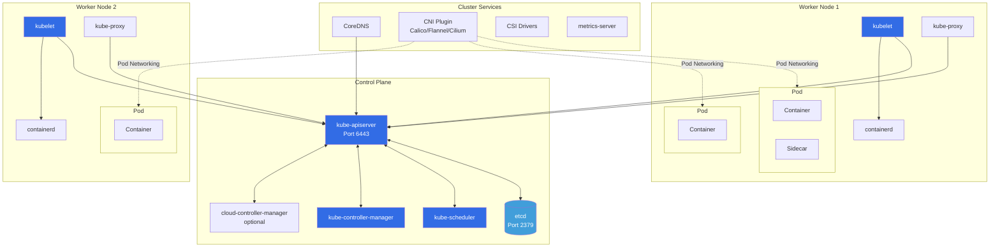
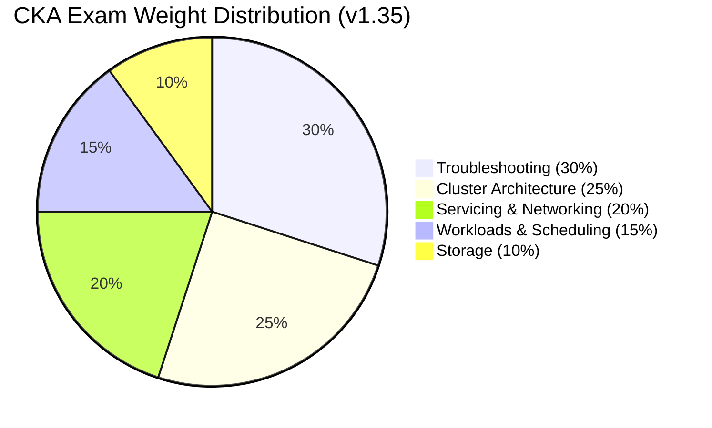
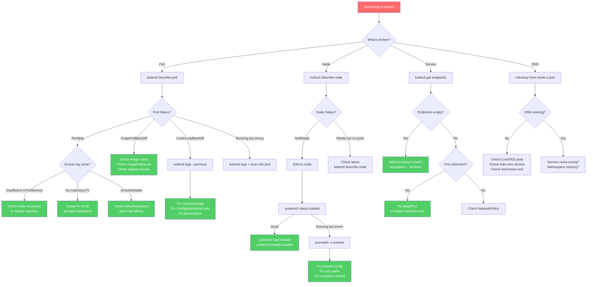

[](https://opensource.org/licenses/MIT)
[](http://makeapullrequest.com)
[]()
[]()
[]()

# CKA Certification Exam Guide 2026 — How to Pass the Certified Kubernetes Administrator

> CKA study guide with practice questions, exam tips, kubectl cheat sheet, and full v1.35 syllabus breakdown. Covers etcd backup, RBAC, kubeadm, Gateway API, NetworkPolicy, troubleshooting, and killer.sh prep. Updated March 2026.

<p align="center">
  
</p>

I took the CKA in March 2026 and scored 89%. Writing this while it's fresh — partly because I was frustrated with how many outdated guides are still floating around (dockershim references in 2026, come on) and partly because organizing my notes helped me retain what I learned.

The [CKA](https://www.cncf.io/certification/cka/) is a hands-on, terminal-based exam. 2 hours, roughly 17 tasks, no multiple choice. I prepped for about 5 weeks. This repo has my notes, the commands I actually used, YAML I wrote from memory, and the mistakes I made along the way.

> Blog version of these notes: [Pass the CKA Certification Exam](https://techwithmohamed.com/blog/cka-exam-study/)

If this was useful, a star helps others find it.

---

## CKA Exam Details — Cost, Duration, Passing Score, Format (March 2026)

| **CKA Exam Details**               | **Information**                                                                                                                                     |
|------------------------------------|-----------------------------------------------------------------------------------------------------------------------------------------------------|
| **Exam Type**                      | Performance-based (live terminal — NOT multiple choice)                                                                                             |
| **Exam Duration**                  | 2 hours                                                                                                                                             |
| **Passing Score**                  | 66% (one free retake included)                                                                                                                      |
| **Kubernetes Version on Exam**     | [Kubernetes v1.35](https://kubernetes.io/blog/2025/12/17/kubernetes-v1-35-release/) (Timbernetes — World Tree)                                       |
| **Certification Validity**         | 2 Years                                                                                                                                             |
| **Exam Cost**                      | $445 USD — check Linux Foundation site for coupons (30% off codes appear regularly; up to 50% during Black Friday / Cyber Monday)                   |
| **Exam Delivery**                  | PSI Bridge — remote proctored, browser-based                                                                                                        |
| **Allowed Resources During Exam**  | One browser tab open to kubernetes.io/docs, kubernetes.io/blog, and GitHub kubernetes repos only                                                   |
| **Number of Questions**            | ~15–20 performance tasks                                                                                                                            |
| **Cluster Contexts**               | Multiple clusters — you must switch context before each task                                                                                        |

> **Important**: The Linux Foundation occasionally updates the exam Kubernetes version. Always verify the current version at [training.linuxfoundation.org](https://training.linuxfoundation.org/certification/certified-kubernetes-administrator-cka/) before you register.

### How Much Does the CKA Exam Cost?

The CKA exam costs **$445 USD** (as of March 2026). That includes:
- One free retake if you fail (valid 12 months)
- Two killer.sh simulator sessions (each valid 36 hours)

I waited for a Linux Foundation **30% off** promotion and saved about $130. They run these a few times a year — check the [training site](https://training.linuxfoundation.org/certification/certified-kubernetes-administrator-cka/) for current deals. Black Friday / Cyber Monday discounts can go up to 50%. Bundle pricing (CKA + CKS or CKA + CKAD) also knocks 20–30% off.

### CKA vs CKAD vs CKS — Which Certification Should You Get First?

| | **CKA** (Administrator) | **CKAD** (Developer) | **CKS** (Security) |
|---|---|---|---|
| **Focus** | Cluster management, troubleshooting, infrastructure | Application development, pod design | Security hardening, vulnerability scanning |
| **Difficulty** | Medium-Hard | Medium | Hard (requires CKA first) |
| **Duration** | 2 hours | 2 hours | 2 hours |
| **Cost** | $445 | $445 | $445 |
| **Prerequisite** | None | None | Active CKA certification |
| **Best for** | DevOps engineers, SREs, platform teams | Developers deploying on K8s | Security engineers, compliance roles |
| **Typical order** | **Start here** | 2nd or do first if you're a dev | 3rd (requires CKA) |

> **Recommendation**: Most people should start with **CKA**. It gives you the broadest foundation. If you already deploy apps on Kubernetes daily, CKAD may feel easier first. CKS requires an active CKA, so you cannot skip it.

---
## What's New in Kubernetes v1.35 (Timbernetes) — What You Need to Know for the CKA

The CKA exam runs on Kubernetes **v1.35** as of March 2026. It was a big release — 60 enhancements. Here are the ones relevant to the exam:

| Feature                                      | Status in v1.35 | Why It Matters for CKA                                                                                                                        |
|----------------------------------------------|-----------------|-----------------------------------------------------------------------------------------------------------------------------------------------|
| **In-Place Pod Vertical Scaling**            | GA (Stable)     | Resize CPU/memory of a running Pod without restarting it — now fully stable. Expect resource management tasks using this.                     |
| **Sidecar Containers**                       | GA (Stable)     | Sidecars start before the main container and persist throughout the Pod lifecycle. Multi-container Pod questions reference this.               |
| **Fine-Grained Container Restart Rules**     | Beta            | Per-container `restartPolicyRules` — restart individual containers based on exit codes without recreating the Pod.                             |
| **OCI Artifact Volumes**                     | Beta (default)  | Mount OCI images as read-only volumes. Enabled by default in v1.35. Useful for tooling and init workflows.                                    |
| **User Namespaces for Pods**                 | Beta            | Isolates container UIDs from host UIDs. Improved support for stateful Pods via id-mapped mounts.                                              |
| **maxUnavailable for StatefulSets**          | Beta            | Configure how many StatefulSet Pods can be unavailable during rolling updates — speeds up stateful app updates.                               |
| **Gateway API (v1.4+)**                      | Standard        | HTTPRoute is the standard. Ingress NGINX is retired (March 2026). The exam **requires** GatewayClass, Gateway, and HTTPRoute knowledge.       |
| **Pod Certificates (Workload Identity)**     | Beta            | Native mTLS — kubelet generates certs and writes them to Pod filesystem. Relevant for security questions.                                     |
| **Configurable HPA Tolerance**               | Beta            | Set per-resource tolerance for HPA scaling sensitivity instead of the fixed 10% global default.                                               |
| **Deployment terminatingReplicas**           | Beta            | New status field showing Pods being terminated — improves rollout observability.                                                               |
| **Ingress NGINX Retired**                    | Removed         | Ingress NGINX is archived after March 2026. Migrate to Gateway API — exam questions now favor Gateway API over Ingress.                       |
| **cgroup v1 Removed**                        | Removed         | Kubelet requires cgroup v2. Nodes on old distros without cgroup v2 will fail. Know this for troubleshooting.                                  |
| **ipvs mode Deprecated**                     | Deprecated      | kube-proxy ipvs mode is deprecated — nftables is the recommended replacement.                                                                 |
| **KYAML**                                    | Beta (default)  | Safer YAML subset for Kubernetes — enabled by default. Less ambiguous than standard YAML.                                                     |
| **Enforced Image Pull Credentials**          | Beta (default)  | Kubelet verifies credentials for cached images — prevents unauthorized Pods from using private images on shared nodes.                         |

When I took the exam in March 2026, I saw Gateway API, Helm, and troubleshooting questions. Ingress NGINX retirement means Gateway API knowledge is no longer optional. Full changelog: [Kubernetes v1.35 CHANGELOG](https://github.com/kubernetes/kubernetes/blob/master/CHANGELOG/CHANGELOG-1.35.md)

---

## Table of Contents

- [CKA Exam Details — Cost, Duration, Passing Score, Format](#cka-exam-details--cost-duration-passing-score-format-march-2026)
  - [How Much Does the CKA Exam Cost?](#how-much-does-the-cka-exam-cost)
  - [CKA vs CKAD vs CKS — Which First?](#cka-vs-ckad-vs-cks--which-certification-should-you-get-first)
- [What's New in v1.35](#whats-new-in-kubernetes-v135-timbernetes--what-you-need-to-know-for-the-cka)
- [Before You Book the Exam](#before-you-book-the-exam)
- [Exam Environment Setup — PSI Tips](#exam-environment-setup--psi-tips)
- [The First 60 Seconds — Your Exam Startup Routine](#the-first-60-seconds--your-exam-startup-routine)
- [Bookmark These Docs Pages — What to Use During the CKA Exam](#bookmark-these-docs-pages--what-to-use-during-the-cka-exam)
- [CKA Cheat Sheet — kubectl Speed Tips and Aliases](#cka-cheat-sheet--kubectl-speed-tips--aliases)
- [CKA Exam Syllabus 2026](#cka-exam-syllabus-2026)
  - [Kubernetes Architecture Diagram](#kubernetes-cluster-architecture--visual-overview)
  - [1. Cluster Architecture, Installation & Configuration (25%)](#1-cluster-architecture-installation--configuration-25)
  - [2. Workloads & Scheduling (15%)](#2-workloads--scheduling-15)
  - [3. Servicing and Networking (20%)](#3-servicing-and-networking-20)
  - [4. Storage (10%)](#4-storage-10)
  - [5. Troubleshooting (30%)](#5-troubleshooting-30)
  - [Troubleshooting Decision Flowchart](#troubleshooting-decision-flowchart)
- [CKA Exam Day Strategy — Time Management Tips](#cka-exam-day-strategy--time-management-tips)
- [Common Mistakes That Fail CKA Candidates](#common-mistakes-that-fail-cka-candidates)
- [CKA Practice Scenarios with Solutions — Hands-On Labs](#cka-practice-scenarios-with-solutions--hands-on-labs)
- [CKA Exam-Style Practice Questions with Answers](#cka-exam-style-practice-questions-with-answers)
- [Real Candidate Feedback — Q4 2025 / Q1 2026](#real-candidate-feedback--q4-2025--q1-2026)
- [Practice Labs & Study Resources for CKA 2026](#practice-labs--study-resources-for-cka-2026)
- [killer.sh vs Real CKA Exam — Difficulty Comparison](#killersh-vs-real-cka-exam--difficulty-comparison)
- [CKA Exam Day Countdown Checklist](#cka-exam-day-countdown-checklist)
- [CKA Study Progress Tracker](#cka-study-progress-tracker)
- [YAML Skeleton Quick Reference](#yaml-skeleton-quick-reference--copy-modify-apply)
- [CKA Exam FAQ](#cka-exam-faq)

---

## Before You Book the Exam

I booked my exam two weeks before I was ready because Linux Foundation had a 30% off sale. Here's what I'd suggest before registering:

**1. Get comfortable with vim first.** The exam terminal doesn't support Ctrl+C/Ctrl+V the way you expect. I fumbled with paste on my first question and lost a few minutes. Practice writing YAML by hand.

**2. Do [killer.sh](https://killer.sh/cka) at least twice.** Two free sessions come with the exam purchase (each valid 36 hours). I scored 48% the first time and 78% a week later. killer.sh is harder than the real exam on purpose.

**3. Use Killercoda for free daily practice.** [killercoda.com/killer-shell-cka](https://killercoda.com/killer-shell-cka) — browser-based Kubernetes playground, no local setup required.

**4. Read the Candidate Handbook.** The Linux Foundation publishes a Candidate Handbook. Understand what IDs are accepted, what you can have in the room, and how the PSI check-in process works before exam day.

**5. Schedule your exam at your best time of day.** I booked mine at 9 AM on a Saturday. If you're a night owl, don't book early morning.

**6. Clean your room the night before.** The proctor asked me to unplug my second monitor and remove a sticky note from my desk before starting. Clear your desk the night before to avoid delays.

**7. Learn where things are in the docs, not just what they say.** You get one tab open to kubernetes.io/docs during the exam. If you've never navigated those pages under pressure, you'll waste time. The Tasks section has the most copy-paste-friendly YAML.

---

## Exam Environment Setup — PSI Tips

The exam runs inside a **remote desktop** hosted by PSI — a Linux desktop in your browser. Here's the setup:

- You open the PSI Secure Browser on your machine.
- The proctor checks your ID and room via webcam.
- You get dropped into a remote Linux desktop with a terminal and a Firefox browser pointed at kubernetes.io/docs.
- The terminal has access to multiple Kubernetes clusters (usually 5–7 clusters across the questions).
- Every question includes a context switch command like `kubectl config use-context k8s` — **run this before you do anything else in that question**.

**Things that tripped me up:**

- Copy/paste uses `Ctrl+Shift+C` / `Ctrl+Shift+V` — NOT `Ctrl+C/V`. I hit Ctrl+C thinking I was copying and killed a running process.
- The connection will lag at some point. Don't retype the same command — just wait.
- You get one terminal tab by default — try `Ctrl+Alt+T` to open a second one. Having two terminals open saved me on the etcd question.
- `mousepad` is available as a text editor if you hate vim, but honestly just learn vim. Under pressure, fewer tools = fewer mistakes.
- Don't use `tmux` unless you literally use it every day at work. I watched a YouTuber recommend it and spent 10 minutes in practice fighting with tmux instead of solving questions.

**Allowed documentation during the exam:**

- kubernetes.io/docs
- kubernetes.io/blog
- GitHub repos under the `kubernetes` organization

That is it. No Stack Overflow, no Medium, no your own notes.

Pro tip: search on kubernetes.io/docs and click the **Tasks** result, not Concepts. Tasks pages have ready-to-use YAML.

---

## The First 60 Seconds — Your Exam Startup Routine

Before you touch Question 1, run this setup. It takes about 30 seconds and you'll use these aliases constantly.

```bash
# 1. Set aliases (your best friend for 2 hours)
alias k=kubectl
export do='--dry-run=client -o yaml'
export now='--force --grace-period=0'

# 2. Enable tab completion
source <(kubectl completion bash)
complete -F __start_kubectl k

# 3. Fix vim for YAML editing
cat << 'EOF' >> ~/.vimrc
set expandtab
set tabstop=2
set shiftwidth=2
set number
EOF

# 4. Verify everything works
k get nodes
```

That's it. Don't overthink it. Don't try to set up tmux. Don't customize your bash prompt. Just these 4 steps, then start solving.

I practiced this sequence every morning during my study weeks so I could type it without thinking on exam day.

---

## Bookmark These Docs Pages — What to Use During the CKA Exam

You can't bookmark in the exam browser, but you can memorize where things are. These are the kubernetes.io pages I actually used during the exam:

| What You Need | Exact Page to Search For | Why |
|---|---|---|
| NetworkPolicy YAML | Search: `network policy` → click **Tasks** result | The example has ingress + egress + DNS egress ready to copy |
| PV / PVC YAML | Search: `persistent volume` → **Tasks** > Configure a Pod to Use a PersistentVolume | Complete PV → PVC → Pod chain |
| Gateway API HTTPRoute | Search: `gateway api` → or go to `gateway-api.sigs.k8s.io` | GatewayClass + Gateway + HTTPRoute examples |
| RBAC | Search: `rbac` → **Using RBAC Authorization** | Role, ClusterRole, bindings — all there |
| Taints & Tolerations | Search: `taints` → first result | Copy the toleration YAML block |
| Node Affinity | Search: `assign pod node` → **Assign Pods to Nodes** | nodeSelector + affinity examples |
| etcd backup | Search: `etcd` → **Operating etcd clusters** | Has the exact `etcdctl snapshot save` command with flags |
| kubeadm upgrade | Search: `kubeadm upgrade` → first result | Step-by-step upgrade procedure |
| StatefulSet | Search: `statefulset` → **Tutorials** result | volumeClaimTemplates example |
| HPA | Search: `horizontal pod autoscaler` → **Tasks** result | Full HPA YAML with metrics |
| Ingress | Search: `ingress` → **Concepts** > Ingress | TLS + path-based routing examples |
| Sidecar containers | Search: `sidecar` → first result | The `restartPolicy: Always` initContainer syntax |
| Resource Quotas | Search: `resource quota` → first result | LimitRange + ResourceQuota YAML |

> The **Tasks** section usually has better copy-paste YAML than **Concepts**.

---

## CKA Cheat Sheet — kubectl Speed Tips & Aliases

These aliases save a lot of typing. Set them up in the first 30 seconds of the exam.

### Step 1 — Set Aliases and Environment (type this first thing)

```bash
alias k=kubectl
export do='--dry-run=client -o yaml'
export now='--force --grace-period=0'
source <(kubectl completion bash)
complete -F __start_kubectl k
```

That is the minimum. Now `k get pods -A` works, and `k delete pod mypod $now` kills pods instantly without the 30-second wait.

### Step 2 — Configure vim for YAML

```bash
cat << 'EOF' >> ~/.vimrc
set expandtab
set tabstop=2
set shiftwidth=2
set number
EOF
```

Without this, a single Tab key in vim breaks YAML indentation. This is one of the most common silent failures — your YAML looks right but fails with an indentation error.

### Step 3 — Know How to Generate YAML Without Typing It

```bash
# Pod
k run nginx --image=nginx $do > pod.yaml

# Deployment
k create deployment nginx --image=nginx --replicas=3 $do > deploy.yaml

# Service (expose existing deployment)
k expose deployment nginx --port=80 $do > svc.yaml

# ConfigMap
k create configmap app-cfg --from-literal=ENV=prod $do > cm.yaml

# Secret
k create secret generic app-sec --from-literal=password=1234 $do > sec.yaml

# ServiceAccount
k create serviceaccount app-sa $do > sa.yaml

# Role
k create role pod-reader --verb=get,list,watch --resource=pods $do > role.yaml

# RoleBinding
k create rolebinding bind-reader --role=pod-reader --serviceaccount=default:app-sa $do > rb.yaml

# ClusterRole
k create clusterrole node-reader --verb=get,list --resource=nodes $do > cr.yaml

# ClusterRoleBinding
k create clusterrolebinding bind-node-reader --clusterrole=node-reader --serviceaccount=default:app-sa $do > crb.yaml

# Job
k create job hello --image=busybox -- echo hello $do > job.yaml

# CronJob
k create cronjob hello --image=busybox --schedule="*/1 * * * *" -- echo hello $do > cj.yaml
```

You generate the scaffold, edit the 2-3 fields you need, then `k apply -f`. This is 10x faster than writing YAML from scratch.

### Essential kubectl Commands for the Exam

```bash
# Context management — run BEFORE every question
kubectl config use-context <context-name>
kubectl config current-context

# Explore what a field means
kubectl explain pod.spec.containers.resources
kubectl explain pod.spec --recursive | grep -A 3 tolerations

# Watch pods in real-time
kubectl get pods -w

# Get all resources in all namespaces
kubectl get all -A

# Check RBAC permissions
kubectl auth can-i create pods --as=system:serviceaccount:dev:my-sa -n dev

# Get events sorted by time (best for debugging)
kubectl get events --sort-by='.lastTimestamp' -n <namespace>

# Force delete a stuck pod immediately
kubectl delete pod stuck-pod --force --grace-period=0

# Copy files from/to a pod
kubectl cp mynamespace/mypod:/var/log/app.log ./app.log

# Port forward to test a service
kubectl port-forward svc/my-service 8080:80

# Resource usage (requires metrics-server)
kubectl top pods --sort-by=cpu
kubectl top nodes

# Get pod on a specific node
kubectl get pods -o wide --field-selector spec.nodeName=node1

# Label a node
kubectl label node worker1 disktype=ssd

# Taint a node
kubectl taint nodes worker1 key=value:NoSchedule

# Remove a taint
kubectl taint nodes worker1 key=value:NoSchedule-
```

---

## CKA Exam Syllabus 2026

This follows the [official CKA Curriculum v1.35](https://github.com/cncf/curriculum/blob/master/CKA_Curriculum_v1.35.pdf). Troubleshooting (30%) and Cluster Architecture (25%) together make up over half the exam, so I spent most of my study time there.

### Kubernetes Cluster Architecture — Visual Overview

Here's the architecture diagram I kept coming back to while studying:



**What to remember:**
- **Everything talks to the API server** — kubelet, scheduler, controller-manager, kubectl, even etcd only talks through the API
- **kubelet runs on EVERY node** (control plane included) — it manages pods as static pods on the control plane, that's how kube-apiserver/etcd/scheduler run
- **etcd is the ONLY stateful component** — that's why backup/restore is tested so heavily
- **kube-proxy runs as a DaemonSet** — one per node, handles Service routing rules (iptables/nftables)
- **CoreDNS is a Deployment** (usually 2 replicas) — resolves `service-name.namespace.svc.cluster.local`

### CKA Domain Weight Map



> Troubleshooting + Cluster Architecture = 55% of your score. If you're short on time, focus there.

---

### 1. Cluster Architecture, Installation & Configuration (25%)

25% of the exam. I got questions on etcd backup and a kubeadm upgrade. RBAC, kubeadm, etcd, and Helm are the core topics here.

#### 1.1 — Manage Role-Based Access Control (RBAC)

RBAC trips people up because of the Role vs ClusterRole vs RoleBinding vs ClusterRoleBinding combinations. On killer.sh I used `ClusterRole` in a `roleRef` but forgot you can bind a ClusterRole with a RoleBinding to scope it to a namespace.

**Core concepts:**
- **Role**: grants permissions within a single namespace
- **ClusterRole**: grants permissions cluster-wide (or can be bound per-namespace with RoleBinding)
- **RoleBinding**: binds a Role or ClusterRole to a user/group/serviceaccount in a namespace
- **ClusterRoleBinding**: binds a ClusterRole cluster-wide

```yaml
# Role — allow read access to pods in "dev" namespace
apiVersion: rbac.authorization.k8s.io/v1
kind: Role
metadata:
  name: pod-reader
  namespace: dev
rules:
- apiGroups: [""]
  resources: ["pods"]
  verbs: ["get", "list", "watch"]
---
# RoleBinding — bind the Role to a ServiceAccount
apiVersion: rbac.authorization.k8s.io/v1
kind: RoleBinding
metadata:
  name: read-pods-binding
  namespace: dev
subjects:
- kind: ServiceAccount
  name: app-sa
  namespace: dev
roleRef:
  kind: Role
  name: pod-reader
  apiGroup: rbac.authorization.k8s.io
```

**Quick imperative commands:**
```bash
# Create a Role
k create role pod-reader --verb=get,list,watch --resource=pods -n dev

# Create a RoleBinding
k create rolebinding read-pods --role=pod-reader --serviceaccount=dev:app-sa -n dev

# Check if a ServiceAccount can do something
k auth can-i list pods --as=system:serviceaccount:dev:app-sa -n dev

# Check which roles exist
k get roles,rolebindings -n dev
```

#### 1.2 — Prepare Underlying Infrastructure for Installing a Kubernetes Cluster

Before you even touch kubeadm, the node needs to be ready. I learned this the hard way on killercoda when my cluster init kept failing because I forgot to load kernel modules. Here's the checklist:
- Container runtime (containerd v2.0+ is the standard — v1.35 is the **last release** to support containerd v1.x)
- Proper kernel modules (`overlay`, `br_netfilter`)
- Sysctl settings (`net.bridge.bridge-nf-call-iptables = 1`)
- Disable swap (`sudo swapoff -a`)
- cgroup v2 is **required** — cgroup v1 support removed in v1.35

```bash
# Load required kernel modules
cat <<EOF | sudo tee /etc/modules-load.d/k8s.conf
overlay
br_netfilter
EOF
sudo modprobe overlay
sudo modprobe br_netfilter

# Set required sysctl params
cat <<EOF | sudo tee /etc/sysctl.d/k8s.conf
net.bridge.bridge-nf-call-iptables  = 1
net.bridge.bridge-nf-call-ip6tables = 1
net.ipv4.ip_forward                 = 1
EOF
sudo sysctl --system

# Disable swap
sudo swapoff -a
# Remove swap entry from /etc/fstab to make it permanent
```

#### 1.3 — Create and Manage Kubernetes Clusters Using kubeadm

This showed up on my exam. Not the full init-from-scratch, but joining a worker node to an existing cluster. Still — practice the full flow because you never know.

**Control plane init:**
```bash
# Initialize the control plane
sudo kubeadm init \
  --pod-network-cidr=10.244.0.0/16 \
  --apiserver-advertise-address=<CONTROL_PLANE_IP> \
  --kubernetes-version=v1.35.0

# Set up kubeconfig (run as non-root user)
mkdir -p $HOME/.kube
sudo cp -i /etc/kubernetes/admin.conf $HOME/.kube/config
sudo chown $(id -u):$(id -g) $HOME/.kube/config
```

**Worker node join:**
```bash
# On the worker node — use the join command from kubeadm init output
sudo kubeadm join <CONTROL_PLANE_IP>:6443 \
  --token <token> \
  --discovery-token-ca-cert-hash sha256:<hash>

# If token expired, generate a new one on control plane
kubeadm token create --print-join-command
```

**Install a CNI plugin (required for pods to communicate):**
```bash
# Flannel
kubectl apply -f https://github.com/flannel-io/flannel/releases/latest/download/kube-flannel.yml

# Or Calico
kubectl apply -f https://raw.githubusercontent.com/projectcalico/calico/v3.28.0/manifests/calico.yaml
```

#### 1.4 — Manage the Lifecycle of Kubernetes Clusters

etcd backup comes up consistently on the exam. The upgrade flow is also common — I got one going from v1.34 to v1.35.

**Upgrade control plane (upgrade kubeadm first, then kubelet):**
```bash
# Check available versions
sudo apt-cache madison kubeadm

# Upgrade kubeadm
sudo apt-get update
sudo apt-get install -y kubeadm=1.35.0-1.1
sudo kubeadm upgrade plan
sudo kubeadm upgrade apply v1.35.0

# Upgrade kubelet and kubectl
sudo apt-get install -y kubelet=1.35.0-1.1 kubectl=1.35.0-1.1
sudo systemctl daemon-reload
sudo systemctl restart kubelet
```

**Upgrade worker node:**
```bash
# On control plane — drain the worker
kubectl drain worker1 --ignore-daemonsets --delete-emptydir-data

# On the worker node
sudo apt-get update
sudo apt-get install -y kubeadm=1.35.0-1.1
sudo kubeadm upgrade node
sudo apt-get install -y kubelet=1.35.0-1.1
sudo systemctl daemon-reload
sudo systemctl restart kubelet

# On control plane — uncordon the worker
kubectl uncordon worker1
```

**Backup etcd** (almost guaranteed on the exam):
```bash
ETCDCTL_API=3 etcdctl snapshot save /tmp/etcd-backup.db \
  --endpoints=https://127.0.0.1:2379 \
  --cacert=/etc/kubernetes/pki/etcd/ca.crt \
  --cert=/etc/kubernetes/pki/etcd/server.crt \
  --key=/etc/kubernetes/pki/etcd/server.key
```

**Verify backup:**
```bash
ETCDCTL_API=3 etcdctl snapshot status /tmp/etcd-backup.db --write-table
```

**Restore etcd:**
```bash
# Stop the API server (move static pod manifest)
sudo mv /etc/kubernetes/manifests/kube-apiserver.yaml /tmp/

# Restore from snapshot
ETCDCTL_API=3 etcdctl snapshot restore /tmp/etcd-backup.db \
  --data-dir=/var/lib/etcd-restored \
  --cacert=/etc/kubernetes/pki/etcd/ca.crt \
  --cert=/etc/kubernetes/pki/etcd/server.crt \
  --key=/etc/kubernetes/pki/etcd/server.key

# Update etcd static pod to use new data directory
# Edit /etc/kubernetes/manifests/etcd.yaml → change --data-dir to /var/lib/etcd-restored
# Also update the hostPath volume mount to point to the new directory

# Restart API server
sudo mv /tmp/kube-apiserver.yaml /etc/kubernetes/manifests/
```

> **Tip**: Find certificate paths by inspecting the etcd pod: `kubectl describe pod etcd-controlplane -n kube-system`

#### 1.5 — Implement and Configure a Highly-Available Control Plane

Focus on stacked etcd (etcd on every control plane node) — that's the typical exam topology. But know the difference between stacked and external etcd:

- Multiple control plane nodes behind a load balancer (e.g., HAProxy, kube-vip)
- `kubeadm join --control-plane --certificate-key <key>` to add additional control plane nodes
- etcd cluster health check: `etcdctl endpoint health --cluster`
- The `--upload-certs` flag on `kubeadm init` to simplify adding control plane nodes

```bash
# Initialize HA cluster (first control plane node)
sudo kubeadm init \
  --control-plane-endpoint="LOAD_BALANCER_IP:6443" \
  --upload-certs \
  --pod-network-cidr=10.244.0.0/16

# Join additional control plane node
sudo kubeadm join LOAD_BALANCER_IP:6443 \
  --token <token> \
  --discovery-token-ca-cert-hash sha256:<hash> \
  --control-plane \
  --certificate-key <key>
```

#### 1.6 — Use Helm and Kustomize to Install Cluster Components

Helm was moved from Workloads to Cluster Architecture in v1.35 — check the [latest curriculum PDF](https://github.com/cncf/curriculum) to make sure you're studying the right version. You need to know install, upgrade, rollback, and how to show chart values.

**Helm:**
```bash
# Add a repository
helm repo add bitnami https://charts.bitnami.com/bitnami
helm repo update

# Search for a chart
helm search repo bitnami/nginx

# Install a release
helm install my-release bitnami/nginx

# List installed releases
helm list
helm list -A    # all namespaces

# Upgrade a release with new values
helm upgrade my-release bitnami/nginx --set replicaCount=3

# Rollback to previous revision
helm rollback my-release 1

# Uninstall
helm uninstall my-release

# Show chart values (useful during exam)
helm show values bitnami/nginx
```

**Kustomize (built into kubectl):**
```bash
# Apply with Kustomize
kubectl apply -k ./overlays/production/

# Preview what Kustomize generates
kubectl kustomize ./base/

# Pipe to apply
kubectl kustomize ./base/ | kubectl apply -f -
```

#### 1.7 — Understand Extension Interfaces (CNI, CSI, CRI, etc.)

On the exam this is practical: "the cluster has no CNI installed, nodes are NotReady, fix it" type questions. Here's what each interface does:

| Interface | Purpose | Examples |
|-----------|---------|----------|
| **CNI** (Container Network Interface) | Pod-to-pod networking + NetworkPolicy | Flannel, Calico, Cilium, Weave |
| **CSI** (Container Storage Interface) | Dynamic storage provisioning | AWS EBS CSI, GCE PD CSI, NFS CSI |
| **CRI** (Container Runtime Interface) | Container lifecycle management | containerd (standard), CRI-O |

```bash
# Check which CNI is installed
ls /etc/cni/net.d/
cat /etc/cni/net.d/*.conflist

# Check container runtime
crictl info
kubectl get nodes -o wide    # shows CONTAINER-RUNTIME column

# Check CSI drivers
kubectl get csidrivers
kubectl get csinodes
```

> **v1.35 note**: containerd v2.0+ is required going forward. v1.35 is the last release supporting containerd v1.x. The `ipvs` mode in kube-proxy is deprecated — `nftables` is now recommended.

#### 1.8 — Understand CRDs, Install and Configure Operators

This wasn't on older CKA exams but was added in v1.35. I didn't get a CRD question, but others in my study group did — one had to create a custom resource from an existing CRD.

```bash
# List existing CRDs in the cluster
kubectl get crds

# Describe a CRD
kubectl describe crd <crd-name>

# Get custom resources
kubectl get <custom-resource-kind>
```

**Create a simple CRD:**
```yaml
apiVersion: apiextensions.k8s.io/v1
kind: CustomResourceDefinition
metadata:
  name: backups.stable.example.com
spec:
  group: stable.example.com
  versions:
  - name: v1
    served: true
    storage: true
    schema:
      openAPIV3Schema:
        type: object
        properties:
          spec:
            type: object
            properties:
              schedule:
                type: string
              database:
                type: string
  scope: Namespaced
  names:
    plural: backups
    singular: backup
    kind: Backup
    shortNames:
    - bk
```

**Create a custom resource instance:**
```yaml
apiVersion: stable.example.com/v1
kind: Backup
metadata:
  name: daily-backup
spec:
  schedule: "0 2 * * *"
  database: production-db
```

**Operators** = CRD + Controller. They automate day-2 operations (backup, scaling, upgrades). On the exam you may need to:
- Install an operator via `kubectl apply -f` (or Helm)
- Create custom resources that the operator manages
- Inspect operator pods in the namespace where it is deployed

```bash
# Install an operator (example: cert-manager)
kubectl apply -f https://github.com/cert-manager/cert-manager/releases/download/v1.16.0/cert-manager.yaml

# Verify operator is running
kubectl get pods -n cert-manager

# Use the custom resources it provides
kubectl get certificates,issuers,clusterissuers
```

---

### 2. Workloads & Scheduling (15%)

15% — smaller weight, but killer.sh had a rolling update strategy question about `maxUnavailable` that I'd never set manually before. Know the YAML details, not just the imperative commands.

#### 2.1 — Understand Application Deployments and How to Perform Rolling Updates and Rollbacks

```bash
# Create a deployment
k create deployment webapp --image=nginx:1.24 --replicas=3

# Update the image (triggers rolling update)
k set image deployment/webapp nginx=nginx:1.25

# Check rollout status
k rollout status deployment/webapp

# View rollout history
k rollout history deployment/webapp

# Rollback to previous version
k rollout undo deployment/webapp

# Rollback to a specific revision
k rollout undo deployment/webapp --to-revision=2

# Scale
k scale deployment/webapp --replicas=5
```

**Deployment strategy in YAML:**
```yaml
apiVersion: apps/v1
kind: Deployment
metadata:
  name: webapp
spec:
  replicas: 3
  strategy:
    type: RollingUpdate
    rollingUpdate:
      maxSurge: 1
      maxUnavailable: 0
  selector:
    matchLabels:
      app: webapp
  template:
    metadata:
      labels:
        app: webapp
    spec:
      containers:
      - name: webapp
        image: nginx:1.25
        resources:
          requests:
            cpu: 100m
            memory: 128Mi
          limits:
            cpu: 250m
            memory: 256Mi
```

#### 2.2 — Use ConfigMaps and Secrets to Configure Applications

**ConfigMap:**
```bash
# From literal
k create configmap app-config --from-literal=DB_HOST=mysql --from-literal=DB_PORT=3306

# From file
k create configmap nginx-conf --from-file=nginx.conf
```

```yaml
# Use ConfigMap as env variables
spec:
  containers:
  - name: app
    image: myapp:v1
    envFrom:
    - configMapRef:
        name: app-config
    # Or individual keys:
    env:
    - name: DATABASE_HOST
      valueFrom:
        configMapKeyRef:
          name: app-config
          key: DB_HOST
```

**Secret:**
```bash
k create secret generic db-creds --from-literal=username=admin --from-literal=password=s3cret
```

```yaml
# Mount Secret as a volume
spec:
  containers:
  - name: app
    image: myapp:v1
    volumeMounts:
    - name: secret-vol
      mountPath: /etc/secrets
      readOnly: true
  volumes:
  - name: secret-vol
    secret:
      secretName: db-creds
```

#### 2.3 — Configure Workload Autoscaling

HPA comes up. I got a simple one — just `kubectl autoscale` — but I've heard from others who had to write the full YAML with multiple metrics. Practice both ways. Note: v1.35 added configurable HPA tolerance (Beta) so you can fine-tune scaling sensitivity per resource, but I doubt they'll test the beta stuff.

```bash
# Create HPA imperatively — requires metrics-server
k autoscale deployment webapp --min=2 --max=10 --cpu-percent=80

# Check HPA status
k get hpa
k describe hpa webapp
```

**HPA in YAML (autoscaling/v2):**
```yaml
apiVersion: autoscaling/v2
kind: HorizontalPodAutoscaler
metadata:
  name: webapp-hpa
spec:
  scaleTargetRef:
    apiVersion: apps/v1
    kind: Deployment
    name: webapp
  minReplicas: 2
  maxReplicas: 10
  metrics:
  - type: Resource
    resource:
      name: cpu
      target:
        type: Utilization
        averageUtilization: 80
  - type: Resource
    resource:
      name: memory
      target:
        type: Utilization
        averageUtilization: 75
```

**Manual scaling** (also valid):
```bash
k scale deployment webapp --replicas=5
```

#### 2.4 — Understand the Primitives Used to Create Robust, Self-Healing, Application Deployments

Quick mental model:
- **ReplicaSet**: Ensures N pods are running (managed by Deployment — rarely created directly)
- **Deployment**: Manages ReplicaSets, provides rolling updates
- **DaemonSet**: Runs one pod per node (logging agents, monitoring)
- **StatefulSet**: For stateful apps needing stable network identity and persistent storage
- **Job**: Run-to-completion tasks
- **CronJob**: Scheduled Jobs

**DaemonSet example:**
```yaml
apiVersion: apps/v1
kind: DaemonSet
metadata:
  name: log-agent
  namespace: kube-system
spec:
  selector:
    matchLabels:
      app: log-agent
  template:
    metadata:
      labels:
        app: log-agent
    spec:
      tolerations:
      - key: node-role.kubernetes.io/control-plane
        effect: NoSchedule
      containers:
      - name: fluentd
        image: fluentd:v1.16
        resources:
          limits:
            memory: 200Mi
          requests:
            cpu: 100m
            memory: 200Mi
```

**Multi-container Pods: Init, Sidecar, and Ephemeral Containers:**

Init container (runs before main container starts):
```yaml
spec:
  initContainers:
  - name: init-db
    image: busybox
    command: ['sh', '-c', 'until nslookup mysql; do echo waiting; sleep 2; done']
  containers:
  - name: app
    image: myapp:v1
```

Sidecar container (GA since v1.33) — uses `restartPolicy: Always` inside initContainers:
```yaml
spec:
  initContainers:
  - name: log-sidecar
    image: fluentd:v1.16
    restartPolicy: Always    # This makes it a sidecar — starts before main, runs for Pod lifetime
  containers:
  - name: app
    image: myapp:v1
```

Ephemeral containers (for debugging — stable since v1.33):
```bash
# Attach a debug container to a running pod
kubectl debug -it pod/myapp --image=busybox --target=app

# Create a copy with a debug container
kubectl debug pod/myapp -it --copy-to=debug-pod --image=ubuntu --share-processes
```

#### 2.5 — Configure Pod Admission and Scheduling (Limits, Node Affinity, etc.)

The curriculum merges resource limits, node affinity, taints, and tolerations into one bullet point — but on the exam, they feel like separate questions. I got a taints+tolerations question AND a separate resource limits question. Practice all of them.

**Resource requests and limits:**
```yaml
spec:
  containers:
  - name: app
    image: myapp:v1
    resources:
      requests:        # scheduler uses this to find a node
        cpu: 250m
        memory: 128Mi
      limits:          # kubelet enforces this ceiling
        cpu: 500m
        memory: 256Mi
```

- **requests**: minimum guaranteed resources — the scheduler uses requests to decide where to place the pod
- **limits**: maximum allowed — exceeding memory limit → OOMKilled, exceeding CPU → throttled
- A pod stays Pending if no node has enough allocatable resources to satisfy its requests

**LimitRange** (set defaults per namespace):
```yaml
apiVersion: v1
kind: LimitRange
metadata:
  name: default-limits
  namespace: dev
spec:
  limits:
  - default:
      cpu: 500m
      memory: 256Mi
    defaultRequest:
      cpu: 100m
      memory: 128Mi
    type: Container
```

**ResourceQuota** (cap total usage per namespace):
```yaml
apiVersion: v1
kind: ResourceQuota
metadata:
  name: dev-quota
  namespace: dev
spec:
  hard:
    requests.cpu: "4"
    requests.memory: 8Gi
    limits.cpu: "8"
    limits.memory: 16Gi
    pods: "20"
```

**NodeSelector (simplest scheduling constraint):**
```yaml
spec:
  nodeSelector:
    disktype: ssd
```

**Node Affinity (more expressive):**
```yaml
spec:
  affinity:
    nodeAffinity:
      requiredDuringSchedulingIgnoredDuringExecution:
        nodeSelectorTerms:
        - matchExpressions:
          - key: disktype
            operator: In
            values:
            - ssd
```

**Taints and Tolerations:**
```bash
# Taint a node — prevents pods without matching toleration
kubectl taint nodes worker1 dedicated=gpu:NoSchedule

# Remove the taint
kubectl taint nodes worker1 dedicated=gpu:NoSchedule-
```

```yaml
# Toleration in pod spec — allows scheduling on tainted node
spec:
  tolerations:
  - key: "dedicated"
    operator: "Equal"
    value: "gpu"
    effect: "NoSchedule"
```

**Pod Topology Spread Constraints:**
```yaml
spec:
  topologySpreadConstraints:
  - maxSkew: 1
    topologyKey: kubernetes.io/hostname
    whenUnsatisfiable: DoNotSchedule
    labelSelector:
      matchLabels:
        app: web
```

---

### 3. Servicing and Networking (20%)

Networking was my weak spot. I got every NetworkPolicy question wrong on my first killer.sh attempt — usually because of a single indent breaking the policy. I ended up writing NetworkPolicies by hand repeatedly until the YAML stuck.

#### 3.1 — Understand Connectivity Between Pods

- Every pod gets a unique IP address
- Pods can communicate directly with any other pod without NAT (flat network model)
- The CNI plugin handles pod-to-pod networking across nodes
- Pods get IPs from the pod CIDR (e.g., `10.244.0.0/16`)
- Services get IPs from the service CIDR (e.g., `10.96.0.0/12`)
- **CoreDNS** resolves service names to cluster IPs
- Service DNS format: `<service-name>.<namespace>.svc.cluster.local`
- Pod DNS format: `<pod-ip-dashed>.<namespace>.pod.cluster.local`

Useful debug commands:
```bash
# Check node networking
ip addr show
ip route

# DNS resolution inside a pod
kubectl exec -it mypod -- nslookup kubernetes.default
kubectl exec -it mypod -- cat /etc/resolv.conf

# Check kube-proxy mode
kubectl get configmap kube-proxy -n kube-system -o yaml | grep mode
```

#### 3.2 — Define and Enforce Network Policies

NetworkPolicies control traffic flow between pods. By default, all pods accept all traffic. A NetworkPolicy acts as a firewall.

```yaml
# Allow traffic to "api" pods only from "frontend" pods on port 8080
apiVersion: networking.k8s.io/v1
kind: NetworkPolicy
metadata:
  name: api-allow-frontend
  namespace: production
spec:
  podSelector:
    matchLabels:
      app: api
  policyTypes:
  - Ingress
  - Egress
  ingress:
  - from:
    - podSelector:
        matchLabels:
          app: frontend
    ports:
    - protocol: TCP
      port: 8080
  egress:
  - to:
    - podSelector:
        matchLabels:
          app: database
    ports:
    - protocol: TCP
      port: 5432
  - to:                    # Allow DNS
    - namespaceSelector: {}
    ports:
    - protocol: UDP
      port: 53
```

**Default deny all ingress in a namespace:**
```yaml
apiVersion: networking.k8s.io/v1
kind: NetworkPolicy
metadata:
  name: default-deny-ingress
  namespace: production
spec:
  podSelector: {}
  policyTypes:
  - Ingress
```

> **Critical**: Always allow DNS egress (port 53 UDP) in your NetworkPolicies, otherwise pods cannot resolve service names. This is the #1 NetworkPolicy gotcha on the exam.

#### 3.3 — Use ClusterIP, NodePort, LoadBalancer Service Types and Endpoints

```yaml
# ClusterIP (default — internal only)
apiVersion: v1
kind: Service
metadata:
  name: backend-svc
spec:
  type: ClusterIP
  selector:
    app: backend
  ports:
  - port: 80
    targetPort: 8080
---
# NodePort (exposes on every node's IP at a static port)
apiVersion: v1
kind: Service
metadata:
  name: webapp-nodeport
spec:
  type: NodePort
  selector:
    app: webapp
  ports:
  - port: 80
    targetPort: 8080
    nodePort: 30080    # Range: 30000-32767
---
# LoadBalancer (provisions external LB — cloud only)
apiVersion: v1
kind: Service
metadata:
  name: webapp-lb
spec:
  type: LoadBalancer
  selector:
    app: webapp
  ports:
  - port: 80
    targetPort: 8080
```

**Endpoints** — verify that a Service has backends:
```bash
k get endpoints <service-name>
# Empty endpoints → selector doesn't match pod labels

k expose deployment webapp --type=NodePort --port=80 --target-port=8080 --name=webapp-np
```

#### 3.4 — Use the Gateway API to Manage Ingress Traffic

Gateway API is the successor to Ingress. With Ingress NGINX retired in March 2026, Gateway API is the primary way to handle HTTP routing. On v1.35, `HTTPRoute` is standard channel (Gateway API v1.4+). The exam **requires** this.

```yaml
# GatewayClass — defines the controller
apiVersion: gateway.networking.k8s.io/v1
kind: GatewayClass
metadata:
  name: example-gc
spec:
  controllerName: example.com/gateway-controller
---
# Gateway — the actual listener
apiVersion: gateway.networking.k8s.io/v1
kind: Gateway
metadata:
  name: my-gateway
  namespace: default
spec:
  gatewayClassName: example-gc
  listeners:
  - name: http
    protocol: HTTP
    port: 80
---
# HTTPRoute — routing rules
apiVersion: gateway.networking.k8s.io/v1
kind: HTTPRoute
metadata:
  name: app-route
  namespace: default
spec:
  parentRefs:
  - name: my-gateway
  hostnames:
  - "app.example.com"
  rules:
  - matches:
    - path:
        type: PathPrefix
        value: /api
    backendRefs:
    - name: api-svc
      port: 80
  - matches:
    - path:
        type: PathPrefix
        value: /
    backendRefs:
    - name: frontend-svc
      port: 80
```

#### 3.5 — Know How to Use Ingress Controllers and Ingress Resources

**Ingress** is still in the curriculum alongside Gateway API. Ingress provides HTTP(S) routing to services based on host/path rules. Requires an Ingress Controller to be installed.

> **Note**: Ingress NGINX was retired in March 2026. For the exam, you may still see Ingress resources but Gateway API is the recommended path forward.

```yaml
apiVersion: networking.k8s.io/v1
kind: Ingress
metadata:
  name: app-ingress
  annotations:
    nginx.ingress.kubernetes.io/rewrite-target: /
spec:
  ingressClassName: nginx
  rules:
  - host: app.example.com
    http:
      paths:
      - path: /api
        pathType: Prefix
        backend:
          service:
            name: api-svc
            port:
              number: 80
      - path: /
        pathType: Prefix
        backend:
          service:
            name: frontend-svc
            port:
              number: 80
  tls:
  - hosts:
    - app.example.com
    secretName: tls-secret
```

#### 3.6 — Understand and Use CoreDNS

CoreDNS runs as a Deployment in `kube-system` namespace. Its config is in a ConfigMap named `coredns`.

```bash
# Check CoreDNS pods
k get pods -n kube-system -l k8s-app=kube-dns

# View CoreDNS configuration
k get configmap coredns -n kube-system -o yaml

# Test DNS from inside a pod
k run dns-test --image=busybox --rm -it --restart=Never -- nslookup kubernetes.default
```

If DNS is broken, check:
1. CoreDNS pods running?
2. CoreDNS service (`kube-dns`) exists?
3. Endpoints populated? `k get endpoints kube-dns -n kube-system`
4. Pod's `/etc/resolv.conf` pointing to the right nameserver?

---

### 4. Storage (10%)

Only 10%, but I nearly lost those points because I forgot `storageClassName` in a PVC and it bound to the wrong PV. The chain to remember: **StorageClass → PersistentVolume → PersistentVolumeClaim → Pod**.

#### 4.1 — Implement Storage Classes and Dynamic Volume Provisioning

**StorageClass** defines how volumes are dynamically provisioned. With dynamic provisioning, you do not need to manually create PVs — the provisioner creates them automatically when a PVC is made.

```yaml
apiVersion: storage.k8s.io/v1
kind: StorageClass
metadata:
  name: fast-storage
provisioner: kubernetes.io/no-provisioner   # local storage — no dynamic provisioning
reclaimPolicy: Retain
volumeBindingMode: WaitForFirstConsumer
---
# StorageClass with dynamic provisioning (cloud example)
apiVersion: storage.k8s.io/v1
kind: StorageClass
metadata:
  name: standard
provisioner: ebs.csi.aws.com     # CSI driver handles provisioning
reclaimPolicy: Delete
volumeBindingMode: WaitForFirstConsumer
parameters:
  type: gp3
```

```bash
# List StorageClasses
k get storageclass

# Check which StorageClass is default
k get sc -o wide
```

**PersistentVolume (manually provisioned — for non-dynamic scenarios):**
```yaml
apiVersion: v1
kind: PersistentVolume
metadata:
  name: pv-data
spec:
  capacity:
    storage: 10Gi
  accessModes:
  - ReadWriteOnce
  persistentVolumeReclaimPolicy: Retain
  storageClassName: fast-storage
  hostPath:
    path: /mnt/data
```

#### 4.2 — Configure Volume Types, Access Modes and Reclaim Policies

**Access Modes:**
| Mode                | Abbreviation | Description                                  |
|---------------------|-------------|----------------------------------------------|
| ReadWriteOnce       | RWO         | Mounted read-write by a single node          |
| ReadOnlyMany        | ROX         | Mounted read-only by many nodes              |
| ReadWriteMany       | RWX         | Mounted read-write by many nodes             |
| ReadWriteOncePod    | RWOP        | Mounted read-write by a single pod (v1.29+)  |

**Reclaim Policies:**
- **Retain**: PV preserved after PVC deleted (manual cleanup needed)
- **Delete**: PV and underlying storage deleted when PVC is deleted
- **Recycle**: (deprecated) basic `rm -rf` and makes PV available again

**Volume Modes:**
- `Filesystem` (default): volume is mounted as a directory
- `Block`: volume is exposed as a raw block device

**Common volume types:**
```yaml
# emptyDir — shared temp storage between containers in same pod (lost when pod dies)
volumes:
- name: cache
  emptyDir: {}

# hostPath — mounts a path from the node (use carefully)
volumes:
- name: host-logs
  hostPath:
    path: /var/log
    type: Directory

# configMap as volume
volumes:
- name: config
  configMap:
    name: app-config

# secret as volume
volumes:
- name: certs
  secret:
    secretName: tls-secret
```

#### 4.3 — Manage Persistent Volumes and Persistent Volume Claims

**PersistentVolumeClaim:**
```yaml
apiVersion: v1
kind: PersistentVolumeClaim
metadata:
  name: data-pvc
  namespace: default
spec:
  accessModes:
  - ReadWriteOnce
  storageClassName: fast-storage
  resources:
    requests:
      storage: 5Gi
```

**Pod using the PVC:**
```yaml
apiVersion: v1
kind: Pod
metadata:
  name: app-with-storage
spec:
  containers:
  - name: app
    image: nginx
    volumeMounts:
    - name: data
      mountPath: /usr/share/nginx/html
  volumes:
  - name: data
    persistentVolumeClaim:
      claimName: data-pvc
```

**StatefulSet with volumeClaimTemplates:**
```yaml
apiVersion: apps/v1
kind: StatefulSet
metadata:
  name: mysql
spec:
  serviceName: mysql
  replicas: 3
  selector:
    matchLabels:
      app: mysql
  template:
    metadata:
      labels:
        app: mysql
    spec:
      containers:
      - name: mysql
        image: mysql:8.0
        volumeMounts:
        - name: data
          mountPath: /var/lib/mysql
  volumeClaimTemplates:
  - metadata:
      name: data
    spec:
      accessModes: ["ReadWriteOnce"]
      storageClassName: fast-storage
      resources:
        requests:
          storage: 10Gi
```

---

### 5. Troubleshooting (30%)

30% of the exam. On mine, I had a broken kubelet, a CrashLoopBackOff pod with a wrong command, and a service with no endpoints due to a selector mismatch. If you haven't actually SSH'd into a node to fix a dead kubelet, practice that before exam day.

#### 5.1 — Troubleshoot Clusters and Nodes

```bash
# Check node status
kubectl get nodes -o wide
kubectl describe node <node-name>

# Node NotReady? SSH to the node and check kubelet
sudo systemctl status kubelet
journalctl -u kubelet | tail -30

# Common fixes:
sudo systemctl enable kubelet
sudo systemctl start kubelet

# Check if it's a CNI issue
ls /etc/cni/net.d/

# Node-level logs
journalctl -u kubelet -f
journalctl -u containerd -f

# Check node conditions and resource pressure
kubectl describe node <node-name> | grep -A 10 Conditions
```

#### 5.2 — Troubleshoot Cluster Components

```bash
# Check all control plane pods
k get pods -n kube-system

# Control plane component logs (running as static pods)
kubectl logs -n kube-system kube-apiserver-controlplane
kubectl logs -n kube-system kube-scheduler-controlplane
kubectl logs -n kube-system kube-controller-manager-controlplane
kubectl logs -n kube-system etcd-controlplane

# If kubectl doesn't work, check kubelet and static pods directly
sudo systemctl status kubelet
sudo crictl ps -a
ls /etc/kubernetes/manifests/    # static pod definitions

# Common issues:
# - kubelet not running → systemctl start kubelet
# - Wrong certificate paths in manifests → check and fix paths
# - etcd not starting → check etcd logs: sudo crictl logs <etcd-container-id>
# - API server crash → check /etc/kubernetes/manifests/kube-apiserver.yaml for typos

# If component is not running as a pod, check the service
sudo systemctl status kubelet
journalctl -u kubelet --no-pager | tail -50
```

#### 5.3 — Monitor Cluster and Application Resource Usage

```bash
# Resource usage (requires metrics-server)
k top nodes
k top pods --sort-by=cpu
k top pods --sort-by=memory
k top pods -A --sort-by=memory    # all namespaces

# Check node allocatable vs capacity
kubectl describe node <node-name> | grep -A 6 "Allocated resources"

# Pod resource requests vs actual usage
k get pods -o custom-columns=NAME:.metadata.name,CPU_REQ:.spec.containers[*].resources.requests.cpu,MEM_REQ:.spec.containers[*].resources.requests.memory
```

#### 5.4 — Manage and Evaluate Container Output Streams

- Kubernetes captures stdout/stderr from containers and stores them on the node at `/var/log/containers/` and `/var/log/pods/`
- `kubectl logs` reads from these files
- For applications logging to files inside the container, use a sidecar container to stream those files to stdout

```bash
# Pod logs
k logs <pod-name>
k logs <pod-name> -c <container-name>     # specific container
k logs <pod-name> --previous               # previous crash logs (critical for CrashLoopBackOff)
k logs -f <pod-name>                       # follow/stream logs
k logs -l app=webapp --all-containers      # all pods with label

# Node-level log files
ls /var/log/containers/
ls /var/log/pods/
```

#### 5.5 — Troubleshoot Services and Networking

```bash
# Service not reachable?
# 1. Check endpoints
k get endpoints <service-name>
# Empty endpoints → selector doesn't match pod labels

# 2. Check labels match
k get pods --show-labels
k get svc <service-name> -o yaml | grep -A5 selector

# 3. DNS working?
k run dns-test --image=busybox:1.36 --rm -it --restart=Never -- nslookup <service-name>

# 4. NetworkPolicy blocking traffic?
k get networkpolicy -A
k describe networkpolicy <policy-name>

# 5. kube-proxy running?
k get pods -n kube-system | grep kube-proxy
k logs -n kube-system <kube-proxy-pod>

# 6. Can you reach the pod directly by IP?
k exec -it test-pod -- wget -qO- <pod-ip>:<port>
```

**Systematic debugging approach (use this on every troubleshooting question):**

```bash
# Step 1: Check the pod status
k get pods -n <namespace> -o wide

# Step 2: Describe the pod (events section reveals the cause 90% of the time)
k describe pod <pod-name> -n <namespace>

# Step 3: Check logs
k logs <pod-name> -n <namespace>
k logs <pod-name> -n <namespace> --previous   # if CrashLoopBackOff

# Step 4: Check events
k get events --sort-by='.lastTimestamp' -n <namespace>

# Step 5: Exec into the pod if it's running
k exec -it <pod-name> -n <namespace> -- /bin/sh
```

**Common pod failure states and what to check:**

| Status              | Common Cause                                         | Fix                                          |
|---------------------|------------------------------------------------------|----------------------------------------------|
| Pending             | Insufficient resources, unschedulable, no matching PV | Check `describe` for events; check node capacity |
| ImagePullBackOff    | Wrong image name, private registry, no pull secret   | Fix image name; create imagePullSecret       |
| CrashLoopBackOff    | App crashing at startup, wrong command/args          | Check `logs --previous`; fix command/config  |
| CreateContainerError| Missing ConfigMap/Secret, volume mount issue         | Verify referenced resources exist            |
| OOMKilled           | Container exceeded memory limit                      | Increase memory limit                        |
| Evicted             | Node under resource pressure                         | Check node conditions; increase resources    |

### Troubleshooting Decision Flowchart

I used this exact mental model on every troubleshooting question. Saved me from going down rabbit holes:



On the exam, when something is broken, start at the top of this flow and work down.

---

## CKA Exam Day Strategy — Time Management Tips

You get 2 hours for ~15–20 questions, so roughly 6–8 minutes each. Here's the approach I used:

### The Two-Pass Approach

**Pass 1 (first 90 minutes):** Go through every question in order. If a question takes more than 5 minutes and you are stuck, **flag it and move on**. Do the quick wins first — a 2-point question you answer in 2 minutes is better than spending 15 minutes on a 4-point question you might get wrong.

**Pass 2 (last 30 minutes):** Return to flagged questions. You now have context from other questions, and the pressure of "I haven't started yet" is gone.

### Time Allocation by Question Type

| Question Type                      | Expected Time | Strategy                                                    |
|------------------------------------|---------------|-------------------------------------------------------------|
| Create a Pod/Deployment/Service    | 2-3 min       | Use imperative commands + `$do` for YAML generation         |
| RBAC (Role + RoleBinding)          | 3-4 min       | Imperative commands are fastest                             |
| NetworkPolicy                      | 5-7 min       | Have the skeleton memorized; adjust selectors               |
| etcd backup/restore                | 5-7 min       | Know the exact flags — practice until automatic             |
| Cluster upgrade                    | 7-10 min       | Follow the steps exactly — don't skip drain/uncordon        |
| Troubleshooting                    | 5-8 min       | Systematic: describe → logs → events → fix                 |
| Ingress / Gateway API              | 5-7 min       | Reference kubernetes.io/docs if needed                      |
| Storage (PV/PVC/Pod)               | 4-6 min       | Generate PVC from docs, connect to pod                      |

### Critical Rules

1. **Always switch context first.** Every question has a context command — run it, or you work on the wrong cluster and get 0 points.
2. **Validate your work.** After creating a resource, verify it works: `k get`, `k describe`, check logs.
3. **Do not over-engineer.** The exam wants the minimum working solution. Do not add resource limits if not asked.
4. **Use the notepad.** The PSI environment has a notepad — use it to paste complex commands you want to reuse.
5. **If a pod is stuck, delete and recreate.** Do not spend 5 minutes debugging your YAML. Delete the resource, regenerate, fix, apply.

---

## Common Mistakes That Fail CKA Candidates

These are the recurring mistakes I've seen discussed on Reddit and Slack, plus the ones I made myself. For how to handle time pressure, see [exam day strategy](#cka-exam-day-strategy--time-management-tips).

### 1. Not Switching Context
Every question requires you to be on a specific cluster context. If you skip this, you deploy to the wrong cluster and get 0 for that question. Get in the habit:
```bash
kubectl config use-context <context-name>
```
Run this at the start of every single question, even if you think you are already on the right context.

### 2. YAML Indentation Errors
One wrong space and your resource fails silently. Use `set expandtab tabstop=2 shiftwidth=2` in vim. Always validate:
```bash
k apply -f resource.yaml --dry-run=server
```
`--dry-run=server` catches more errors than `--dry-run=client` because it validates against the API server.

### 3. Forgetting the Namespace
Many questions specify a namespace. If you create a resource without `-n <namespace>`, it goes to `default` and you get 0.
```bash
# Check what namespace the question asks for
# Then either use -n flag:
k apply -f pod.yaml -n production

# Or set namespace in the YAML metadata:
metadata:
  name: my-pod
  namespace: production
```

### 4. Not Using Imperative Commands
Writing YAML from scratch under time pressure is slow and error-prone. Use imperative commands to generate scaffolds:
```bash
k run nginx --image=nginx $do > pod.yaml
# Edit the 2-3 fields you need, then apply
```

### 5. Not Verifying Your Work
You created a Deployment? Check it:
```bash
k get deploy
k get pods
k describe pod <pod-name>
```
If the pod is not Running, you lost the points. Catch it now, not after the exam.

### 6. Spending Too Long on One Question
If you are stuck after 7 minutes, flag it and move on. You can return to it later. A 3-point question is not worth missing two 2-point questions.

### 7. Not Draining Before Upgrading
During cluster upgrades, if you skip `kubectl drain`, workloads keep running on outdated kubelet. This is wrong and costs points.

### 8. Forgetting DNS Egress in NetworkPolicy
When you write a NetworkPolicy with egress restrictions, always include DNS:
```yaml
egress:
- to:
  - namespaceSelector: {}
  ports:
  - protocol: UDP
    port: 53
```

### 9. Wrong Certificate Paths in etcd Commands
etcd commands require `--cacert`, `--cert`, and `--key`. Find them with:
```bash
kubectl describe pod etcd-controlplane -n kube-system | grep -A 20 "Command"
# or
cat /etc/kubernetes/manifests/etcd.yaml | grep -E "cert|key|ca"
```

### 10. Ignoring the Question Scope
If the question says "create a Pod", do not create a Deployment. If it says "in namespace staging", you must create in staging. Read every word.

---

## CKA Practice Scenarios with Solutions — Hands-On Labs

These are based on what I actually practiced. Some are close to what I saw on the exam, some are from killer.sh patterns, some are from killercoda labs. Do them in a real cluster — reading the solution without trying first teaches you nothing. For more questions, see the [exam-style practice questions](#cka-exam-style-practice-questions-with-answers) section.

### Scenario 1 — RBAC: Create a Service Account with Limited Access

**Task:** In namespace `apps`, create a ServiceAccount `deploy-sa` that can only `get`, `list`, and `create` Deployments.

<details>
<summary>Solution</summary>

```bash
# Create the namespace if it doesn't exist
k create namespace apps

# Create the ServiceAccount
k create serviceaccount deploy-sa -n apps

# Create the Role
k create role deployment-manager \
  --verb=get,list,create \
  --resource=deployments \
  -n apps

# Bind the Role to the ServiceAccount
k create rolebinding deploy-sa-binding \
  --role=deployment-manager \
  --serviceaccount=apps:deploy-sa \
  -n apps

# Verify
k auth can-i create deployments --as=system:serviceaccount:apps:deploy-sa -n apps
# Should return: yes

k auth can-i delete deployments --as=system:serviceaccount:apps:deploy-sa -n apps
# Should return: no
```
</details>

### Scenario 2 — etcd Backup and Restore

**Task:** Create a snapshot of etcd and save it to `/opt/etcd-backup.db`. Then restore etcd from `/opt/etcd-backup-previous.db` to a new data directory `/var/lib/etcd-restored`.

<details>
<summary>Solution</summary>

```bash
# Find certificate paths
kubectl describe pod etcd-controlplane -n kube-system | grep -E "cert|key|ca"

# Backup
ETCDCTL_API=3 etcdctl snapshot save /opt/etcd-backup.db \
  --endpoints=https://127.0.0.1:2379 \
  --cacert=/etc/kubernetes/pki/etcd/ca.crt \
  --cert=/etc/kubernetes/pki/etcd/server.crt \
  --key=/etc/kubernetes/pki/etcd/server.key

# Verify
ETCDCTL_API=3 etcdctl snapshot status /opt/etcd-backup.db --write-table

# Restore from previous backup
ETCDCTL_API=3 etcdctl snapshot restore /opt/etcd-backup-previous.db \
  --data-dir=/var/lib/etcd-restored

# Update etcd manifest to use new data directory
sudo vi /etc/kubernetes/manifests/etcd.yaml
# Change --data-dir=/var/lib/etcd to --data-dir=/var/lib/etcd-restored
# Change the hostPath volume from /var/lib/etcd to /var/lib/etcd-restored

# Wait for etcd to restart with new data
kubectl get pods -n kube-system
```
</details>

### Scenario 3 — Cluster Upgrade

**Task:** Upgrade the control plane node from v1.34.0 to v1.35.0.

<details>
<summary>Solution</summary>

```bash
# On the control plane node

# Step 1: Upgrade kubeadm
sudo apt-get update
sudo apt-get install -y kubeadm=1.35.0-1.1

# Step 2: Verify upgrade plan
sudo kubeadm upgrade plan

# Step 3: Apply upgrade
sudo kubeadm upgrade apply v1.35.0

# Step 4: Drain the node (if asked to upgrade kubelet too)
kubectl drain controlplane --ignore-daemonsets

# Step 5: Upgrade kubelet and kubectl
sudo apt-get install -y kubelet=1.35.0-1.1 kubectl=1.35.0-1.1
sudo systemctl daemon-reload
sudo systemctl restart kubelet

# Step 6: Uncordon
kubectl uncordon controlplane

# Verify
kubectl get nodes
```
</details>

### Scenario 4 — NetworkPolicy

**Task:** In namespace `secure`, create a NetworkPolicy that allows ingress traffic to pods labeled `app=db` only from pods labeled `app=api` on port 3306.

<details>
<summary>Solution</summary>

```yaml
apiVersion: networking.k8s.io/v1
kind: NetworkPolicy
metadata:
  name: allow-api-to-db
  namespace: secure
spec:
  podSelector:
    matchLabels:
      app: db
  policyTypes:
  - Ingress
  ingress:
  - from:
    - podSelector:
        matchLabels:
          app: api
    ports:
    - protocol: TCP
      port: 3306
```

```bash
k apply -f netpol.yaml

# Verify — test from an api pod
k exec -it api-pod -n secure -- nc -zv <db-pod-ip> 3306   # should succeed
# Test from another pod — should fail
```
</details>

### Scenario 5 — Troubleshooting a Broken Node

**Task:** Worker node `worker1` is showing NotReady. Fix it.

<details>
<summary>Solution</summary>

```bash
# Step 1: Check the node status
kubectl get nodes
kubectl describe node worker1

# Step 2: SSH to the worker node
ssh worker1

# Step 3: Check kubelet
sudo systemctl status kubelet
# If inactive/dead:
sudo systemctl start kubelet
sudo systemctl enable kubelet

# If kubelet is crashing, check logs:
journalctl -u kubelet | tail -30

# Common issues:
# - Wrong kubelet config: check /var/lib/kubelet/config.yaml
# - Certificate expired: check kubelet logs for certificate errors
# - Wrong container runtime socket: check --container-runtime-endpoint in kubelet config

# Step 4: Verify
kubectl get nodes
# worker1 should be Ready
```
</details>

### Scenario 6 — PV, PVC, and Pod

**Task:** Create a PersistentVolume `pv-log` of 100Mi using hostPath `/pv/log`. Create a PVC `pvc-log` requesting 50Mi. Create a pod `logger` using image `busybox` that mounts this volume at `/var/log/app`.

<details>
<summary>Solution</summary>

```yaml
# pv.yaml
apiVersion: v1
kind: PersistentVolume
metadata:
  name: pv-log
spec:
  capacity:
    storage: 100Mi
  accessModes:
  - ReadWriteOnce
  hostPath:
    path: /pv/log
---
# pvc.yaml
apiVersion: v1
kind: PersistentVolumeClaim
metadata:
  name: pvc-log
spec:
  accessModes:
  - ReadWriteOnce
  resources:
    requests:
      storage: 50Mi
---
# pod.yaml
apiVersion: v1
kind: Pod
metadata:
  name: logger
spec:
  containers:
  - name: logger
    image: busybox
    command: ["sh", "-c", "while true; do date >> /var/log/app/out.log; sleep 5; done"]
    volumeMounts:
    - name: log-volume
      mountPath: /var/log/app
  volumes:
  - name: log-volume
    persistentVolumeClaim:
      claimName: pvc-log
```

```bash
k apply -f pv.yaml
k apply -f pvc.yaml
k apply -f pod.yaml

# Verify
k get pv,pvc
k get pod logger
k exec logger -- cat /var/log/app/out.log
```
</details>

### Scenario 7 — Sidecar Container for Logging

**Task:** Create a pod `web-logger` with two containers: (1) `nginx` serving on port 80 writing access logs to a shared volume at `/var/log/nginx`, and (2) a sidecar `log-reader` using `busybox` that tails the access log file.

<details>
<summary>Solution</summary>

```yaml
apiVersion: v1
kind: Pod
metadata:
  name: web-logger
spec:
  initContainers:
  - name: log-reader
    image: busybox
    restartPolicy: Always
    command: ["sh", "-c", "tail -f /var/log/nginx/access.log"]
    volumeMounts:
    - name: logs
      mountPath: /var/log/nginx
  containers:
  - name: nginx
    image: nginx
    ports:
    - containerPort: 80
    volumeMounts:
    - name: logs
      mountPath: /var/log/nginx
  volumes:
  - name: logs
    emptyDir: {}
```

```bash
k apply -f web-logger.yaml
k get pod web-logger
# Check sidecar logs
k logs web-logger -c log-reader
```
</details>

### Scenario 8 — Ingress Resource

**Task:** Create an Ingress resource that routes traffic for `myapp.example.com/shop` to service `shop-svc` on port 80, and `/cart` to service `cart-svc` on port 80.

<details>
<summary>Solution</summary>

```yaml
apiVersion: networking.k8s.io/v1
kind: Ingress
metadata:
  name: myapp-ingress
  annotations:
    nginx.ingress.kubernetes.io/rewrite-target: /
spec:
  ingressClassName: nginx
  rules:
  - host: myapp.example.com
    http:
      paths:
      - path: /shop
        pathType: Prefix
        backend:
          service:
            name: shop-svc
            port:
              number: 80
      - path: /cart
        pathType: Prefix
        backend:
          service:
            name: cart-svc
            port:
              number: 80
```
</details>

---

## CKA Exam-Style Practice Questions with Answers

> **Disclaimer**: These are **original practice questions** based on publicly available curriculum objectives and common themes discussed by candidates on Reddit, Slack, and YouTube. They are NOT actual exam questions. Sharing real exam content violates the [CNCF certification agreement](https://www.cncf.io/certification/agreement/).

Set a timer (5–8 minutes per question), use only kubernetes.io/docs as reference, and work in a real cluster. Try each one before opening the solution.

---

### Q1 — RBAC + ServiceAccount `[4%]` `[Cluster Architecture]`

**Context:** `kubectl config use-context k8s-cluster1`

**Task:** Create a ClusterRole named `node-viewer` that grants `get`, `list`, and `watch` permissions on `nodes` and `pods` resources. Bind it to an existing ServiceAccount `monitoring-sa` in namespace `monitoring` using a ClusterRoleBinding named `monitoring-node-access`.

Verify that the ServiceAccount can list nodes but cannot delete pods.

<details>
<summary>Solution</summary>

```bash
k create clusterrole node-viewer --verb=get,list,watch --resource=nodes,pods

k create clusterrolebinding monitoring-node-access \
  --clusterrole=node-viewer \
  --serviceaccount=monitoring:monitoring-sa

# Verify
k auth can-i list nodes --as=system:serviceaccount:monitoring:monitoring-sa
# yes
k auth can-i delete pods --as=system:serviceaccount:monitoring:monitoring-sa
# no
```
</details>

---

### Q2 — kubeadm Cluster Upgrade `[4%]` `[Cluster Architecture]`

**Context:** `kubectl config use-context k8s-cluster2`

**Task:** The control plane node `controlplane` is running Kubernetes v1.34.0. Upgrade it to v1.35.0. Only upgrade the control plane components and the kubelet/kubectl on the control plane node. Do not upgrade worker nodes.

<details>
<summary>Solution</summary>

```bash
# Upgrade kubeadm
sudo apt-get update
sudo apt-get install -y kubeadm=1.35.0-1.1

# Plan and apply
sudo kubeadm upgrade plan
sudo kubeadm upgrade apply v1.35.0

# Drain the control plane node
kubectl drain controlplane --ignore-daemonsets

# Upgrade kubelet and kubectl
sudo apt-get install -y kubelet=1.35.0-1.1 kubectl=1.35.0-1.1
sudo systemctl daemon-reload
sudo systemctl restart kubelet

# Uncordon
kubectl uncordon controlplane

# Verify
kubectl get nodes
```
</details>

---

### Q3 — etcd Snapshot + Restore `[7%]` `[Cluster Architecture]`

**Context:** `kubectl config use-context k8s-cluster1`

**Task:**
1. Take a snapshot of etcd and save it to `/opt/backup/etcd-snapshot.db`
2. Then restore etcd from an existing backup located at `/opt/backup/etcd-snapshot-previous.db` to a new data directory `/var/lib/etcd-from-backup`
3. Ensure the cluster is functioning after the restore

The etcd server is running on `https://127.0.0.1:2379`. Certificates are at their default locations.

<details>
<summary>Solution</summary>

```bash
# Create backup directory
sudo mkdir -p /opt/backup

# Backup
ETCDCTL_API=3 etcdctl snapshot save /opt/backup/etcd-snapshot.db \
  --endpoints=https://127.0.0.1:2379 \
  --cacert=/etc/kubernetes/pki/etcd/ca.crt \
  --cert=/etc/kubernetes/pki/etcd/server.crt \
  --key=/etc/kubernetes/pki/etcd/server.key

# Verify backup
ETCDCTL_API=3 etcdctl snapshot status /opt/backup/etcd-snapshot.db --write-table

# Restore from previous backup
ETCDCTL_API=3 etcdctl snapshot restore /opt/backup/etcd-snapshot-previous.db \
  --data-dir=/var/lib/etcd-from-backup

# Update etcd static pod manifest
sudo vi /etc/kubernetes/manifests/etcd.yaml
# 1. Change --data-dir=/var/lib/etcd to --data-dir=/var/lib/etcd-from-backup
# 2. Update hostPath volume:
#    path: /var/lib/etcd  →  path: /var/lib/etcd-from-backup

# Wait for etcd and API server to restart
kubectl get pods -n kube-system
```
</details>

---

### Q4 — Helm Install and Upgrade `[3%]` `[Cluster Architecture]`

**Context:** `kubectl config use-context k8s-cluster1`

**Task:** Using Helm:
1. Add the Bitnami repository: `https://charts.bitnami.com/bitnami`
2. Install a release named `web-app` using chart `bitnami/apache` in namespace `web` (create the namespace if it does not exist)
3. Upgrade the release to set `replicaCount=3`

<details>
<summary>Solution</summary>

```bash
# Add repo
helm repo add bitnami https://charts.bitnami.com/bitnami
helm repo update

# Install (--create-namespace creates the namespace if it doesn't exist)
helm install web-app bitnami/apache -n web --create-namespace

# Verify
helm list -n web

# Upgrade with new value
helm upgrade web-app bitnami/apache -n web --set replicaCount=3

# Verify
kubectl get pods -n web
```
</details>

---

### Q5 — CRD and Custom Resources `[3%]` `[Cluster Architecture]`

**Context:** `kubectl config use-context k8s-cluster2`

**Task:** A CustomResourceDefinition named `alerts.monitoring.example.com` has been created in the cluster. List all CRDs and find this one. Then create a custom resource of kind `Alert` with the following spec:
- Name: `high-cpu-alert`
- `spec.severity`: `critical`
- `spec.threshold`: `90`
- `spec.message`: `CPU usage exceeded 90%`

<details>
<summary>Solution</summary>

```bash
# Find the CRD
kubectl get crds | grep alerts
kubectl describe crd alerts.monitoring.example.com
# Check the group, version, and accepted schema from the describe output
```

```yaml
# alert.yaml
apiVersion: monitoring.example.com/v1
kind: Alert
metadata:
  name: high-cpu-alert
spec:
  severity: critical
  threshold: 90
  message: "CPU usage exceeded 90%"
```

```bash
kubectl apply -f alert.yaml
kubectl get alerts
kubectl describe alert high-cpu-alert
```
</details>

---

### Q6 — Deployment Rolling Update + Rollback `[4%]` `[Workloads]`

**Context:** `kubectl config use-context k8s-cluster1`

**Task:** Create a Deployment named `frontend` in namespace `production` with image `nginx:1.24` and 4 replicas. Configure the rolling update strategy with `maxSurge=2` and `maxUnavailable=1`. Then update the image to `nginx:1.25`. Record the change. After the update completes, rollback to the previous revision.

<details>
<summary>Solution</summary>

```bash
# Create the deployment
k create deployment frontend --image=nginx:1.24 --replicas=4 -n production --dry-run=client -o yaml > frontend.yaml
```

Edit `frontend.yaml` to add strategy:
```yaml
spec:
  strategy:
    type: RollingUpdate
    rollingUpdate:
      maxSurge: 2
      maxUnavailable: 1
```

```bash
k apply -f frontend.yaml

# Update image
k set image deployment/frontend nginx=nginx:1.25 -n production

# Check rollout
k rollout status deployment/frontend -n production
k rollout history deployment/frontend -n production

# Rollback
k rollout undo deployment/frontend -n production

# Verify — image should be back to nginx:1.24
k describe deployment frontend -n production | grep Image
```
</details>

---

### Q7 — HPA Autoscaling `[3%]` `[Workloads]`

**Context:** `kubectl config use-context k8s-cluster1`

**Task:** A deployment `api-server` exists in namespace `backend` with CPU requests set to `200m`. Create a HorizontalPodAutoscaler named `api-hpa` that:
- Targets deployment `api-server`
- Scales between 2 and 8 replicas
- Scales up when average CPU utilization exceeds 70%

<details>
<summary>Solution</summary>

```bash
k autoscale deployment api-server -n backend \
  --name=api-hpa \
  --min=2 --max=8 --cpu-percent=70

# Verify
k get hpa -n backend
k describe hpa api-hpa -n backend
```
</details>

---

### Q8 — Pod Scheduling with Taints and Node Affinity `[4%]` `[Workloads]`

**Context:** `kubectl config use-context k8s-cluster2`

**Task:**
1. Taint node `worker2` with `environment=production:NoSchedule`
2. Create a pod named `prod-app` with image `nginx` that:
   - Has a toleration for the above taint
   - Has a node affinity rule that **requires** scheduling on nodes labeled `environment=production`

<details>
<summary>Solution</summary>

```bash
# Taint the node
kubectl taint nodes worker2 environment=production:NoSchedule

# Label the node (if not already labeled)
kubectl label nodes worker2 environment=production
```

```yaml
# prod-app.yaml
apiVersion: v1
kind: Pod
metadata:
  name: prod-app
spec:
  tolerations:
  - key: "environment"
    operator: "Equal"
    value: "production"
    effect: "NoSchedule"
  affinity:
    nodeAffinity:
      requiredDuringSchedulingIgnoredDuringExecution:
        nodeSelectorTerms:
        - matchExpressions:
          - key: environment
            operator: In
            values:
            - production
  containers:
  - name: nginx
    image: nginx
```

```bash
k apply -f prod-app.yaml
k get pod prod-app -o wide
# Should be running on worker2
```
</details>

---

### Q9 — Service + Endpoints Debugging `[4%]` `[Servicing & Networking]`

**Context:** `kubectl config use-context k8s-cluster1`

**Task:** A deployment `payment-api` with 3 replicas exists in namespace `finance`. Pods are running with label `app=payment` but the existing service `payment-svc` has no endpoints. Investigate and fix the service so it correctly routes traffic to the pods on port 8080.

<details>
<summary>Solution</summary>

```bash
# Check the service selector
k get svc payment-svc -n finance -o yaml | grep -A3 selector
# Compare with pod labels
k get pods -n finance --show-labels

# The selector in the service likely doesn't match the pod labels
# Fix the selector to match app=payment
k edit svc payment-svc -n finance
# Change the selector to:
#   selector:
#     app: payment

# Or if targetPort is wrong, fix that too:
#   ports:
#   - port: 80
#     targetPort: 8080

# Verify endpoints now exist
k get endpoints payment-svc -n finance
```
</details>

---

### Q10 — Gateway API HTTPRoute `[5%]` `[Servicing & Networking]`

**Context:** `kubectl config use-context k8s-cluster1`

**Task:** A GatewayClass `external-gc` and a Gateway `main-gateway` already exist in namespace `default`. Create an HTTPRoute named `app-routing` that:
- Attaches to `main-gateway`
- Routes requests for host `shop.example.com` with path prefix `/api` to service `api-svc` on port 8080
- Routes requests for host `shop.example.com` with path prefix `/` to service `web-svc` on port 80

<details>
<summary>Solution</summary>

```yaml
apiVersion: gateway.networking.k8s.io/v1
kind: HTTPRoute
metadata:
  name: app-routing
  namespace: default
spec:
  parentRefs:
  - name: main-gateway
  hostnames:
  - "shop.example.com"
  rules:
  - matches:
    - path:
        type: PathPrefix
        value: /api
    backendRefs:
    - name: api-svc
      port: 8080
  - matches:
    - path:
        type: PathPrefix
        value: /
    backendRefs:
    - name: web-svc
      port: 80
```

```bash
k apply -f httproute.yaml
k get httproute app-routing
k describe httproute app-routing
```
</details>

---

### Q11 — NetworkPolicy with Egress `[5%]` `[Servicing & Networking]`

**Context:** `kubectl config use-context k8s-cluster2`

**Task:** In namespace `restricted`, create a NetworkPolicy named `api-netpol` that applies to pods labeled `role=api` and:
- **Allows ingress** only from pods labeled `role=frontend` in the same namespace, on TCP port 443
- **Allows egress** only to pods labeled `role=database` in the same namespace on TCP port 5432
- **Allows egress** to any destination on UDP port 53 (DNS)
- **Denies** all other ingress and egress traffic

<details>
<summary>Solution</summary>

```yaml
apiVersion: networking.k8s.io/v1
kind: NetworkPolicy
metadata:
  name: api-netpol
  namespace: restricted
spec:
  podSelector:
    matchLabels:
      role: api
  policyTypes:
  - Ingress
  - Egress
  ingress:
  - from:
    - podSelector:
        matchLabels:
          role: frontend
    ports:
    - protocol: TCP
      port: 443
  egress:
  - to:
    - podSelector:
        matchLabels:
          role: database
    ports:
    - protocol: TCP
      port: 5432
  - to:
    - namespaceSelector: {}
    ports:
    - protocol: UDP
      port: 53
```

```bash
k apply -f api-netpol.yaml
k describe networkpolicy api-netpol -n restricted
```
</details>

---

### Q12 — PV + PVC + StorageClass `[5%]` `[Storage]`

**Context:** `kubectl config use-context k8s-cluster1`

**Task:**
1. Create a StorageClass named `local-storage` with provisioner `kubernetes.io/no-provisioner`, reclaim policy `Retain`, and volume binding mode `WaitForFirstConsumer`
2. Create a PersistentVolume named `local-pv` with 500Mi capacity, access mode `ReadWriteOnce`, storage class `local-storage`, hostPath `/mnt/data`
3. Create a PersistentVolumeClaim named `local-pvc` in namespace `data` requesting 250Mi from storage class `local-storage`
4. Create a pod named `data-writer` in namespace `data` that mounts the PVC at `/app/data` using image `busybox` with command `sleep 3600`

<details>
<summary>Solution</summary>

```yaml
# storage.yaml
apiVersion: storage.k8s.io/v1
kind: StorageClass
metadata:
  name: local-storage
provisioner: kubernetes.io/no-provisioner
reclaimPolicy: Retain
volumeBindingMode: WaitForFirstConsumer
---
apiVersion: v1
kind: PersistentVolume
metadata:
  name: local-pv
spec:
  capacity:
    storage: 500Mi
  accessModes:
  - ReadWriteOnce
  storageClassName: local-storage
  hostPath:
    path: /mnt/data
---
apiVersion: v1
kind: PersistentVolumeClaim
metadata:
  name: local-pvc
  namespace: data
spec:
  accessModes:
  - ReadWriteOnce
  storageClassName: local-storage
  resources:
    requests:
      storage: 250Mi
---
apiVersion: v1
kind: Pod
metadata:
  name: data-writer
  namespace: data
spec:
  containers:
  - name: writer
    image: busybox
    command: ["sleep", "3600"]
    volumeMounts:
    - name: data-vol
      mountPath: /app/data
  volumes:
  - name: data-vol
    persistentVolumeClaim:
      claimName: local-pvc
```

```bash
k create namespace data
k apply -f storage.yaml

# Verify
k get sc,pv
k get pvc -n data
k get pod data-writer -n data
```
</details>

---

### Q13 — Troubleshoot a Broken kubelet `[7%]` `[Troubleshooting]`

**Context:** `kubectl config use-context k8s-cluster3`

**Task:** Node `worker3` is in NotReady state. SSH to the node, investigate, and fix the issue. The node should return to Ready state.

<details>
<summary>Solution</summary>

```bash
# Check node status
kubectl get nodes
kubectl describe node worker3

# SSH to the node
ssh worker3

# Check kubelet status
sudo systemctl status kubelet
# If stopped/failed:
journalctl -u kubelet | tail -40

# Common issues to check:
# 1. kubelet service not running
sudo systemctl start kubelet
sudo systemctl enable kubelet

# 2. Wrong config path or flags
cat /var/lib/kubelet/config.yaml
# Check for typos in config

# 3. Wrong container runtime endpoint
# Check --container-runtime-endpoint in kubelet args
# Should be: unix:///run/containerd/containerd.sock

# 4. Certificate issues
ls -la /etc/kubernetes/pki/
# Check if ca.crt exists

# 5. Wrong static pod path
cat /var/lib/kubelet/config.yaml | grep staticPodPath

# After fixing, restart kubelet
sudo systemctl daemon-reload
sudo systemctl restart kubelet

# Verify from control plane
kubectl get nodes
# worker3 should be Ready
```
</details>

---

### Q14 — Troubleshoot a CrashLoopBackOff Pod `[7%]` `[Troubleshooting]`

**Context:** `kubectl config use-context k8s-cluster1`

**Task:** Pod `app-processor` in namespace `jobs` is in CrashLoopBackOff state. Investigate the issue and fix it so the pod runs successfully. The pod should remain running.

<details>
<summary>Solution</summary>

```bash
# Step 1: Check pod status
k get pod app-processor -n jobs

# Step 2: Describe for events
k describe pod app-processor -n jobs
# Look at Events section and container status (Last State: Terminated, Reason)

# Step 3: Check logs (current and previous crash)
k logs app-processor -n jobs
k logs app-processor -n jobs --previous

# Common causes and fixes:

# A) Wrong command/args
k get pod app-processor -n jobs -o yaml | grep -A5 "command\|args"
# Fix: edit the deployment/pod to correct the command

# B) Missing ConfigMap or Secret
k describe pod app-processor -n jobs | grep -A5 "Environment\|Volumes"
# Fix: create the missing ConfigMap/Secret

# C) OOMKilled — container exceeded memory limit
k describe pod app-processor -n jobs | grep OOMKilled
# Fix: increase memory limit in the pod spec

# D) Wrong image or entrypoint
k get pod app-processor -n jobs -o jsonpath='{.spec.containers[*].image}'
# Fix: correct the image

# After identifying the issue, edit the resource:
k edit deployment app-processor -n jobs
# or if it's a standalone pod, delete and recreate with fixes:
k get pod app-processor -n jobs -o yaml > /tmp/app-processor.yaml
# Edit the file, fix the issue
k delete pod app-processor -n jobs
k apply -f /tmp/app-processor.yaml

# Verify
k get pod app-processor -n jobs
# Should be Running
```
</details>

---

### Q15 — Troubleshoot DNS Resolution `[7%]` `[Troubleshooting]`

**Context:** `kubectl config use-context k8s-cluster2`

**Task:** Pods in namespace `app` cannot resolve service names. Service `redis-svc` exists in namespace `app` with correct endpoints, but `kubectl exec` into any pod and running `nslookup redis-svc` fails.

Investigate and fix the DNS issue.

<details>
<summary>Solution</summary>

```bash
# Step 1: Check CoreDNS
k get pods -n kube-system -l k8s-app=kube-dns
# Are the pods running? How many replicas?

# Step 2: Check CoreDNS logs
k logs -n kube-system -l k8s-app=kube-dns

# Step 3: Check the kube-dns service
k get svc kube-dns -n kube-system
k get endpoints kube-dns -n kube-system

# Step 4: Check CoreDNS configmap for errors
k get configmap coredns -n kube-system -o yaml
# Look for syntax errors in Corefile

# Step 5: Check if pod resolv.conf is correct
k exec -it <pod-name> -n app -- cat /etc/resolv.conf
# nameserver should point to kube-dns ClusterIP

# Common fixes:
# A) CoreDNS pods crashed → check logs, fix configmap, restart
k rollout restart deployment coredns -n kube-system

# B) Corefile has errors → edit configmap
k edit configmap coredns -n kube-system
# Fix the syntax, CoreDNS pods will reload

# C) kube-dns service missing or wrong port
k get svc kube-dns -n kube-system
# Should expose port 53 on UDP and TCP

# Verify
k exec -it <pod-name> -n app -- nslookup redis-svc
k exec -it <pod-name> -n app -- nslookup redis-svc.app.svc.cluster.local
```
</details>

---

### Q16 — Troubleshoot Service Networking `[7%]` `[Troubleshooting]`

**Context:** `kubectl config use-context k8s-cluster1`

**Task:** An application exposed via NodePort service `webapp-svc` in namespace `default` is not accessible on port 30080 from outside the cluster. The deployment `webapp` has 3 healthy running pods. Find and fix the issue.

<details>
<summary>Solution</summary>

```bash
# Step 1: Check the service
k get svc webapp-svc
k describe svc webapp-svc

# Step 2: Check endpoints (are pods matched?)
k get endpoints webapp-svc
# If empty → selector mismatch

# Step 3: Compare labels
k get pods --show-labels
k get svc webapp-svc -o yaml | grep -A3 selector

# If selector doesn't match pod labels:
k edit svc webapp-svc
# Fix the selector to match pod labels

# Step 4: Check targetPort
k get svc webapp-svc -o yaml | grep targetPort
# Make sure targetPort matches the container port
k get pods -o jsonpath='{.items[0].spec.containers[*].ports[*].containerPort}'

# Step 5: Check if nodePort is correct
k get svc webapp-svc -o yaml | grep nodePort
# Should be 30080

# Step 6: Check NetworkPolicy
k get networkpolicy -A
# A policy might be blocking ingress

# Step 7: Direct pod connectivity test
k exec -it <test-pod> -- wget -qO- <pod-ip>:<container-port> --timeout=3

# After fix, verify from outside:
curl http://<node-ip>:30080
```
</details>

---

### Q17 — Monitor Resource Usage `[5%]` `[Troubleshooting]`

**Context:** `kubectl config use-context k8s-cluster1`

**Task:**
1. Find the node consuming the most CPU and write its name to `/opt/answers/high-cpu-node.txt`
2. Find the pod consuming the most memory across all namespaces and write its name and namespace in format `namespace/pod-name` to `/opt/answers/high-mem-pod.txt`

<details>
<summary>Solution</summary>

```bash
# Find node with highest CPU
k top nodes --sort-by=cpu --no-headers | head -1 | awk '{print $1}' > /opt/answers/high-cpu-node.txt

# Verify
cat /opt/answers/high-cpu-node.txt

# Find pod with highest memory across all namespaces
k top pods -A --sort-by=memory --no-headers | head -1 | awk '{print $1"/"$2}' > /opt/answers/high-mem-pod.txt

# Verify
cat /opt/answers/high-mem-pod.txt
```
</details>

---

### Score Card

| Domain                                          | Questions     | Points |
|-------------------------------------------------|---------------|--------|
| 1. Cluster Architecture, Installation & Config  | Q1–Q5         | 21%    |
| 2. Workloads & Scheduling                       | Q6–Q8         | 11%    |
| 3. Servicing and Networking                     | Q9–Q11        | 14%    |
| 4. Storage                                      | Q12           | 5%     |
| 5. Troubleshooting                              | Q13–Q17       | 33%    |
| **Total**                                       | **17 questions** | **100%** |

> **Target**: Complete all 17 questions in under 2 hours using only `kubernetes.io/docs`. If you finish in time with 70%+ correct, you are ready.

---

## Real Candidate Feedback — Q4 2025 / Q1 2026

Common themes from Reddit r/kubernetes, Kubernetes Slack #cka, and CNCF forums between October 2025 and March 2026:

- **Troubleshooting is heavily weighted.** Multiple candidates reported 3 troubleshooting questions worth 7–8% each. Debugging kubelet and crashing pods came up repeatedly.
- **Gateway API appeared on the exam.** At least one question asked for GatewayClass + Gateway + HTTPRoute specifically, not just Ingress.
- **Helm basics are tested** — install, upgrade with `--set`, and rollback.
- **etcd backup shows up consistently.** Forgetting the cert flags is a common way to lose easy points.
- **NetworkPolicy + DNS egress trips people up.** Forgetting to allow port 53 UDP when adding egress rules is frequently mentioned.
- **Sidecar containers using `restartPolicy: Always`** inside initContainers appeared in multi-container pod questions.
- **PSI environment lag is real.** Several people mentioned losing time to lag. Starting with easier questions helps.
- **killer.sh difficulty is consistent.** The simulator is generally considered harder than the real exam.

---

## Practice Labs & Study Resources for CKA 2026

### Free Resources
| Resource | Description |
|----------|-------------|
| [Killercoda CKA Scenarios](https://killercoda.com/killer-shell-cka) | Free browser-based CKA practice labs — no setup required |
| [Kubernetes Official Docs](https://kubernetes.io/docs/) | The only reference allowed during the exam — know it well |
| [Kubernetes Tasks](https://kubernetes.io/docs/tasks/) | Step-by-step guides for every common operation — great for practice |
| [kubectl Cheat Sheet](https://kubernetes.io/docs/reference/kubectl/cheatsheet/) | Official kubectl reference — bookmark this |
| [Kubernetes the Hard Way](https://github.com/kelseyhightower/kubernetes-the-hard-way) | Build a cluster from scratch — deepens understanding of architecture |
| [CKA Exam Curriculum](https://github.com/cncf/curriculum) | Official exam objectives from CNCF — always check the latest version |
| [CKA Real Exam-Style Walkthrough (YouTube)](https://www.youtube.com/playlist?list=PLvZb3tGyqC1TOasSaN36haM5xlCxHQBlA) | Video walkthroughs of CKA-style questions — great for seeing the exam flow |

### Paid Resources (Worth the Investment)
| Resource | Description |
|----------|-------------|
| [killer.sh CKA Simulator](https://killer.sh/cka) | 2 free sessions included with exam purchase — harder than the real exam |
| [KodeKloud CKA Course](https://kodekloud.com/courses/certified-kubernetes-administrator-cka/) | Hands-on course with integrated labs — best structured learning path |
| [Udemy — CKA by Mumshad Mannambeth](https://www.udemy.com/course/certified-kubernetes-administrator-with-practice-tests/) | Most popular CKA course — includes practice tests on KodeKloud |
| [A Cloud Guru CKA](https://acloudguru.com/course/certified-kubernetes-administrator-cka) | Good alternative with cloud sandboxes |

### Local Practice Environments
```bash
# kind (Kubernetes in Docker) — recommended for CKA practice
kind create cluster --name cka-practice --config kind-config.yaml

# minikube
minikube start --nodes 3 --kubernetes-version=v1.35.0

# kubeadm on VMs (closest to exam experience)
# Use Vagrant or cloud VMs to practice kubeadm init/join/upgrade
```

### Study Plan (4-6 Weeks)

| Week | Focus Area | Weight | What to Do |
|------|-----------|--------|------------|
| Week 1 | Cluster Architecture & kubeadm | 25% | Set up clusters with kubeadm, practice upgrades and etcd backup/restore |
| Week 2 | Workloads & Scheduling | 15% | Deployments, DaemonSets, Jobs, ConfigMaps, Secrets, scheduling constraints |
| Week 3 | Services & Networking | 20% | Services, Ingress, Gateway API, NetworkPolicy, CoreDNS |
| Week 4 | Storage + Troubleshooting | 40% | PV/PVC, StorageClass + all troubleshooting scenarios |
| Week 5 | killer.sh Simulator #1 | — | Take the first simulator, review every wrong answer |
| Week 6 | Weak areas + killer.sh #2 | — | Revisit weak domains, take second simulator, then book the exam |

---

## killer.sh vs Real CKA Exam — Difficulty Comparison

After doing killer.sh twice and then taking the real exam, here's how they compare. For practice resources, see the [study resources section](#practice-labs--study-resources-for-cka-2026).

| Aspect | killer.sh Simulator | Real CKA Exam |
|--------|-------------------|---------------|
| **Difficulty** | Harder — intentionally brutal | Moderate — challenging but fair |
| **Number of Questions** | ~25 questions | ~15–20 questions |
| **Time Pressure** | Almost impossible to finish in time | Tight but doable with practice |
| **Question Clarity** | Some questions are vaguely worded on purpose | Clearer instructions, less ambiguity |
| **Topics Covered** | Everything including obscure edge cases | Focused on curriculum — no surprises |
| **Environment Lag** | None (runs smooth) | Occasional lag (PSI remote desktop) |
| **Scoring** | Strict — partial credit is rare | More forgiving — partial credit exists |
| **Passing Score** | No pass/fail — just a percentage | 66% to pass |
| **Copy/Paste** | Normal Ctrl+C/V | Ctrl+Shift+C/V (catches everyone) |
| **Clusters** | Usually 2-3 contexts | 5-7 different contexts |

**My scores:**
- killer.sh attempt #1: **48%**
- killer.sh attempt #2 (1 week later): **78%**
- Real CKA exam: **89%** (finished with about 15 min left)

From what I've read online, scoring 70%+ on killer.sh is a pretty reliable indicator that you'll pass the real thing.

---

## CKA Exam Day Countdown Checklist

Here's the checklist I used. Covers a week before through exam completion.

### 1 Week Before
- [ ] Confirm your exam date and time in the PSI portal
- [ ] Make sure your government-issued ID isn't expired
- [ ] Run the [PSI system check](https://syscheck.bridge.psiexams.com/) on the computer you'll use
- [ ] Do killer.sh simulator #2 if you haven't already
- [ ] Review the [Candidate Handbook](https://docs.linuxfoundation.org/tc-docs/certification/tips-cka-and-ckad) one more time

### 1 Day Before
- [ ] Clear your desk completely — nothing but laptop, keyboard, mouse, webcam
- [ ] Remove all papers, sticky notes, books, phones from the desk
- [ ] Unplug extra monitors (or turn them face-down)
- [ ] Make sure your webcam works and your room is well-lit
- [ ] Close all browser extensions (especially password managers — proctor will flag them)
- [ ] Review the "Bookmark These Docs Pages" section above — click through each one
- [ ] Go to bed early. Seriously.

### 30 Minutes Before
- [ ] Close ALL other applications on your computer
- [ ] Disable notifications (Focus mode on Windows/Mac)
- [ ] Have your ID ready next to you
- [ ] Use the bathroom now (you can take a break during the exam but it eats your time)
- [ ] Have water in a clear, label-free bottle (some proctors are picky about labels)

### First 60 Seconds of the Exam
- [ ] Run the alias setup (see "First 60 Seconds" section above)
- [ ] Run `k get nodes` to verify everything works
- [ ] Read Question 1 — but first run the context switch command!

### During the Exam
- [ ] Switch context at the start of EVERY question
- [ ] Flag hard questions — come back in Pass 2
- [ ] Verify every answer (`kubectl get`, `kubectl describe`)
- [ ] Use `kubectl explain` if you forget a field name
- [ ] Don't panic if the environment lags — just wait

### After the Exam
- [ ] Results arrive within 24 hours via email (I got mine in 8 hours)
- [ ] Check the Linux Foundation portal for your certificate
- [ ] Update your LinkedIn immediately
- [ ] Come back here and star this repo 😉

---

## CKA Study Progress Tracker

Fork this repo and check these off as you go.

### Domain 1 — Cluster Architecture (25%)
- [ ] Can create a Role + RoleBinding from memory
- [ ] Can create a ClusterRole + ClusterRoleBinding from memory
- [ ] Know `kubectl auth can-i` syntax
- [ ] Practiced `kubeadm init` at least once
- [ ] Practiced `kubeadm join` (worker node)
- [ ] Practiced full cluster upgrade (kubeadm → kubelet → kubectl)
- [ ] Can do etcd backup with all cert flags without looking anything up
- [ ] Can do etcd restore (new data-dir + update manifest)
- [ ] Know stacked vs external etcd topology difference
- [ ] Practiced `helm install`, `helm upgrade --set`, `helm rollback`
- [ ] Know `kubectl apply -k` for Kustomize
- [ ] Can list CNI plugins and check which one is active
- [ ] Know how to check container runtime (`crictl info`)
- [ ] Understand what CRDs are and can create a custom resource

### Domain 2 — Workloads & Scheduling (15%)
- [ ] Can create a Deployment + rolling update + rollback
- [ ] Know `maxSurge` and `maxUnavailable` in strategy
- [ ] Can create ConfigMaps (from-literal + from-file)
- [ ] Can create Secrets and mount them as volume or env
- [ ] Can create an HPA (imperative + YAML)
- [ ] Know all workload types: Deployment, DaemonSet, StatefulSet, Job, CronJob
- [ ] Can create a multi-container pod with sidecar (`restartPolicy: Always`)
- [ ] Can use `kubectl debug` for ephemeral containers
- [ ] Know nodeSelector, nodeAffinity, taints, tolerations
- [ ] Can create LimitRange and ResourceQuota
- [ ] Know Pod Topology Spread Constraints syntax

### Domain 3 — Servicing & Networking (20%)
- [ ] Understand pod-to-pod networking (flat network, no NAT)
- [ ] Know DNS format: `service.namespace.svc.cluster.local`
- [ ] Can write a NetworkPolicy from scratch (ingress + egress + DNS)
- [ ] Can write a default-deny NetworkPolicy
- [ ] Know ClusterIP vs NodePort vs LoadBalancer differences
- [ ] Can create Services (imperative with `kubectl expose`)
- [ ] Can troubleshoot empty endpoints
- [ ] Can create Gateway API resources (GatewayClass, Gateway, HTTPRoute)
- [ ] Can create an Ingress resource with host/path routing
- [ ] Know how to check CoreDNS (pods, configmap, endpoints)
- [ ] Can troubleshoot DNS failures

### Domain 4 — Storage (10%)
- [ ] Know the StorageClass → PV → PVC → Pod chain
- [ ] Can create a PV with hostPath
- [ ] Can create a PVC and bind it to a PV
- [ ] Can mount a PVC in a Pod
- [ ] Know access modes (RWO, ROX, RWX, RWOP)
- [ ] Know reclaim policies (Retain, Delete, Recycle)
- [ ] Can create a StatefulSet with volumeClaimTemplates
- [ ] Know emptyDir, hostPath, configMap, secret volume types

### Domain 5 — Troubleshooting (30%)
- [ ] Can fix a NotReady node (SSH → kubelet → fix → verify)
- [ ] Can troubleshoot a CrashLoopBackOff pod (logs --previous)
- [ ] Can troubleshoot an ImagePullBackOff pod
- [ ] Can troubleshoot a Pending pod (resources, taints, PV)
- [ ] Can check control plane component logs
- [ ] Can use `kubectl top` for resource monitoring
- [ ] Can troubleshoot a Service with no endpoints
- [ ] Can troubleshoot DNS resolution failures
- [ ] Know the systematic approach: describe → logs → events → fix
- [ ] Have practiced at least 5 troubleshooting scenarios end-to-end

### Exam Readiness
- [ ] Aliases and vim config memorized (can type in under 30 seconds)
- [ ] killer.sh attempt #1 completed (score: ___)
- [ ] killer.sh attempt #2 completed (score: ___)
- [ ] Completed at least 3 killercoda scenarios
- [ ] Comfortable with Ctrl+Shift+C / Ctrl+Shift+V
- [ ] Know where to find YAML on kubernetes.io/docs
- [ ] Can finish 17 questions in under 2 hours
- [ ] **READY TO BOOK THE EXAM** 🚀

---

## YAML Skeleton Quick Reference — Copy, Modify, Apply

The night before the exam, I went through each of these once. They're the bare minimum YAML for every resource type you might need. On the real exam, `kubectl create --dry-run=client -o yaml` generates most of these, but having the structure in your head means you can modify faster.

<details>
<summary><b>Pod</b></summary>

```yaml
apiVersion: v1
kind: Pod
metadata:
  name: NAME
  namespace: NAMESPACE
  labels:
    app: NAME
spec:
  containers:
  - name: NAME
    image: IMAGE
    ports:
    - containerPort: 80
    resources:
      requests:
        cpu: 100m
        memory: 128Mi
      limits:
        cpu: 250m
        memory: 256Mi
```
</details>

<details>
<summary><b>Deployment</b></summary>

```yaml
apiVersion: apps/v1
kind: Deployment
metadata:
  name: NAME
  namespace: NAMESPACE
spec:
  replicas: 3
  selector:
    matchLabels:
      app: NAME
  template:
    metadata:
      labels:
        app: NAME
    spec:
      containers:
      - name: NAME
        image: IMAGE
```
</details>

<details>
<summary><b>Service (ClusterIP)</b></summary>

```yaml
apiVersion: v1
kind: Service
metadata:
  name: NAME
  namespace: NAMESPACE
spec:
  type: ClusterIP
  selector:
    app: NAME
  ports:
  - port: 80
    targetPort: 8080
```
</details>

<details>
<summary><b>NetworkPolicy</b></summary>

```yaml
apiVersion: networking.k8s.io/v1
kind: NetworkPolicy
metadata:
  name: NAME
  namespace: NAMESPACE
spec:
  podSelector:
    matchLabels:
      app: TARGET
  policyTypes:
  - Ingress
  - Egress
  ingress:
  - from:
    - podSelector:
        matchLabels:
          app: SOURCE
    ports:
    - protocol: TCP
      port: 80
  egress:
  - to: []
    ports:
    - protocol: UDP
      port: 53
```
</details>

<details>
<summary><b>PersistentVolume + PersistentVolumeClaim</b></summary>

```yaml
apiVersion: v1
kind: PersistentVolume
metadata:
  name: PV-NAME
spec:
  capacity:
    storage: 10Gi
  accessModes:
  - ReadWriteOnce
  storageClassName: STORAGE-CLASS
  hostPath:
    path: /data/path
---
apiVersion: v1
kind: PersistentVolumeClaim
metadata:
  name: PVC-NAME
  namespace: NAMESPACE
spec:
  accessModes:
  - ReadWriteOnce
  storageClassName: STORAGE-CLASS
  resources:
    requests:
      storage: 5Gi
```
</details>

<details>
<summary><b>Ingress</b></summary>

```yaml
apiVersion: networking.k8s.io/v1
kind: Ingress
metadata:
  name: NAME
  namespace: NAMESPACE
spec:
  ingressClassName: nginx
  rules:
  - host: HOST.example.com
    http:
      paths:
      - path: /
        pathType: Prefix
        backend:
          service:
            name: SERVICE-NAME
            port:
              number: 80
```
</details>

<details>
<summary><b>Gateway API (GatewayClass + Gateway + HTTPRoute)</b></summary>

```yaml
apiVersion: gateway.networking.k8s.io/v1
kind: GatewayClass
metadata:
  name: GC-NAME
spec:
  controllerName: example.com/gateway-controller
---
apiVersion: gateway.networking.k8s.io/v1
kind: Gateway
metadata:
  name: GW-NAME
spec:
  gatewayClassName: GC-NAME
  listeners:
  - name: http
    protocol: HTTP
    port: 80
---
apiVersion: gateway.networking.k8s.io/v1
kind: HTTPRoute
metadata:
  name: ROUTE-NAME
spec:
  parentRefs:
  - name: GW-NAME
  hostnames:
  - "app.example.com"
  rules:
  - matches:
    - path:
        type: PathPrefix
        value: /
    backendRefs:
    - name: SERVICE-NAME
      port: 80
```
</details>

<details>
<summary><b>RBAC (Role + RoleBinding)</b></summary>

```yaml
apiVersion: rbac.authorization.k8s.io/v1
kind: Role
metadata:
  name: ROLE-NAME
  namespace: NAMESPACE
rules:
- apiGroups: [""]
  resources: ["pods"]
  verbs: ["get", "list", "watch"]
---
apiVersion: rbac.authorization.k8s.io/v1
kind: RoleBinding
metadata:
  name: BINDING-NAME
  namespace: NAMESPACE
subjects:
- kind: ServiceAccount
  name: SA-NAME
  namespace: NAMESPACE
roleRef:
  kind: Role
  name: ROLE-NAME
  apiGroup: rbac.authorization.k8s.io
```
</details>

<details>
<summary><b>DaemonSet</b></summary>

```yaml
apiVersion: apps/v1
kind: DaemonSet
metadata:
  name: NAME
  namespace: NAMESPACE
spec:
  selector:
    matchLabels:
      app: NAME
  template:
    metadata:
      labels:
        app: NAME
    spec:
      containers:
      - name: NAME
        image: IMAGE
```
</details>

<details>
<summary><b>CronJob</b></summary>

```yaml
apiVersion: batch/v1
kind: CronJob
metadata:
  name: NAME
spec:
  schedule: "*/5 * * * *"
  jobTemplate:
    spec:
      template:
        spec:
          containers:
          - name: NAME
            image: IMAGE
            command: ["echo", "hello"]
          restartPolicy: OnFailure
```
</details>

<details>
<summary><b>HPA (autoscaling/v2)</b></summary>

```yaml
apiVersion: autoscaling/v2
kind: HorizontalPodAutoscaler
metadata:
  name: NAME
spec:
  scaleTargetRef:
    apiVersion: apps/v1
    kind: Deployment
    name: DEPLOYMENT-NAME
  minReplicas: 2
  maxReplicas: 10
  metrics:
  - type: Resource
    resource:
      name: cpu
      target:
        type: Utilization
        averageUtilization: 80
```
</details>

<details>
<summary><b>etcd Backup Command</b></summary>

```bash
ETCDCTL_API=3 etcdctl snapshot save /path/to/backup.db \
  --endpoints=https://127.0.0.1:2379 \
  --cacert=/etc/kubernetes/pki/etcd/ca.crt \
  --cert=/etc/kubernetes/pki/etcd/server.crt \
  --key=/etc/kubernetes/pki/etcd/server.key
```
</details>

---

## CKA Exam FAQ

Questions I kept getting asked after passing.

### Is the CKA Exam Hard? What's the CKA Pass Rate?

I'd say 7/10 difficulty. CNCF doesn't publish official pass rates, but forum consensus puts it around 60–70%. The hard part isn't any single concept — it's doing everything under time pressure across multiple cluster contexts in a laggy remote desktop. 4–6 weeks of hands-on practice should be enough. See the [study plan](#practice-labs--study-resources-for-cka-2026) and [common mistakes](#common-mistakes-that-fail-cka-candidates) sections for specifics.

### Is the CKA Certification Worth It? What's the CKA Salary Impact?

The cert itself is a checkbox. The real value is what you learn preparing for it. That said, the checkbox does open doors — I noticed more recruiter interest after adding it to LinkedIn, and more job postings are listing it as a requirement rather than a nice-to-have. Check Glassdoor and levels.fyi for current salary data in your region. The cert is valid for 2 years.

### How Long Does It Take to Prepare for the CKA?

Depends on where you're starting from. Here's a rough guide based on my experience and what I've seen in study groups:

| Your Background | Realistic Study Time |
|---|---|
| Already using Kubernetes daily at work | 2–3 weeks (just learn the exam format) |
| Familiar with Docker, played with K8s a bit | 4–6 weeks (this was me) |
| Know Linux well but new to Kubernetes | 8–10 weeks |
| New to all of this | 12+ weeks (don't rush it) |

### What Are the CKA Exam Prerequisites?

None. Zero. No other cert needed, no minimum experience, no degree. Literally anyone can book it.

But realistically, you'll struggle hard if you're not comfortable with:
- Linux command line (navigating, editing files, systemctl, journalctl)
- Basic networking (what's an IP, a port, DNS, TCP vs UDP)
- YAML (indentation will haunt you if you don't practice)
- Containers (you should know what a container is and have run one before)

### Can I Use Notes During the CKA Exam?

No. You get **one browser tab** with:
- kubernetes.io/docs
- kubernetes.io/blog
- GitHub repos under the kubernetes org

Nothing else. Learn where things are in the docs before exam day.

### What Happens If I Fail the CKA? Retake Policy

You get **one free retake** with your purchase, valid for 12 months. If you fail both, you buy a new exam. A colleague failed with 61%, studied his weak areas for another week, and passed the retake with 82%.

### How Many Questions Are on the CKA Exam?

I had 17. Others report 15–20. Each has a weight (mine ranged from 4% to 8%). You need **66% to pass**.

### Is the CKA Exam Open Book?

You can browse kubernetes.io/docs during the exam, but nothing else. I used the docs maybe 4–5 times, mostly for NetworkPolicy and Gateway API syntax.

### Can I Take the CKA Exam Online / Remotely?

Yes. I took mine from home. You need a webcam, mic, and stable internet. A proctor watches via webcam the entire time. Your desk needs to be completely clear — no papers, no phone.

### How to Register for the CKA Exam

1. Go to [training.linuxfoundation.org](https://training.linuxfoundation.org/certification/certified-kubernetes-administrator-cka/) and create an account
2. Pay $445 (or wait for a discount)
3. Schedule the exam through the PSI portal — you have 12 months to use it
4. Use your killer.sh simulator sessions before the exam

### How to Pass the CKA on the First Attempt

What worked for me (89%):

1. Set up aliases at the start of the exam — see the cheat sheet section above
2. Practice in a real cluster daily — kind, minikube, or killercoda
3. Spend most of your study time on Troubleshooting + Cluster Architecture (55% of the score)
4. Do killer.sh twice
5. Memorize the etcd backup command
6. Do easy questions first, come back to hard ones
7. Switch context before every question
8. Verify your work with `kubectl get` / `kubectl describe`

---

## Final Words

The stuff I practiced was the stuff that showed up. If something in this guide is wrong or outdated, open a PR.

Good luck.

---

<p align="center">
  <b>If this guide helped you, star the repo.</b>
</p>

<p align="center">
  <a href="https://techwithmohamed.com">techwithmohamed.com</a> · 
  <a href="https://techwithmohamed.com/blog/cka-exam-study/">Blog Post</a>
</p>

---

### Topics

`cka` `cka-exam` `cka-certification` `cka-study-guide` `cka-practice-questions` `cka-cheat-sheet` `certified-kubernetes-administrator` `kubernetes` `kubernetes-certification` `kubernetes-exam` `cka-2026` `cka-exam-preparation` `kubectl` `kubeadm` `etcd-backup` `kubernetes-troubleshooting` `cka-tips` `killer-sh` `kubernetes-rbac` `gateway-api` `helm` `networkpolicy` `kubernetes-v1-35`

